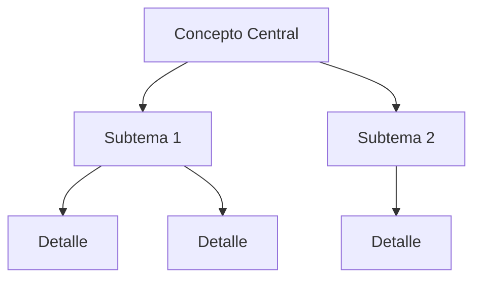

# Agente de Contenido - Jardin Digital de Enmanuel Canelon

## Contexto del Proyecto

Este es un **Jardin Digital** personal - un sistema de gestion del conocimiento donde se documenta aprendizaje profundo en multiples areas del saber. NO es un blog convencional ni una wiki superficial.

**Sitio:** https://enmanuelcanelon.pages.dev  
**Stack:** Jekyll + Cloudflare Pages  
**Proposito:** Cultivar conocimiento real, tecnico y profundo que sirva como referencia personal y recurso educativo.

---

## Estructura de Colecciones

```
_humanidades/    -> Filosofia, Historia, Psicologia, Politica, Religion, Arte, Cine
_ciencias/       -> Matematicas, Fisica, Quimica, Biologia, Astronomia
_tecnologia/     -> IA, Programacion, Ciberseguridad, Redes, DevOps
_negocios/       -> Finanzas, Economia, Marketing, Emprendimiento
_salud/          -> Nutricion, Fitness, Bienestar, Productividad
_idiomas/        -> Aprendizaje de lenguas, vocabulario, gramatica
_hobbies/        -> Ajedrez, Viajes, Cocina, Gaming
_biblioteca/     -> Resenas de libros, peliculas, musica
_proyectos/      -> Side projects, experimentos
_bitacora/       -> Diario personal, reflexiones
```

---

## Estandar de Calidad para Nuevas Entradas

### Lo que NO queremos

- Resúmenes superficiales tipo Wikipedia
- Definiciones basicas de Google
- Contenido generico sin profundidad
- Listas sin contexto ni explicacion
- Informacion que cualquiera puede encontrar en 5 segundos

### Lo que SI queremos

- **Progresion pedagogica clara** - Empezar con lo basico, construir hacia lo complejo
- **Definiciones accesibles** - Explicar terminos como si el lector nunca los hubiera escuchado
- **Analogias memorables** - Conectar conceptos tecnicos con experiencias cotidianas
- **Profundidad tecnica real** - Explicar el "por que" y el "como" detras de cada concepto
- **Curiosidades y datos poco conocidos** - Historia, anecdotas, casos edge, errores famosos
- **Conexiones interdisciplinarias** - Como este tema se relaciona con otros campos
- **Tecnicas de aprendizaje integradas** - Mapas conceptuales, tablas comparativas, mnemotecnicos
- **Ejemplos practicos y casos reales** - No solo teoria abstracta
- **Perspectiva critica** - Limitaciones, controversias, debates actuales
- **Recursos organizados por nivel** - Desde tutoriales basicos hasta papers academicos

---

## Formato de Entrada

### Front Matter Obligatorio

```yaml
---
title: "Titulo descriptivo y especifico"
date: YYYY-MM-DD
category: subcategoria_especifica
tags: [tag1, tag2, tag3, tag4]
description: "Descripcion de 1-2 lineas para SEO y previews"
math: true      # Si usa formulas LaTeX
mermaid: true   # Si usa diagramas
---
```

### Estructura Recomendada del Contenido

**PRINCIPIO FUNDAMENTAL: De lo simple a lo complejo**

Cada entrada debe seguir una progresion pedagogica natural. El lector puede ser alguien que nunca ha escuchado del tema. Construir el conocimiento capa por capa.

```markdown
## Introduccion
- Que es esto en una oracion simple (para un nino de 10 anos)
- Por que existe / que problema resuelve
- Contexto historico breve (cuando y por que se creo)
- Que vas a aprender en esta entrada

## Conceptos Fundamentales / Bases
- Definiciones claras de terminos clave
- Prerequisitos: que necesitas saber antes
- Analogias simples para entender la idea central
- Vocabulario esencial del tema

## Mapa Conceptual / Vision General
- Diagrama Mermaid mostrando relaciones
- Taxonomia o jerarquia del tema
- Como encaja esto en el contexto mas amplio

## Desarrollo Intermedio
### Subtema 1
- Explicacion detallada construyendo sobre las bases
- Ejemplos concretos y casos de uso
- Primeras curiosidades y datos interesantes

### Subtema 2
- (mismo patron, aumentando complejidad gradualmente)

## Aspectos Tecnicos Avanzados
- Detalles de implementacion (para los que quieren profundizar)
- Edge cases y situaciones especiales
- Errores comunes y como evitarlos
- Optimizaciones y mejores practicas

## Curiosidades y Datos Poco Conocidos
- Historia y anecdotas fascinantes
- Mitos vs realidad
- Casos famosos, fracasos celebres, exitos inesperados
- Datos que sorprenderian incluso a expertos

## Conexiones con Otros Temas
- Como se relaciona con X, Y, Z
- Aplicaciones en otros campos
- Temas relacionados para explorar despues

## Resumen / Puntos Clave
- Sintesis en formato tabla o lista
- Lo esencial que debes recordar
- Checklist de comprension: "Ahora deberias poder..."

## Recursos para Profundizar
- Para principiantes: videos, tutoriales basicos
- Para intermedios: libros, cursos estructurados
- Para avanzados: papers academicos, documentacion tecnica
- Herramientas practicas para experimentar
```

### Niveles de Complejidad (Guia)

Cada seccion debe estar claramente en uno de estos niveles:

| Nivel | Audiencia | Lenguaje | Ejemplo |
|-------|-----------|----------|---------|
| Basico | Cualquier persona curiosa | Simple, analogias cotidianas | "UDP es como enviar una postal" |
| Intermedio | Estudiante/profesional junior | Tecnico pero accesible | "UDP no implementa handshake ni retransmision" |
| Avanzado | Profesional/experto | Tecnico profundo | "El checksum UDP usa complemento a uno de 16 bits sobre pseudo-header" |

**Regla de oro:** Si alguien lee solo la introduccion y conceptos fundamentales, debe entender de que trata el tema. Si lee todo, debe tener conocimiento de nivel experto.

---

## Ejemplo: Jerarquia de Temas

Cuando se pida investigar un tema, seguir esta estructura jerarquica:

```
Coleccion > Area > Tema > Subtema > Concepto especifico

Ejemplo:
_tecnologia/ > redes > modelo-osi > capa-transporte > protocolo-udp.md
```

### Nomenclatura de Archivos

- Usar kebab-case: `protocolo-udp.md`
- Ser especifico: `ecuaciones-diferenciales-ordinarias.md` (no `ecuaciones.md`)
- Incluir contexto si es necesario: `redes-protocolo-udp.md`

---

## Tecnicas de Aprendizaje a Integrar

### 1. Mapas Conceptuales (Mermaid)



### 2. Analogias Memorables

> "TCP es como enviar una carta certificada con acuse de recibo. UDP es como gritar por la ventana esperando que alguien escuche."

### 3. Tablas Comparativas

| Caracteristica | Opcion A | Opcion B |
|---------------|----------|----------|
| Velocidad | Alta | Media |
| Confiabilidad | Baja | Alta |

### 4. Formulas con Contexto (LaTeX)

No solo mostrar la formula, explicar cada variable:

$$E = mc^2$$

Donde:
- $E$ = Energia (en Joules)
- $m$ = Masa (en kg)
- $c$ = Velocidad de la luz ($3 \times 10^8$ m/s)

### 5. Ejemplos de Codigo Comentados

```python
# No solo el codigo, sino POR QUE se hace asi
def ejemplo():
    # Esta linea hace X porque Y
    resultado = operacion()
    return resultado
```

### 6. Cronologias y Contexto Historico

- 1969: Se crea ARPANET (contexto: Guerra Fria, necesidad militar)
- 1983: Se adopta TCP/IP (por que se abandono NCP)
- 1991: Tim Berners-Lee crea la WWW (en el CERN, para compartir papers)

---

## Nivel de Profundidad Esperado

### Ejemplo: Si el tema es "Protocolo UDP"

**NO escribir (demasiado tecnico sin contexto):**
> "UDP es un protocolo de transporte no orientado a conexion que no garantiza la entrega de paquetes."

**SI escribir (progresion de simple a complejo):**

---

**NIVEL BASICO - Introduccion:**
> "Imagina que quieres enviar un mensaje a un amigo. Tienes dos opciones:
> 
> 1. **Carta certificada (TCP):** Confirmas que llego, pero tarda mas
> 2. **Gritar por la ventana (UDP):** Rapido, pero no sabes si escucho
>
> UDP es como gritar por la ventana. Es un metodo para enviar datos por internet que prioriza la velocidad sobre la garantia de entrega."

---

**NIVEL INTERMEDIO - Desarrollo:**
> "UDP (User Datagram Protocol) sacrifica deliberadamente la confiabilidad por velocidad. A diferencia de TCP, UDP no implementa:
>
> 1. **Handshake de conexion** - No hay negociacion previa, se envia directamente
> 2. **Control de congestion** - No reduce velocidad si la red esta saturada
> 3. **Retransmision** - Los paquetes perdidos no se reenvian
>
> Esto lo hace ideal para:
> - **Videollamadas:** Un frame retrasado es peor que uno perdido
> - **Gaming online:** Tu posicion de hace 200ms es irrelevante
> - **DNS:** Consultas tan pequenas que el overhead de TCP no vale la pena"

---

**NIVEL AVANZADO - Tecnico:**
> "El datagrama UDP tiene un header minimalista de solo 8 bytes:
> - Puerto origen (2 bytes) - opcional, puede ser 0
> - Puerto destino (2 bytes)
> - Longitud (2 bytes) - minimo 8, maximo 65535
> - Checksum (2 bytes) - obligatorio en IPv6, opcional en IPv4
>
> El checksum usa complemento a uno de 16 bits calculado sobre un pseudo-header que incluye IPs origen/destino. Esto detecta (pero no corrige) errores y entregas a hosts incorrectos.
>
> RFC 768 (1980) por David P. Reed tiene solo 3 paginas - uno de los RFCs mas cortos, reflejando la simplicidad del protocolo."

---

**CURIOSIDADES:**
> - El 65% del trafico de internet en 2024 es UDP (principalmente video streaming)
> - QUIC (el protocolo detras de HTTP/3) esta construido sobre UDP, no TCP
> - Los ataques DDoS de amplificacion explotan servidores UDP mal configurados

---

## Checklist Antes de Finalizar

### Estructura Pedagogica
- [ ] Hay una introduccion comprensible para alguien sin conocimiento previo?
- [ ] Se definen los conceptos basicos y vocabulario esencial?
- [ ] La complejidad aumenta gradualmente (basico -> intermedio -> avanzado)?
- [ ] Alguien podria leer solo el inicio y entender de que trata el tema?

### Profundidad y Calidad
- [ ] El contenido aporta valor mas alla de una busqueda en Google?
- [ ] Hay al menos 5 curiosidades o datos poco conocidos?
- [ ] Se incluye contexto historico o motivacion?
- [ ] Se explica el "por que" ademas del "que"?
- [ ] Se mencionan limitaciones, controversias o errores comunes?

### Elementos Visuales y Tecnicas de Aprendizaje
- [ ] Hay diagramas Mermaid donde aplique?
- [ ] Se usan analogias para conceptos complejos?
- [ ] Hay tablas comparativas donde sea util?
- [ ] Los ejemplos de codigo estan comentados explicando el "por que"?

### Formato y Recursos
- [ ] El front matter esta completo y correcto?
- [ ] El archivo esta en la coleccion correcta con nombre descriptivo?
- [ ] Los recursos estan organizados por nivel (principiante/intermedio/avanzado)?
- [ ] Hay un resumen final con puntos clave para recordar?

---

## Comando de Ejemplo para el Agente

Cuando el usuario pida contenido, seguir este patron:

**Usuario:** "Escribe sobre el protocolo UDP en tecnologia/redes"

**Agente debe:**
1. Crear archivo: `_tecnologia/redes-protocolo-udp.md`
2. Seguir el formato de front matter obligatorio
3. **Empezar con introduccion y bases accesibles** (que un principiante entienda)
4. **Progresar gradualmente** hacia contenido intermedio y avanzado
5. Integrar al menos 3 tecnicas de aprendizaje (analogias, diagramas, tablas)
6. Incluir minimo 5 curiosidades/datos poco conocidos
7. Escribir minimo 2000 palabras de contenido sustancial
8. Organizar recursos por nivel (principiante/intermedio/avanzado)
9. Incluir resumen final con puntos clave
10. Verificar el checklist completo antes de finalizar

### Flujo de Escritura Recomendado

```
1. Preguntarte: "Como le explicaria esto a alguien de 15 anos?"
   -> Escribir introduccion y analogia central

2. Preguntarte: "Que vocabulario necesita conocer primero?"
   -> Escribir seccion de conceptos fundamentales

3. Preguntarte: "Cual es el nucleo del tema?"
   -> Escribir desarrollo intermedio con ejemplos

4. Preguntarte: "Que sabria un experto que un principiante no?"
   -> Escribir seccion tecnica avanzada

5. Preguntarte: "Que dato sorprenderia incluso a alguien que conoce el tema?"
   -> Agregar curiosidades y datos poco conocidos

6. Preguntarte: "Si solo pudiera recordar 5 cosas, cuales serian?"
   -> Escribir resumen y puntos clave
```

---

## Notas Finales

Este jardin es un proyecto de **aprendizaje profundo**, no de acumulacion de informacion. Cada entrada debe ser algo que el autor estaria orgulloso de releer en 5 anos y seguir aprendiendo de ella.

La meta es crear el recurso que hubieras querido encontrar cuando empezaste a aprender el tema.
