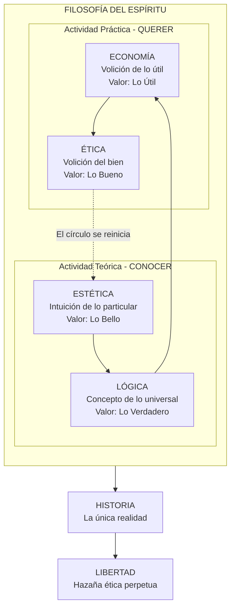
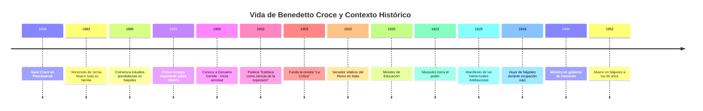

## Introducción

Imagina que toda tu familia muere en un terremoto cuando tienes 17 años. Quedas enterrado bajo los escombros durante horas, solo, herido, escuchando silencio donde antes había voces. Cuando te rescatan, no queda nadie. ¿Cómo reconstruyes una vida después de eso?

**Benedetto Croce** (1866-1952) respondió de una manera extraordinaria: convirtió el dolor en filosofía. Durante los siguientes 69 años de su vida, construyó un sistema intelectual completo que abarcaba el arte, la lógica, la política y la historia. Se convirtió en el **"Papa laico"** de la cultura italiana, el hombre que educó a generaciones enteras desde su palacio en Nápoles, sin jamás ocupar un cargo universitario.

> **En una oración simple:** Croce fue un filósofo italiano que demostró que toda la realidad es actividad humana (el "Espíritu"), que el arte es conocimiento intuitivo puro, y que la historia es la única forma de entender la verdad — porque la verdad no existe fuera del tiempo.

### ¿Por qué existe Croce como figura histórica?

Croce importa porque:

1. **Revolucionó la estética** con su teoría de la identidad intuición-expresión
2. **Reformuló el idealismo hegeliano** reemplazando la "dialéctica de los opuestos" por la "dialéctica de los distintos"
3. **Defendió la libertad intelectual** contra el fascismo cuando era peligroso hacerlo
4. **Influyó en pensadores opuestos**: tanto Gramsci (marxista) como Collingwood (liberal británico) le deben sus ideas fundamentales

### Contexto histórico breve

Croce nació en la Italia recién unificada (1861) y vivió:

- **La crisis del positivismo** — El fin de la fe ciega en la ciencia como respuesta a todo
- **El nacimiento del fascismo** (1922) — Al que se opuso públicamente
- **Dos guerras mundiales** — Que confirmaron su visión de la historia como lucha por la libertad
- **La reconstrucción de Italia** — Donde fue brevemente ministro y figura moral

Su vida abarca desde la Italia liberal del siglo XIX hasta la República italiana de la posguerra.

### ¿Qué vas a aprender en esta entrada?

Al terminar de leer, entenderás:

- La "Filosofía del Espíritu" y sus cuatro momentos (Estética, Lógica, Economía, Ética)
- Por qué Croce decía que "la intuición ES la expresión" (y cómo esto cambió la crítica de arte)
- El "historicismo absoluto" y la frase "toda historia es historia contemporánea"
- La distinción entre "liberismo" (economía de mercado) y "liberalismo" (ética de la libertad)
- Su enfrentamiento con el fascismo y con Giovanni Gentile
- Su influencia en Gramsci, Collingwood y la cultura del siglo XX

---

## Conceptos Fundamentales

### Vocabulario esencial crociano

Antes de adentrarnos en Croce, necesitas conocer estos términos que él acuñó o redefinió:

| Término                         | Definición                                                                                                                                                   | Analogía                                                                                              |
| ------------------------------- | ------------------------------------------------------------------------------------------------------------------------------------------------------------ | ----------------------------------------------------------------------------------------------------- |
| **Espíritu** (_Spirito_)        | No es un fantasma ni un alma religiosa. Es el conjunto de toda actividad humana consciente: pensar, hacer, crear, desear.                                    | Como el "software" que corre en el "hardware" del mundo                                               |
| **Dialéctica de los Distintos** | Los cuatro momentos del Espíritu son diferentes entre sí pero no se contradicen. El arte no "lucha" contra la lógica; simplemente es otro tipo de actividad. | Como los cuatro elementos: agua y fuego son distintos, no opuestos                                    |
| **Intuición-Expresión**         | La idea central de su estética: si no puedes expresar algo, es porque no lo has intuido realmente. No hay "ideas en la cabeza" sin forma.                    | Si dices "tengo una canción genial pero no puedo cantarla", Croce diría que no tienes ninguna canción |
| **Historicismo Absoluto**       | No hay verdades eternas fuera del tiempo. Toda verdad es histórica, toda filosofía es historia de la filosofía.                                              | Como un río que nunca es el mismo: la "verdad" de ayer no es la de hoy                                |
| **Vitalidad**                   | La fuerza cruda, pre-moral, instintiva del ser humano. Necesaria para actuar, pero peligrosa sin dirección ética.                                            | El caballo salvaje que la moral debe domar, pero sin el cual no hay movimiento                        |

### La analogía central: El círculo del Espíritu

> **Imagina la vida humana como una rueda con cuatro radios que gira eternamente.**

Cada "radio" es un tipo de actividad:

1. **ESTÉTICA** — Conocer lo particular (intuición de una rosa concreta)
2. **LÓGICA** — Conocer lo universal (el concepto de "rosa" en general)
3. **ECONOMÍA** — Querer lo útil (plantar rosas para venderlas)
4. **ÉTICA** — Querer lo bueno (regalar rosas por amor)

La rueda nunca se detiene. Después de actuar éticamente, surgen nuevas situaciones que requieren nuevas intuiciones, nuevos conceptos, nuevas acciones...

### Prerequisitos conceptuales

Para entender plenamente a Croce, ayuda conocer:

1. **Hegel y el idealismo alemán** — Croce se considera un "hegeliano reformado"
2. **El positivismo del siglo XIX** — La fe en la ciencia que Croce critica
3. **Kant y la estética** — Croce dialoga con la "Crítica del Juicio"
4. **La unificación de Italia (1861)** — El contexto político de su formación

---

## Mapa Conceptual: El Sistema Crociano

### Línea temporal: Croce y su época

### ¿Cómo encaja Croce en la historia de la filosofía?

Croce fue un puente entre:

- **El idealismo alemán** (Hegel, Kant)
- **El historicismo italiano** (Vico)
- **El liberalismo ético** del siglo XX
- **El marxismo gramsciano** (que lo usó como punto de partida para superarlo)

---

## Desarrollo Intermedio

### Subtema 1: La Vida de Croce — Del Terremoto al Palacio de la Sabiduría

#### Infancia y tragedia (1866-1883)

Benedetto Croce nació el 25 de febrero de 1866 en **Pescasseroli**, un pequeño pueblo en los Abruzos, Italia central. Su familia era de la alta burguesía napolitana, propietaria de tierras y negocios.

Su infancia fue privilegiada pero marcada por una religiosidad estricta que luego rechazaría completamente. Fue educado en colegios católicos en Nápoles.

**El 28 de julio de 1883**, la familia Croce estaba de vacaciones en la isla de **Ischia**, en el golfo de Nápoles. Un terremoto devastador destruyó la villa donde se alojaban. Croce, de 17 años, quedó sepultado bajo los escombros durante horas.

Cuando finalmente fue rescatado, descubrió que habían muerto:

- Su padre **Pasquale Croce**
- Su madre **Luisa Sipari**
- Su hermana **Maria**

**Dato curioso #1:** Croce sobrevivió porque estaba en una parte de la casa que formó un hueco protector. Pasó horas consciente bajo los escombros, sin saber si alguien vendría a rescatarlo. Esta experiencia de soledad extrema y confrontación con la muerte lo marcó para siempre.

#### La depresión y el renacimiento intelectual (1883-1893)

Huérfano y heredero de una considerable fortuna, Croce fue acogido por su tío **Silvio Spaventa** en Roma. Silvio era un importante político liberal y filósofo hegeliano, hermano del más famoso filósofo **Bertrando Spaventa**.

En Roma, Croce asistió brevemente a clases universitarias, pero encontró la academia insípida y burocrática. Cayó en una profunda **depresión** que duraría años — lo que él llamó "el mal de vivir".

> "Me encontraba en un estado de completa desolación espiritual. No creía en nada: ni en Dios, ni en la ciencia, ni en el amor. Solo el trabajo intelectual me salvó." — Croce

Su salvación vino de la **lectura obsesiva**. Descubrió a los historiadores napolitanos del siglo XVIII, especialmente a **Giambattista Vico**, quien se convertiría en su maestro intelectual. También leyó vorazmente a Hegel, De Sanctis, y la literatura europea.

**Dato curioso #2:** Croce nunca obtuvo un título universitario formal. Fue completamente autodidacta. Esto lo liberó de las modas académicas pero también le dio una cierta soberbia hacia los "profesores de profesión".

#### El palacio de Nápoles (1893-1952)

En 1893, Croce se estableció definitivamente en **Nápoles**, en el palacio familiar de Via Trinità Maggiore. Este palacio se convirtió en su "universidad privada":

- Una biblioteca personal de **80,000 volúmenes**
- Un despacho donde recibía a intelectuales de toda Europa
- La sede editorial de su revista **La Critica**

Nunca aceptó un cargo universitario, prefiriendo su independencia económica. Vivía de sus rentas y dedicaba todo su tiempo a la escritura, la correspondencia, y la organización cultural.

**Dato curioso #3:** El palacio de Croce fue respetado incluso por los nazis durante la ocupación de Nápoles (1943-1944). Croce tuvo que huir temporalmente, pero su biblioteca fue preservada. Hoy es sede del **Instituto Italiano per gli Studi Storici**, fundado por él mismo.

#### Matrimonio y vida personal

En 1914, a los 48 años, Croce se casó con **Adele Rossi**, una mujer culta que se convirtió en su colaboradora y compañera durante casi 40 años. Tuvieron cuatro hijas.

A pesar de su imagen de patriarca severo, las cartas revelan un Croce afectuoso con su familia y preocupado por los detalles domésticos.

#### La vejez y la muerte (1944-1952)

Tras la liberación de Italia, Croce fue brevemente ministro en el gobierno de transición y participó en la redacción de la nueva constitución republicana. Sin embargo, prefirió volver a su trabajo intelectual.

Murió el 20 de noviembre de 1952 en su palacio de Nápoles, a los 86 años, trabajando hasta el último día.

**Dato curioso #4:** Las últimas palabras de Croce fueron sobre un manuscrito que estaba corrigiendo. Incluso moribundo, seguía editando.

---

### Subtema 2: La Estética — La Identidad Intuición-Expresión

#### El problema que Croce intentaba resolver

La estética tradicional tenía un problema: separaba el "contenido" (la idea, la emoción) de la "forma" (las palabras, los colores, los sonidos). Esto llevaba a absurdos como:

- "Tengo una gran novela en la cabeza pero no puedo escribirla"
- "El contenido de esta pintura es profundo aunque la técnica sea mala"

Croce cortó este nudo con una tesis radical.

#### La tesis central: Intuición = Expresión

En **"Estética como ciencia de la expresión y lingüística general"** (1902), Croce argumentó:

1. **La intuición no existe sin expresión**
   - Si no puedes expresar algo, es porque no lo has intuido claramente
   - Las "ideas vagas" no son intuiciones; son confusión

2. **El arte es conocimiento, no placer**
   - El arte no existe para darnos placer (hedonismo)
   - No existe para educarnos (moralismo)
   - Existe para **conocer lo individual** en su singularidad

3. **Todos somos artistas**
   - La diferencia entre Dante y una persona común es de cantidad, no de cualidad
   - Cada vez que expresamos bien una impresión ("¡qué hermoso atardecer!"), hacemos micro-arte

> **Analogía:** Piensa en aprender un idioma. Al principio, tienes "ideas" que no puedes expresar en el nuevo idioma. Croce diría que esas no son realmente ideas — son sensaciones confusas. Solo cuando encuentras las palabras correctas, la idea existe plenamente.

#### Consecuencias de esta teoría

| Idea tradicional                                         | Posición de Croce                                                                  |
| -------------------------------------------------------- | ---------------------------------------------------------------------------------- |
| El artista tiene primero la idea, luego busca la técnica | La técnica viene _después_ de la intuición; si no hay expresión, no hubo intuición |
| Algunos géneros son superiores (épica > lírica)          | Los géneros son clasificaciones externas; solo importa la calidad de la intuición  |
| El arte se puede enseñar                                 | Las técnicas se enseñan, pero la intuición es personal e intransferible            |
| Hay un canon objetivo de belleza                         | Lo bello es lo bien expresado; no hay reglas externas                              |

#### La crítica de Croce a las "ciencias del arte"

Croce rechazaba:

- La **sociología del arte** (el arte no se explica por condiciones sociales)
- La **psicología del arte** (el arte no se reduce a procesos mentales)
- La **historia del arte como historia de estilos** (el estilo es consecuencia, no causa)

Para él, solo existía la **crítica estética**: juzgar si una obra expresa bien una intuición.

**Dato curioso #5:** Croce fue muy polémico en sus juicios literarios. Consideraba que Dante era el supremo poeta italiano pero que muchos pasajes de la _Divina Comedia_ eran "estructura" (teología, alegoría) y no verdadera "poesía". Esto enfureció a los dantistas tradicionales.

---

### Subtema 3: La Lógica — El Concepto Puro y la Muerte de las Ciencias

#### La distinción crucial: Conceptos puros vs. Pseudoconceptos

Croce dividió los conceptos en dos categorías:

**Conceptos puros (filosóficos):**

- Son universales y concretos a la vez
- Ejemplos: "belleza", "verdad", "libertad", "historia"
- Permiten entender la realidad en su totalidad

**Pseudoconceptos (científicos y empíricos):**

- Son abstracciones útiles pero parciales
- Ejemplos: "gato", "átomo", "gravedad", "especie"
- Sirven para manipular el mundo, pero no dicen qué es la realidad

> **Analogía:** Los pseudoconceptos son como las etiquetas en un supermercado: útiles para organizar productos, pero la etiqueta "fruta" no te dice nada sobre _esta_ manzana concreta que tienes en la mano.

#### La polémica anti-científica

Croce llegó a afirmar que **las ciencias naturales no son verdadero conocimiento**:

- La física, la química, la biología trabajan con pseudoconceptos
- Son útiles para la técnica, pero no para entender la realidad
- Solo la **Historia** es ciencia verdadera, porque une lo universal (concepto) con lo particular (hecho)

Esta posición fue muy controvertida y le ganó enemigos entre los científicos y los positivistas.

**Tabla comparativa: Ciencia vs. Historia según Croce**

| Aspecto          | Ciencias naturales                | Historia                            |
| ---------------- | --------------------------------- | ----------------------------------- |
| Tipo de concepto | Pseudoconcepto (abstracto)        | Concepto puro (concreto-universal)  |
| Objeto           | Naturaleza (construcción nuestra) | Espíritu humano (la única realidad) |
| Método           | Clasificación, generalización     | Comprensión del hecho individual    |
| Verdad           | Utilidad práctica                 | Conocimiento genuino                |

**Dato curioso #6:** Albert Einstein visitó a Croce en Nápoles. La conversación fue cortés pero tensa. Croce consideraba la física como una "ficción económica" útil; Einstein, naturalmente, no estaba de acuerdo.

---

### Subtema 4: La Historia — "Toda Historia es Historia Contemporánea"

#### El historicismo absoluto

Si no hay Dios (Croce era agnóstico) y la Naturaleza es una construcción nuestra... ¿qué queda? **La Historia**.

Para Croce:

- **Ser es ser histórico** — No hay esencias eternas, solo devenir
- **La filosofía es historia de la filosofía** — Platón cobra sentido solo en relación con sus predecesores y con nuestras preguntas actuales
- **La verdad es histórica** — Lo que era "verdadero" para los griegos no es lo mismo que para nosotros

#### La frase clave: "Toda historia es historia contemporánea"

Esta es quizás la frase más famosa de Croce. Significa:

1. **El pasado no existe "en sí mismo"** — Solo existe en la medida en que lo reconstruimos desde el presente
2. **Un historiador de 2024** que escribe sobre Roma responde a preguntas de 2024, no de Roma
3. **El pasado "vive"** solo cuando conecta con un interés presente
4. **No hay historia neutral** — Siempre escribimos desde una perspectiva

> **Analogía:** El pasado es como un álbum de fotos. Las fotos están ahí, pero cobran sentido solo cuando _tú_ las miras y les das significado desde tu presente.

#### El juicio histórico como único juicio

Croce rechazaba:

- El **Juicio Final** religioso (Dios juzgará al final de los tiempos)
- El **tribunal de la Razón** ilustrado (la Historia avanza hacia un progreso garantizado)

En cambio, proponía:

- El **juicio histórico** — La historia misma es el único tribunal
- Los hechos se juzgan por sus consecuencias históricas, no por principios eternos

Esto NO significa que "todo vale". Para Croce, la historia tiene una dirección: **la conquista progresiva (pero nunca garantizada) de la libertad**.

---

### Subtema 5: La Economía y la Ética — Vitalidad y Libertad

#### El momento económico

Croce usaba "economía" en un sentido amplio: todo lo relacionado con la **utilidad**, la **fuerza**, el **poder**. Incluye:

- La economía propiamente dicha (negocios, finanzas)
- La política (como lucha por el poder)
- La técnica (como manipulación del mundo)
- La "vitalidad" (la fuerza instintiva del ser humano)

**Punto crucial:** El momento económico es **autónomo** del momento ético.

Un político puede ser **eficaz** (buen "economista" en este sentido) aunque sea moralmente malo. Maquiavelo entendió esto perfectamente.

#### El momento ético

La ética, para Croce, es:

- La **voluntad del bien universal** — No el placer personal ni la utilidad
- **Libertad** — No como ausencia de obstáculos, sino como autodeterminación del espíritu
- **Hazaña perpetua** — No un estado que se alcanza, sino una lucha constante

> "La libertad no es un regalo de la naturaleza ni de Dios. Es una conquista que debe renovarse cada día contra la barbarie." — Croce

#### Liberismo vs. Liberalismo

Croce tuvo un famoso debate con el economista **Luigi Einaudi** sobre esta distinción:

| Concepto        | Definición                               | Momento del Espíritu |
| --------------- | ---------------------------------------- | -------------------- |
| **Liberismo**   | Libre mercado, laissez-faire económico   | Económico (útil)     |
| **Liberalismo** | Libertad del espíritu, autodeterminación | Ético (bueno)        |

**Conclusión de Croce:**

- Un verdadero **liberal** (ético) podría, en teoría, aceptar medidas socialistas si estas aumentaran la libertad humana real
- El liberismo es una receta económica contingente; el liberalismo es una exigencia ética permanente

Esta distinción sigue siendo potentísima para entender los debates políticos actuales.

---

### Subtema 6: Croce contra el Fascismo

#### La amistad rota con Giovanni Gentile

Giovanni Gentile (1875-1944) fue el colaborador más cercano de Croce durante 20 años. Juntos fundaron **La Critica** y desarrollaron el "neoidealismo italiano".

Pero en 1922, cuando Mussolini tomó el poder, sus caminos se separaron:

- **Gentile** se convirtió en el "filósofo del fascismo", ministro de educación de Mussolini
- **Croce** se opuso públicamente al régimen

**Dato curioso #7:** Croce y Gentile dejaron de hablarse tras 1925 y nunca se reconciliaron. Gentile fue asesinado por partisanos en 1944. Croce, a pesar del distanciamiento, escribió una nota de pésame.

#### El Manifiesto de los Intelectuales Antifascistas (1925)

El 21 de abril de 1925, Gentile publicó el **"Manifiesto de los Intelectuales Fascistas"**, firmado por cientos de académicos.

Croce respondió el 1 de mayo con el **"Manifiesto de los Intelectuales Antifascistas"**, que declaraba:

> "Nos oponemos a la mezcla confusa de teorías dispares [...] a la intolerancia y a la violencia, a la humillación de los parlamentos, a la supresión de la libertad de prensa..."

El contramanifiesto fue firmado por figuras como Luigi Einaudi, Eugenio Montale, y otros cientos de intelectuales. Fue el acto que dividió la cultura italiana en dos bandos.

**Dato curioso #8:** Croce nunca fue arrestado por el régimen fascista, probablemente porque era demasiado famoso internacionalmente. Sin embargo, estaba bajo vigilancia constante, su correo era interceptado, y sus obras eran censuradas en las universidades.

#### La resistencia pasiva

Durante 20 años de fascismo (1922-1943), Croce:

- Siguió publicando **La Critica** con críticas veladas al régimen
- Mantuvo correspondencia con intelectuales antifascistas en el exilio
- Protegió a estudiantes y colegas perseguidos
- Rechazó todo cargo oficial que legitimara al fascismo

Su palacio en Nápoles se convirtió en un refugio para la cultura libre.

---

## Aspectos Avanzados

### La dialéctica de los distintos vs. la dialéctica de los opuestos

Esta es la gran innovación técnica de Croce respecto a Hegel.

**Hegel** usaba la "dialéctica de los opuestos":

- Tesis → Antítesis → Síntesis
- El arte es "superado" por la religión, que es "superada" por la filosofía
- Cada momento inferior muere en el superior

**Croce** propuso la "dialéctica de los distintos":

- Los cuatro momentos (Estética, Lógica, Economía, Ética) son **distintos** pero no opuestos
- El arte no muere en la lógica; simplemente es otro tipo de actividad
- Dentro de cada momento sí hay oposición (Bello vs. Feo, Verdadero vs. Falso)

**Tabla comparativa:**

| Aspecto                         | Hegel                                     | Croce                               |
| ------------------------------- | ----------------------------------------- | ----------------------------------- |
| Relación entre momentos         | Superación (Aufhebung)                    | Distinción (circularidad)           |
| ¿El arte muere en la filosofía? | Sí, es "superado"                         | No, coexiste eternamente            |
| Modelo                          | Escalera ascendente                       | Círculo que gira                    |
| Finalidad                       | El Espíritu Absoluto se conoce a sí mismo | La historia como hazaña de libertad |

### La teoría de la vitalidad y el problema del mal

En sus obras tardías (especialmente durante y después de la Segunda Guerra Mundial), Croce desarrolló el concepto de **Vitalidad**:

- Es la fuerza bruta, pre-moral, que subyace a toda acción humana
- Sin vitalidad, no hay acción posible (estaríamos muertos)
- Pero la vitalidad sin dirección ética produce fascismo, violencia, barbarie

Croce reconoció que el fascismo tenía una "vitalidad demoníaca": energía, pasión, dinamismo... al servicio de la destrucción.

**Lección:** La Razón y la Ética no pueden "matar" a la vitalidad (la bestia), solo pueden **domarla**. La lucha contra la barbarie es eterna.

### Croce y Gramsci: El diálogo imposible

Antonio Gramsci (1891-1937), fundador del Partido Comunista Italiano, escribió sus **Cuadernos de la Cárcel** en gran parte como un enfrentamiento con Croce.

**Lo que Gramsci admiraba de Croce:**

- El historicismo (la realidad es historia)
- La autonomía del momento político (la política no se reduce a economía)
- La importancia de la cultura en la transformación social

**Lo que Gramsci criticaba:**

- El idealismo (Croce ignora las condiciones materiales)
- El liberalismo (Croce defiende el statu quo burgués)
- La crítica a la ciencia (el marxismo es científico)

Gramsci escribió:

> "La filosofía de la praxis [marxismo] debe ser para Croce lo que Hegel fue para Marx: su superación."

**Dato curioso #9:** Gramsci pidió libros de Croce desde la cárcel y los estudió obsesivamente. Croce, por su parte, desconocía quién era Gramsci hasta después de la guerra.

---

## Curiosidades y Datos Poco Conocidos

### 1. El terremoto como origen de todo

El terremoto de Ischia (1883) no solo mató a su familia; lo salvó de una vida convencional. Sin esa tragedia, Croce probablemente habría sido un abogado o terrateniente acomodado. El dolor lo convirtió en filósofo.

### 2. La biblioteca monumental

Su biblioteca personal de 80,000 volúmenes era una de las más grandes de Europa en manos privadas. La conocía de memoria y podía indicar a los visitantes la ubicación exacta de cualquier libro.

### 3. El rechazo a la academia

Croce rechazó múltiples ofertas de cátedras universitarias. Consideraba que la academia era burocrática y corrupta. Prefería su "universidad privada" en Nápoles.

### 4. El visitante ilustre: Borges

Jorge Luis Borges visitó a Croce en Nápoles y quedó impresionado. Sin embargo, Croce criticó duramente a algunos autores que Borges admiraba (como Kipling), lo que provocó un intercambio tenso pero cortés.

### 5. Einstein y el desencuentro

Cuando Einstein visitó Italia, fue a ver a Croce. La conversación fue respetuosa pero marcada por un desacuerdo fundamental: Croce consideraba la física una "ficción útil", no verdadero conocimiento.

### 6. Natalia Ginzburg y la severidad

La joven Natalia Ginzburg envió sus primeros textos literarios a Croce, esperando aprobación. Él respondió que eran "pueriles y sentimentales". Ginzburg nunca lo olvidó, pero reconoció que esa severidad la hizo exigente consigo misma.

### 7. El fascismo que no lo arrestó

A pesar de sus críticas públicas, el régimen fascista nunca arrestó a Croce. Era demasiado famoso internacionalmente; su arresto habría sido un escándalo. Pero fue vigilado, censurado y marginado.

### 8. El Instituto que sobrevive

El **Instituto Italiano per gli Studi Storici**, fundado por Croce en 1946 en su propio palacio, sigue funcionando hoy. Ha formado a generaciones de historiadores y humanistas italianos.

---

## Conexiones con Otros Temas

### Con Hegel

Croce se consideraba un hegeliano, pero reformado:

- Aceptaba la idea del Espíritu como realidad total
- Rechazaba la dialéctica de los opuestos (la reemplazó por la de los distintos)
- Rechazaba el Estado como culminación de la historia (el Estado es solo momento económico)

### Con Vico

Giambattista Vico (1668-1744), el filósofo napolitano, fue el verdadero maestro de Croce:

- La idea de que **verum ipsum factum** (lo verdadero es lo hecho, lo histórico)
- El conocimiento de la historia es superior al de la naturaleza
- La "ciencia nueva" como ciencia del mundo humano

### Con Gramsci

La relación más importante del pensamiento italiano del siglo XX:

- Gramsci tomó de Croce el historicismo, la autonomía de la política, la idea de hegemonía cultural
- Pero lo invirtió: donde Croce veía libertad espiritual, Gramsci veía lucha de clases

> **Conexión con el Jardín:** Ver la entrada sobre [Antonio Gramsci](/humanidades/politica-antonio-gramsci/) para profundizar en el marxismo italiano y su deuda con Croce.

### Con Pirandello

Croce y Luigi Pirandello fueron contemporáneos y tuvieron un famoso desencuentro sobre el **concepto de humor**.

Cuando Pirandello publicó su ensayo **"L'Umorismo"** (1908), Croce lo criticó duramente:

- Para Croce, el arte es intuición pura; no necesita categorías como "humorismo"
- Pirandello respondió que el humorismo requiere reflexión además de intuición

> **Conexión con el Jardín:** Ver la entrada sobre [Luigi Pirandello](/humanidades/literatura-luigi-pirandello/) para explorar el otro lado de este debate.

### Con R.G. Collingwood

El filósofo británico R.G. Collingwood (1889-1943) fue el mayor discípulo de Croce fuera de Italia:

- Su **"The Idea of History"** es esencialmente crociano
- Desarrolló la estética de Croce en contexto anglosajón
- Defendió el historicismo contra el positivismo lógico

### Con el liberalismo contemporáneo

La distinción liberismo/liberalismo de Croce anticipa debates actuales:

- ¿Es el neoliberalismo compatible con la libertad humana real?
- ¿Puede un liberal apoyar intervención estatal si aumenta la libertad efectiva?
- ¿La "libertad de mercado" es un fin o un medio?

---

## Resumen: Puntos Clave

### La esencia de Croce en 10 puntos

| #   | Punto clave                                                                                             |
| --- | ------------------------------------------------------------------------------------------------------- |
| 1   | **Filosofía del Espíritu:** La realidad es actividad humana consciente, dividida en cuatro momentos     |
| 2   | **Dialéctica de los distintos:** Los momentos no se "superan" entre sí; son eternos y circulares        |
| 3   | **Intuición = Expresión:** El arte es conocimiento intuitivo; si no hay expresión, no hubo intuición    |
| 4   | **Pseudoconceptos:** Las ciencias naturales son útiles pero no conocen la "verdad" profunda             |
| 5   | **Historicismo absoluto:** No hay verdades fuera del tiempo; toda filosofía es historia de la filosofía |
| 6   | **"Toda historia es historia contemporánea":** El pasado existe solo en relación con el presente        |
| 7   | **Autonomía de la economía:** La política/utilidad es independiente de la moral                         |
| 8   | **Liberismo ≠ Liberalismo:** La economía de mercado es contingente; la libertad ética es permanente     |
| 9   | **Vitalidad demoníaca:** El fascismo mostró que la fuerza sin ética es destructiva                      |
| 10  | **Libertad como hazaña:** La libertad no está garantizada; es una conquista perpetua                    |

### Checklist de comprensión

Después de leer esta entrada, deberías poder:

- [ ] Explicar los cuatro momentos del Espíritu y cómo se relacionan
- [ ] Describir qué significa "la intuición ES la expresión"
- [ ] Distinguir entre conceptos puros y pseudoconceptos
- [ ] Interpretar "toda historia es historia contemporánea"
- [ ] Diferenciar liberismo (económico) de liberalismo (ético)
- [ ] Explicar por qué Croce se opuso al fascismo
- [ ] Relacionar a Croce con Gramsci (similitudes y diferencias)
- [ ] Describir el debate Croce-Pirandello sobre el humorismo

---

## Recursos para Profundizar

### Para principiantes

**Lecturas:**

- _Breviario de estética_ (1913) — Croce explicándose a sí mismo para no expertos. Esencial.
- _La historia como hazaña de la libertad_ (1938) — Su testamento político y moral
- Fragmentos de _La Critica_ disponibles online

**Audiovisuales:**

- Documentales sobre el "Manifiesto de los Intelectuales Antifascistas"
- Material sobre la Italia fascista y la resistencia intelectual

### Para nivel intermedio

**Lecturas:**

- _Estética como ciencia de la expresión y lingüística general_ (1902) — La obra que lo hizo famoso
- _Lógica como ciencia del concepto puro_ (1909) — Donde desarrolla la teoría de los pseudoconceptos
- Correspondencia Croce-Gentile (fascinante ver la amistad y la ruptura)

**Estudios críticos:**

- Raffaello Franchini, _Croce interprete di Hegel_
- Cecil Sprigge, _Benedetto Croce: Man and Thinker_

### Para nivel avanzado

**Obras completas:**

- _Filosofia dello Spirito_ (los cuatro volúmenes: Estética, Lógica, Filosofia della pratica, Teoria e storia della storiografia)
- _Etica e politica_ — La ética de la libertad

**Estudios académicos:**

- David Roberts, _Benedetto Croce and the Uses of Historicism_
- Estudios comparativos Croce-Gramsci, Croce-Collingwood
- El debate Croce-Einaudi sobre liberismo y liberalismo

**Contexto histórico:**

- R.J.B. Bosworth, _Mussolini's Italy_
- Para entender el fascismo al que Croce se opuso

---

## Glosario Final

| Término                         | Definición                                                                                |
| ------------------------------- | ----------------------------------------------------------------------------------------- |
| **Concepto puro**               | Concepto filosófico que une lo universal y lo concreto; permite conocer la realidad       |
| **Dialéctica de los distintos** | Sistema donde los momentos del Espíritu son diferentes pero no opuestos entre sí          |
| **Espíritu**                    | La totalidad de la actividad humana consciente; la única realidad para Croce              |
| **Historicismo absoluto**       | Posición que niega verdades eternas; toda verdad es histórica                             |
| **Intuición-Expresión**         | Identidad entre la percepción estética y su manifestación; núcleo de la estética crociana |
| **La Critica**                  | Revista fundada por Croce en 1903, publicada hasta 1944                                   |
| **Liberismo**                   | Doctrina económica del libre mercado (momento económico)                                  |
| **Liberalismo**                 | Doctrina ética de la libertad del espíritu (momento ético)                                |
| **Pseudoconcepto**              | Concepto científico o empírico útil pero que no capta la realidad profunda                |
| **Vitalidad**                   | Fuerza pre-moral, instintiva, necesaria para la acción pero peligrosa sin ética           |

---

## Reflexión Final

Benedetto Croce construyó una filosofía desde las ruinas de un terremoto. Convirtió el dolor en sistema, la soledad en biblioteca, el duelo en creatividad.

Su lección más profunda no es técnica ni académica. Es existencial: **la libertad no es un regalo, es una conquista perpetua**. Cada generación debe ganarla de nuevo contra la barbarie, la violencia, la pereza intelectual.

En un mundo donde vuelven los autoritarismos, donde la "posverdad" contamina el debate público, donde muchos prefieren certezas fáciles a la difícil libertad de pensar, Croce sigue siendo perturbadoramente actual.

Como escribió al final de su vida:

> "La historia está llena de retrocesos, desvíos, catástrofes. Pero eso no significa que la libertad esté perdida. Solo significa que hay que reconquistarla."

Croce nos recuerda que la civilización es frágil, que la barbarie siempre acecha, y que la única respuesta posible es **seguir pensando, seguir creando, seguir luchando por la libertad**.
