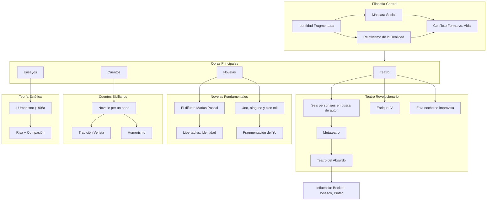
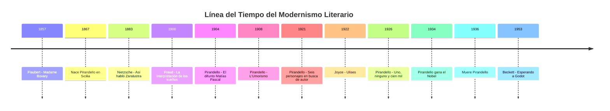

## Introducción

Imagina que un día te miras al espejo y descubres que la persona que ves no es quien tú creías ser. Tu esposa te dice que tienes la nariz un poco torcida —algo que nunca habías notado— y de repente te das cuenta de que todas las personas que conoces te ven de manera diferente a como tú te ves a ti mismo. ¿Quién eres realmente? ¿El que tú crees ser, o las cien mil versiones que los demás perciben de ti?

Esta es la pregunta fundamental que **Luigi Pirandello** (1867-1936) dedicó toda su vida a explorar. Pirandello fue un dramaturgo, novelista, poeta y cuentista italiano que revolucionó el teatro del siglo XX y ganó el **Premio Nobel de Literatura en 1934** por su "audaz e ingenioso renacimiento del arte dramático y escénico".

> **En una oración simple:** Pirandello fue un escritor italiano que descubrió que no tenemos una sola identidad, sino muchas, y que la "realidad" es solo una ilusión que cada persona construye de manera diferente.

### ¿Por qué existe y qué problema resuelve?

Antes de Pirandello, el teatro representaba la realidad como algo objetivo y los personajes como seres coherentes con identidades fijas. Pirandello destrozó estas convenciones mostrando que:

1. **La identidad es fluida** — no somos una sola persona, sino múltiples versiones de nosotros mismos
2. **La realidad es subjetiva** — cada persona vive en su propia versión de la realidad
3. **El teatro puede reflexionar sobre sí mismo** — los personajes pueden cuestionar si son "reales"

### Contexto histórico breve

Pirandello nació en una Sicilia recién unificada a Italia (1861), en una familia acomodada de comerciantes de azufre. Su vida estuvo marcada por:

- **La enfermedad mental de su esposa** María Antonietta, quien sufrió una crisis psicótica tras la ruina económica familiar
- **El desastre de las minas de azufre** (1903), que destruyó la fortuna familiar
- **La Primera Guerra Mundial**, donde su hijo fue capturado como prisionero
- **El auge del fascismo**, con el que mantuvo una relación ambigua

Estas experiencias personales alimentaron su visión pesimista pero profundamente humana de la existencia.

### ¿Qué vas a aprender en esta entrada?

Al terminar de leer, entenderás:

- La filosofía pirandelliana de la identidad y la máscara
- Sus obras teatrales revolucionarias y por qué cambiaron el teatro para siempre
- Sus novelas fundamentales sobre la crisis del yo
- El concepto de "umorismo" (humorismo) como visión del mundo
- Su influencia en el teatro del absurdo y la literatura moderna
- Las controversias sobre su relación con el fascismo

---

## Conceptos Fundamentales

### Vocabulario esencial pirandelliano

Antes de adentrarnos en Pirandello, necesitas conocer estos términos que él acuñó o redefinió:

| Término                  | Definición                                                       | Analogía                                                                                   |
| ------------------------ | ---------------------------------------------------------------- | ------------------------------------------------------------------------------------------ |
| **Máscara** (_maschera_) | La identidad artificial que adoptamos para funcionar en sociedad | Como las diferentes "versiones" que muestras en LinkedIn, con tus amigos, y con tu familia |
| **Forma** (_forma_)      | La estructura rígida que la sociedad impone sobre la vida fluida | Un río encauzado en un canal: pierde su naturaleza salvaje                                 |
| **Vida** (_vita_)        | El flujo caótico y auténtico de la existencia interior           | El agua en su estado natural, sin contención                                               |
| **Umorismo**             | Un tipo especial de humor que combina risa y compasión           | Reírte de alguien y al mismo tiempo sentir pena por él                                     |
| **Metateatro**           | Teatro que habla sobre el teatro mismo                           | Una película donde los personajes saben que están en una película                          |

### La analogía central: El teatro de la vida

> **Imagina la vida como un enorme teatro donde todos somos actores que han olvidado que están actuando.**

Cada día, cuando sales de casa, te pones una "máscara": eres el empleado competente, el hijo responsable, el amigo divertido. Pero ninguna de esas máscaras es _tú_ completo. Pirandello descubrió que:

1. **No hay un "tú verdadero"** detrás de las máscaras — o si lo hay, es inalcanzable
2. **Cada persona que te conoce** ve una máscara diferente
3. **Tú mismo no conoces** todas tus máscaras

Esta es la tragedia pirandelliana: estamos atrapados en personajes que no elegimos, interpretando roles que otros nos asignaron.

### Prerequisitos conceptuales

Para entender plenamente a Pirandello, ayuda conocer:

1. **El positivismo del siglo XIX** — la creencia de que la ciencia puede explicar todo (Pirandello lo critica)
2. **El verismo italiano** — literatura realista siciliana (Giovanni Verga) que influenció sus primeras obras
3. **La crisis de la modernidad** — el sentimiento de alienación y pérdida de certezas en el cambio de siglo
4. **Freud y el psicoanálisis** — la idea del inconsciente y la fragmentación del yo

---

## Mapa Conceptual: El Universo Pirandelliano

### ¿Cómo encaja Pirandello en el contexto más amplio?

Pirandello fue un puente entre:

- **El realismo del siglo XIX** (Verga, Zola)
- **El modernismo** (Joyce, Kafka)
- **El teatro del absurdo** (Beckett, Ionesco)

---

## Desarrollo Intermedio

### Subtema 1: La Vida de Pirandello — El Hombre Detrás de las Máscaras

#### Infancia siciliana (1867-1886)

Luigi Pirandello nació el 28 de junio de 1867 en **Girgenti** (hoy Agrigento), Sicilia, en una localidad llamada "Caos" — un nombre que él consideraría profético. Su padre, Stefano Pirandello, era un comerciante de azufre, y su madre, Caterina Ricci Gramitto, provenía de una familia de patriotas garibaldinos.

**Dato curioso #1:** El lugar de nacimiento de Pirandello se llamaba literalmente "Caos" (_Il Caos_ en italiano), y él lo consideraba una metáfora perfecta de la condición humana.

La Sicilia de su infancia era un mundo de:

- Estrictas jerarquías sociales
- Códigos de honor inflexibles
- Matrimonios arreglados
- Superstición mezclada con religión

Estas experiencias alimentarían sus críticas a las convenciones sociales.

#### Formación académica (1886-1891)

Pirandello estudió filología en:

1. **Universidad de Palermo** (brevemente)
2. **Universidad de Roma** (1887-1889)
3. **Universidad de Bonn, Alemania** (1889-1891)

En Bonn obtuvo su doctorado con una tesis sobre el **dialecto de Agrigento**. Esta formación filológica le dio una sensibilidad extraordinaria hacia el lenguaje y sus límites.

**Dato curioso #2:** En Bonn, Pirandello se enamoró de una joven alemana, Jenny Schulz-Lander, pero la relación terminó cuando él regresó a Italia. Este amor frustrado aparece transformado en varias de sus obras.

#### El matrimonio y la tragedia (1894-1919)

En 1894, Pirandello se casó con **María Antonietta Portulano** en un matrimonio arreglado por sus familias (ambas estaban en el negocio del azufre). Tuvieron tres hijos: Stefano, Lietta y Fausto.

El desastre llegó en **1903**: una inundación destruyó las minas de azufre familiares, arruinándolos económicamente. Este golpe provocó en María Antonietta una **crisis psicótica** que nunca superó. Durante casi 20 años, Pirandello cuidó de su esposa mientras ella sufría de:

- Celos patológicos extremos
- Paranoia persecutoria
- Episodios de violencia

> **La experiencia más formativa de la vida de Pirandello fue vivir con alguien cuya percepción de la realidad era completamente diferente a la suya, pero igual de "real" para ella.**

Esta convivencia con la locura le enseñó que:

1. La "realidad" es una construcción mental
2. La locura puede ser una forma de escape
3. El límite entre cordura y locura es arbitrario

En 1919, María Antonietta fue finalmente internada en un sanatorio, donde permanecería hasta su muerte en 1959.

#### El éxito tardío y el Nobel (1921-1936)

Aunque Pirandello había escrito cuentos y novelas desde los años 1890, su fama mundial llegó con el estreno de **"Seis personajes en busca de autor"** en 1921. El estreno en Roma fue un escándalo —parte del público abucheó mientras otros aplaudían— pero convirtió a Pirandello en una celebridad internacional.

En 1925 fundó el **Teatro d'Arte di Roma** con apoyo de Mussolini, y en 1934 recibió el **Premio Nobel de Literatura**.

Murió el 10 de diciembre de 1936 en Roma, dejando instrucciones específicas: quería un funeral sencillo, sin honores oficiales, y que sus cenizas fueran enterradas en Sicilia.

**Dato curioso #3:** Las instrucciones testamentarias de Pirandello pedían: "Carro de ínfima clase, para los pobres. Desnudo. Y que nadie me acompañe, ni parientes ni amigos. El carro, el caballo, el cochero y basta."

---

### Subtema 2: Las Obras Teatrales Revolucionarias

#### "Seis personajes en busca de autor" (1921)

Esta es la obra más famosa de Pirandello y posiblemente la más influyente del teatro del siglo XX.

**Argumento simplificado:**

Una compañía de teatro está ensayando una obra cuando, de repente, irrumpen seis figuras extrañas: un Padre, una Madre, una Hijastra, un Hijo, un Muchacho y una Niña. Afirman ser **personajes** de una obra que nunca fue terminada, abandonados por su autor, y piden a los actores que representen su drama para darles existencia.

El Director intenta organizar la representación, pero surgen problemas:

- Los personajes discuten sobre qué "realmente" pasó en su historia
- Los actores no pueden capturar la esencia de los personajes
- La línea entre ficción y realidad se disuelve

La obra termina en tragedia: la Niña se ahoga y el Muchacho se dispara, pero nadie sabe si "realmente" ocurrió o fue una representación.

**¿Por qué es revolucionaria?**

| Elemento tradicional                     | Innovación pirandelliana                |
| ---------------------------------------- | --------------------------------------- |
| Los personajes obedecen al autor         | Los personajes reclaman autonomía       |
| La ficción y realidad están separadas    | Se mezclan hasta ser indistinguibles    |
| El público observa pasivamente           | El público cuestiona qué es "real"      |
| La historia tiene una versión definitiva | Hay múltiples versiones contradictorias |

> **Analogía:** Es como si los personajes de una novela que estás escribiendo cobraran vida y te reclamaran: "¡No puedes dejarnos a medias! ¡Tenemos derecho a existir!"

**Cita clave del Padre:**

> "Un personaje, señor, siempre puede preguntar a un hombre quién es. Porque un personaje tiene realmente una vida suya, marcada con caracteres propios, por lo cual es siempre 'alguien'. Mientras que un hombre —no digo usted, sino un hombre en general— puede no ser 'nadie'."

---

#### "Enrique IV" (1922)

Considerada por muchos críticos como la obra maestra de Pirandello, más profunda incluso que "Seis personajes".

**Argumento:**

Un hombre rico, durante una cabalgata de disfraces hace 20 años, cayó del caballo y sufrió un golpe en la cabeza. Desde entonces, cree ser el emperador alemán Enrique IV del siglo XI. Su familia le construyó un castillo medieval con sirvientes que mantienen su ilusión.

El giro crucial: **12 años después de la caída, recuperó la cordura, pero decidió seguir fingiendo locura**. ¿Por qué? Porque dentro de su "locura" controlada, puede:

- Decir verdades que los "cuerdos" no pueden decir
- Escapar del paso del tiempo (para él, siempre es el siglo XI)
- Manipular a quienes lo rodean

La obra culmina cuando su ex-novia Matilda y su nuevo amante intentan "curarlo", provocando una tragedia.

**Temas centrales:**

1. **Locura como elección** — ¿Es más loco fingir cordura en un mundo absurdo?
2. **El tiempo congelado** — Enrique IV escapa del envejecimiento refugiándose en un pasado fijo
3. **La máscara que se convierte en rostro** — Después de 20 años, ¿queda algo del "verdadero" hombre?

**Dato curioso #4:** La obra está basada en un incidente real de la historia alemana: el emperador Enrique IV tuvo que caminar descalzo en la nieve hasta Canossa (1077) para pedir perdón al Papa Gregorio VII. Esta humillación histórica resuena con la humillación del protagonista que cayó del caballo.

---

#### "Esta noche se improvisa" (1930)

La tercera parte de la "trilogía del teatro en el teatro" (junto con "Seis personajes" y "Cada uno a su manera").

**Innovación clave:** Los actores "improvisan" siguiendo solo un esquema argumental, igual que en la **Commedia dell'Arte** del siglo XVI. Pero la improvisación revela conflictos entre:

- El Director (autoritario)
- Los actores (que quieren libertad)
- Los personajes (que reclaman su verdad)

**Dato curioso #5:** Pirandello escribió esta obra mientras dirigía su propia compañía teatral, y muchas de las tensiones entre Director y actores reflejan sus propias frustraciones reales.

---

### Subtema 3: Las Novelas de la Crisis del Yo

#### "El difunto Matías Pascal" (1904)

Esta novela cuenta la historia de Mattia Pascal, un bibliotecario infeliz atrapado en un matrimonio desastroso y una vida sin sentido. Un día, gana una fortuna en el casino de Montecarlo. Al regresar a casa, lee en el periódico que se ha suicidado —encontraron un cadáver que confundieron con él.

En lugar de aclarar el error, Mattia decide **"morirse"**: adopta una nueva identidad (Adriano Meis) y comienza una nueva vida.

**El problema:** Sin documentos legales, sin pasado, sin conexiones sociales, Mattia/Adriano descubre que su "libertad total" es una nueva prisión. No puede:

- Casarse (no tiene identidad legal)
- Denunciar un robo (no existe oficialmente)
- Hacer amigos verdaderos (todo es mentira)

Finalmente, "mata" a Adriano Meis (fingiendo otro suicidio) y regresa a su pueblo, solo para descubrir que su esposa se ha casado con otro y tiene un hijo. Mattia está legalmente muerto y no puede recuperar su antigua vida.

**Conclusión devastadora:** La novela termina con Mattia visitando su propia tumba y presentándose como "el difunto Matías Pascal".

**Tema central:** La paradoja de la identidad — creemos que nuestra identidad nos limita, pero sin ella, no somos nadie.

> **Analogía:** Es como borrar todas tus redes sociales, cambiar de ciudad, y empezar "de cero", solo para descubrir que sin historia, sin conexiones, sin pasado, eres un fantasma.

---

#### "Uno, ninguno y cien mil" (1926)

Esta es la novela más radical de Pirandello, escrita durante más de 15 años.

**Premisa inicial:** Vitangelo Moscarda, un hombre rico pero mediocre, un día escucha a su esposa comentar que tiene la nariz ligeramente torcida hacia la derecha. Él nunca lo había notado.

Esta observación trivial desencadena una crisis existencial total. Vitangelo se da cuenta de que:

- Él se ve de una manera
- Su esposa lo ve de otra
- Cada persona que lo conoce tiene una versión diferente de él
- Por lo tanto, él es **UNO** (el que cree ser), **CIEN MIL** (las versiones en las mentes de otros), y **NINGUNO** (porque no hay un "verdadero" Vitangelo).

**El desarrollo radical:**

Vitangelo intenta destruir todas las "máscaras" que otros le atribuyen. Para ello:

1. Desaloja a un inquilino pobre (destruyendo su imagen de "buen hombre")
2. Regala sus propiedades (destruyendo su identidad de "rico")
3. Provoca a su esposa hasta que lo abandona
4. Finalmente, se retira a un hospicio que él mismo donó

**Final místico:**

La novela termina con Vitangelo viviendo sin nombre, sin identidad fija, renaciendo a cada instante en comunión con la naturaleza:

> "Ningún nombre. Ningún recuerdo del nombre de ayer; del nombre de hoy, mañana. Si el nombre es la cosa; si un nombre es en nosotros el concepto de toda cosa puesta fuera de nosotros; y sin nombre no se tiene el concepto, y la cosa queda en nosotros como ciega, no distinta y no definida; pues bien, que este que espera en la calle, fuera de la cancela, se tome ese nombre que había estado inscrito en las tablas de un cementerio: se lo lleve y deje que yo muera en cada minuto, y renazca nuevo y sin recuerdos: vivo y completo, no en mí mismo, sino en todas las cosas fuera."

**Dato curioso #6:** Pirandello trabajó en esta novela desde 1909 hasta 1926. La publicó por entregas en una revista y no la terminó hasta que estuvo a punto de cumplir 60 años. Es su testamento filosófico.

---

### Subtema 4: El Ensayo Clave — "L'Umorismo" (1908)

Este ensayo es la piedra angular teórica de toda la obra de Pirandello. En él distingue entre lo **cómico** y el **umorismo** (humorismo).

#### La diferencia fundamental

**Lo cómico** es superficial: nos reímos de algo que percibimos como contrario a lo normal.

**El umorismo** es profundo: primero nos reímos, pero luego reflexionamos y sentimos compasión.

**El ejemplo famoso de Pirandello:**

> Imaginemos a una anciana con el rostro cubierto de maquillaje exagerado, vestida como una jovencita, con el pelo teñido.

- **Reacción cómica:** Nos reímos de lo ridículo de la situación
- **Reacción humorística:** Reflexionamos: ¿Por qué se viste así? Quizás su marido es mucho más joven y ella tiene terror a perderlo. Quizás ella misma odia verse así, pero siente que no tiene alternativa.

El **"sentimiento de lo contrario"** (_il sentimento del contrario_) transforma la risa en comprensión. El humorismo pirandelliano es tragicómico: reconoce el absurdo de la vida, pero con compasión por quienes lo sufren.

#### La "linterna" de Pirandello

En el ensayo, Pirandello usa la metáfora de la linterna: cada ser humano lleva una pequeña linterna que ilumina solo una porción diminuta de la oscuridad que lo rodea. Creemos que nuestra luz ilumina "la realidad", pero solo vemos una fracción subjetiva.

> "Cada uno de nosotros tiene un pequeño farol lacrimoso que proyecta en torno a cada uno de nosotros un círculo más o menos amplio de luz, más allá del cual está la oscuridad negra."

Esta metáfora explica por qué:

- Nadie puede conocer la "verdad completa"
- Los malentendidos son inevitables
- El conflicto entre "realidades" es trágico

---

## Aspectos Avanzados

### La filosofía pirandelliana en profundidad

#### Relativismo ontológico

Pirandello no es un relativista moral simple ("todo vale"). Su relativismo es **ontológico**: cuestiona la existencia misma de una realidad objetiva compartida.

**Tres niveles de relativismo en Pirandello:**

| Nivel          | Pregunta                       | Respuesta pirandelliana |
| -------------- | ------------------------------ | ----------------------- |
| Epistemológico | ¿Podemos conocer la realidad?  | No completamente        |
| Ontológico     | ¿Existe una realidad objetiva? | Posiblemente no         |
| Identitario    | ¿Existe un "yo" coherente?     | Definitivamente no      |

#### El conflicto Forma vs. Vida

La dicotomía central de Pirandello:

- **Vida** (_la vita_): Flujo caótico, irracional, cambiante — la experiencia inmediata de existir
- **Forma** (_la forma_): Estructuras sociales, identidades fijas, convenciones — lo que congela la vida

La tragedia humana es que necesitamos la Forma para vivir en sociedad, pero la Forma mata la Vida. Cada vez que "definimos" a alguien ("eres un abogado", "eres mi esposo"), lo aprisionamos en una forma rígida.

> **Analogía:** Piensa en el agua (vida) y el hielo (forma). El hielo tiene forma definida, pero está "muerto" comparado con el agua fluyendo. Cuando el agua se congela, pierde su esencia.

#### La influencia de Bergson

Henri Bergson, filósofo francés, influyó profundamente en Pirandello con su concepto de **élan vital** — el impulso vital que subyace a toda existencia. Bergson distinguía entre:

- **Tiempo medido** (el reloj): artificial, mecánico
- **Duración** (_durée_): la experiencia subjetiva del tiempo fluyendo

Pirandello adoptó esta distinción: sus personajes sufren cuando el "tiempo social" (forma) contradice su duración interna (vida).

### El debate con Benedetto Croce

El ensayo "L'Umorismo" provocó una polémica famosa con **Benedetto Croce**, el filósofo italiano más influyente de la época.

**Croce** defendía que el arte es expresión pura de intuición, sin necesidad de teorías. Criticó a Pirandello por "intelectualizar" el arte con categorías como "umorismo".

**Pirandello** respondió que el arte reflexivo no es inferior al arte intuitivo — de hecho, el humorismo requiere tanto intuición como reflexión.

Este debate refleja una tensión permanente en la obra de Pirandello: ¿Es un artista instintivo o un filósofo disfrazado de artista?

> **Conexión con el Jardín:** Ver la entrada sobre [Benedetto Croce](/humanidades/filosofia-benedetto-croce/) para una exploración profunda de su estética y su debate con Pirandello.

### La relación compleja con el fascismo

Este es el aspecto más controvertido de la vida de Pirandello, y requiere matices.

**Los hechos:**

- En **1924**, tras el asesinato del diputado socialista Giacomo Matteotti por escuadrones fascistas, Pirandello se unió públicamente al Partido Nacional Fascista
- Escribió a Mussolini: "Soy fascista porque soy italiano"
- En **1925**, Mussolini financió el Teatro d'Arte de Pirandello
- En **1927**, rompió su carné del partido en un gesto de protesta (por razones poco claras)
- Estuvo vigilado por la policía secreta fascista (OVRA) el resto de su vida
- En **1935**, donó su medalla del Nobel para la campaña "Oro a la Patria" que financió la invasión de Etiopía

**Interpretaciones:**

1. **Oportunismo pragmático:** Pirandello necesitaba apoyo financiero para su teatro y lo buscó donde lo había
2. **Nacionalismo cultural:** Esperaba que el fascismo promoviera la cultura italiana internacionalmente
3. **Protesta personal:** Sus obras de los años 30 son cada vez más pesimistas y pueden leerse como críticas veladas
4. **Ambigüedad genuina:** Pirandello era genuinamente ambivalente sobre el poder y la política

**Lo que sus obras sugieren:**

Las obras de Pirandello casi nunca son políticas directamente. Sin embargo, su visión de:

- La relatividad de la verdad
- La manipulación de las apariencias
- El poder de las máscaras

...puede interpretarse como compatible con el fascismo (crear realidades alternativas) o como su crítica (desenmascarar el poder).

**Dato curioso #7:** En los últimos años de su vida, Pirandello mostró cada vez más escepticismo hacia el régimen. Cuando le preguntaban por su afiliación fascista, a veces respondía: "Eso ya no me interesa."

---

## Curiosidades y Datos Poco Conocidos

### 1. El nombre profético

Pirandello nació en una localidad llamada **"Caos"** (contrata rural de Girgenti). Él consideraba que este nombre resumía perfectamente su filosofía: la vida humana es un caos al que intentamos imponer orden artificial.

### 2. El duelo que casi fue

En su juventud en Alemania, Pirandello casi se batió en duelo con un estudiante alemán por un desacuerdo sobre política. Solo la intervención de amigos comunes lo evitó.

### 3. Las 15 novelas del año

Pirandello planeó escribir 365 cuentos —uno para cada día del año— en su colección "Novelle per un anno". Aunque no lo completó (escribió unos 250), produjo una de las colecciones de cuentos más impresionantes de la literatura italiana.

### 4. El "robo" del premio

Cuando Pirandello ganó el Nobel en 1934, donó la medalla al gobierno fascista para fundirla por su oro. Sin embargo, existe una leyenda (no confirmada) de que fue robada antes de ser fundida.

### 5. La relación secreta

En sus últimos años, Pirandello mantuvo una relación intensa (platónica o no) con la actriz **Marta Abba**, 30 años menor. Le escribió cientos de cartas y creó varios papeles específicamente para ella. Esta relación fue fuente de escándalo y fascinación.

### 6. El funeral minimalista

Sus instrucciones testamentarias pedían un funeral de "ínfima clase", sin honores, sin acompañamiento, solo "el carro, el caballo, el cochero y basta". No quería ni flores ni discursos. Sus cenizas fueron esparcidas en Sicilia.

### 7. El término "pirandelliano"

El adjetivo **"pirandelliano"** ha entrado en varios idiomas para describir situaciones absurdas, paradójicas o irresolubles donde la identidad y la realidad son cuestionadas. Es uno de los pocos escritores cuyo nombre se ha convertido en adjetivo de uso común.

### 8. La profecía de la televisión

En 1928, Pirandello escribió una obra llamada "Questa sera si recita a soggetto" donde hay escenas que se desarrollan en múltiples lugares simultáneamente, con una estructura que anticipa la narrativa televisiva de décadas después.

---

## Conexiones con Otros Temas

### Con la filosofía existencialista

Pirandello anticipó muchas ideas del existencialismo:

| Concepto         | En Pirandello                                                   | En Sartre/Camus                                  |
| ---------------- | --------------------------------------------------------------- | ------------------------------------------------ |
| Libertad radical | El difunto Matías Pascal descubre la carga de la libertad total | "Estamos condenados a ser libres" (Sartre)       |
| Absurdo          | La vida no tiene sentido inherente                              | El mito de Sísifo (Camus)                        |
| Mala fe          | Las máscaras sociales como autoengaño                           | La mala fe como negación de la libertad (Sartre) |
| El otro          | Somos definidos por la mirada ajena                             | "El infierno son los otros" (Sartre)             |

**Influencia directa:** Sartre conocía y citaba a Pirandello. Su obra teatral "A puerta cerrada" tiene claras resonancias pirandellianas.

### Con el teatro del absurdo

Pirandello es considerado el **padre del teatro del absurdo**, aunque ese movimiento floreció después de su muerte.

| Autor          | Obra influenciada por Pirandello                                                 |
| -------------- | -------------------------------------------------------------------------------- |
| Samuel Beckett | Esperando a Godot (personajes esperando un sentido que nunca llega)              |
| Eugène Ionesco | La cantante calva (ruptura de la comunicación significativa)                     |
| Harold Pinter  | La habitación (ambigüedad de la identidad y amenaza)                             |
| Tom Stoppard   | Rosencrantz y Guildenstern han muerto (personajes conscientes de ser personajes) |

### Con la psicología

Pirandello y Freud fueron contemporáneos, y hay paralelos notables:

- **Fragmentación del yo:** Pirandello muestra personajes fragmentados; Freud teoriza el yo, el ello y el superyó
- **El inconsciente:** Las máscaras pirandellianas ocultan impulsos que el personaje desconoce
- **Represión:** Los personajes de Pirandello sufren por lo que no pueden expresar

Sin embargo, Pirandello desconfiaba de las explicaciones "científicas" de la psique. Para él, el misterio del yo era irreducible.

### Con el arte contemporáneo

Las ideas de Pirandello resuenan en:

- **Cine:** "Synecdoche, New York" de Charlie Kaufman (un director construye una réplica de Nueva York dentro de su obra)
- **Series de TV:** "WandaVision" (personajes que descubren que viven en una ficción)
- **Videojuegos:** "The Stanley Parable" (el jugador cuestiona su agencia)
- **Redes sociales:** La gestión de "múltiples identidades" online es esencialmente pirandelliana

---

## Resumen: Puntos Clave

### La esencia de Pirandello en 10 puntos

| #   | Punto clave                                                                        |
| --- | ---------------------------------------------------------------------------------- |
| 1   | **Identidad fragmentada:** No somos una persona, sino muchas según quién nos mire  |
| 2   | **Máscaras sociales:** Todos actuamos roles que otros nos asignaron                |
| 3   | **Relativismo de la realidad:** No hay una "verdad objetiva", solo perspectivas    |
| 4   | **Conflicto Forma vs. Vida:** La sociedad congela la vida fluida en formas rígidas |
| 5   | **Metateatro:** El teatro puede reflexionar sobre sí mismo y cuestionar la ficción |
| 6   | **Humorismo:** Combinar risa con compasión, ver lo tragicómico de la existencia    |
| 7   | **Libertad como carga:** La libertad total es tan opresiva como la prisión         |
| 8   | **Locura como elección:** A veces, la "locura" es más cuerda que la "cordura"      |
| 9   | **Influencia enorme:** Padre del teatro del absurdo, precursor del existencialismo |
| 10  | **Contradicciones personales:** Fascista y disidente, tradicional y revolucionario |

### Checklist de comprensión

Después de leer esta entrada, deberías poder:

- [ ] Explicar qué es una "máscara" en términos pirandellianos
- [ ] Resumir el argumento de "Seis personajes en busca de autor"
- [ ] Distinguir entre lo "cómico" y el "umorismo"
- [ ] Explicar la paradoja de libertad en "El difunto Matías Pascal"
- [ ] Interpretar el título "Uno, ninguno y cien mil"
- [ ] Conectar a Pirandello con el teatro del absurdo
- [ ] Discutir críticamente su relación con el fascismo
- [ ] Aplicar conceptos pirandellianos a situaciones contemporáneas (redes sociales, identidad digital)

---

## Recursos para Profundizar

### Para principiantes

**Lecturas:**

- _El difunto Matías Pascal_ — La novela más accesible y entretenida
- _Seis personajes en busca de autor_ — La obra teatral esencial, corta y potente
- Cuentos seleccionados de _Novelle per un anno_ — Empezar con "El tren ha silbado" (_Il treno ha fischiato_)

**Audiovisuales:**

- Adaptaciones cinematográficas de "Seis personajes" (varias versiones)
- Documentales sobre el teatro italiano del siglo XX

### Para nivel intermedio

**Lecturas:**

- _Uno, ninguno y cien mil_ — Más filosófica y desafiante
- _Enrique IV_ — Su obra teatral más profunda
- _L'Umorismo_ — El ensayo teórico fundamental

**Estudios críticos:**

- Giovanni Macchia, _Pirandello o la stanza della tortura_
- Claudio Vicentini, _Pirandello: il disagio del teatro_

### Para nivel avanzado

**Obras completas:**

- _Maschere nude_ — Colección completa de teatro
- _Tutti i romanzi_ — Todas las novelas
- Correspondencia con Marta Abba

**Estudios académicos:**

- Gaspare Giudice, _Pirandello: A Biography_ — La biografía definitiva
- Anne Paolucci, _Pirandello's Theater: The Recovery of the Modern Stage_
- Estudios comparativos con Beckett, Ionesco, y el teatro postmoderno

**Contexto histórico:**

- Ruth Ben-Ghiat, _Fascist Modernities: Italy 1922-1945_
- Para entender el contexto político de su adhesión al fascismo

---

## Glosario Final

| Término                | Definición                                                                       |
| ---------------------- | -------------------------------------------------------------------------------- |
| **Commedia dell'Arte** | Forma teatral italiana del siglo XVI con personajes enmascarados e improvisación |
| **Forma**              | Estructura rígida que la sociedad impone sobre la vida fluida                    |
| **Máscara**            | Identidad artificial que adoptamos en contextos sociales                         |
| **Metateatro**         | Teatro que reflexiona sobre su propia naturaleza teatral                         |
| **Mise en abyme**      | Estructura de espejo: una obra dentro de otra obra                               |
| **Umorismo**           | Humor reflexivo que combina risa y compasión                                     |
| **Verismo**            | Movimiento literario italiano de realismo social (fines del s. XIX)              |
| **Vita**               | La vida como flujo caótico y auténtico, opuesta a la Forma                       |

---

## Reflexión Final

Luigi Pirandello nos dejó una pregunta que sigue siendo incómoda: _¿Quién eres realmente?_

En una era de redes sociales donde cultivamos múltiples identidades, de realidad virtual donde creamos avatares, de "fake news" donde la verdad es cada vez más escurridiza, Pirandello parece más contemporáneo que nunca.

Quizás su lección más profunda no es que la identidad es imposible, sino que debemos abrazar la incomodidad de no conocernos completamente. En lugar de aferrarnos a máscaras rígidas, podemos reconocer nuestra naturaleza fluida.

Como escribió al final de _Uno, ninguno y cien mil_:

> "Morir cada instante, y renacer nuevo y sin recuerdos: vivo y completo, no en mí mismo, sino en todas las cosas fuera."

Pirandello nos invita a dejar de buscar un "yo verdadero" fijo y, en cambio, fluir con la vida misma.
