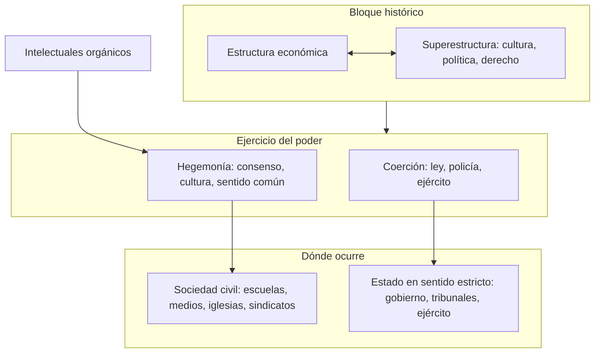

## Introducción

**Antonio Gramsci** (1891-1937) fue un pensador y político italiano que respondió a una pregunta que el marxismo clásico había dejado a medias: *¿por qué la clase obrera a veces acepta un orden que la perjudica, en lugar de rebelarse?* Su respuesta —que el poder no se sostiene solo con policía y ejército, sino sobre todo con ideas, cultura y consenso— cambió la manera de entender la política y la dominación en el siglo XX.

En una frase: **Gramsci es el teórico que explicó por qué "lo que la gente da por sentado" es tan importante como las leyes o la fuerza para mantener (o cambiar) el poder.**

Escribió su obra más importante —los *Cuadernos de la cárcel*— entre rejas, bajo el fascismo de Mussolini, con la salud quebrada y sin poder citar abiertamente a Marx. Ese contexto (Italia, cárcel, fascismo) marca cada página: no es teoría abstracta, sino pensamiento escrito contra la opresión y a favor de una transformación cultural y política.

En esta entrada verás: qué es la **hegemonía** y por qué importa; quiénes son los **intelectuales orgánicos**; qué son el **bloque histórico** y la distinción **sociedad civil / Estado**; y cómo todo esto se conecta con la estrategia política (guerra de posiciones vs. guerra de maniobra). También incluye contexto histórico, curiosidades, críticas y recursos para seguir leyendo.

---

## Conceptos fundamentales

Antes de entrar en detalle, conviene tener claros unos pocos términos que Gramsci usa de forma muy precisa.

### Vocabulario esencial

| Término | Significado en una línea |
|--------|---------------------------|
| **Hegemonía** | Dominación que se apoya en el **consenso** (ideas, cultura, “sentido común”) además de la coerción. |
| **Intelectual orgánico** | Pensador o mediador que surge de un grupo social y le da coherencia ideológica y organizativa. |
| **Bloque histórico** | Unidad entre base económica y cultura/política: una clase no domina solo con dinero, sino con una visión del mundo. |
| **Sociedad civil** | Ámbito de iglesias, escuelas, medios, sindicatos, asociaciones: donde se forma el “sentido común”. |
| **Estado (en sentido amplio)** | No solo gobierno y leyes, sino Estado + sociedad civil: el conjunto del poder político y cultural. |
| **Guerra de posiciones** | Estrategia de conquista cultural e institucional lenta (trincheras, hegemonía) en lugar del asalto frontal. |

### Una analogía para la hegemonía

Imagina un colegio donde una pandilla no es la más fuerte a puñetazos, pero todo el mundo repite sus bromas, viste como ellos y quiere sentarse con ellos. Nadie “obedece” por ley; simplemente **lo normal** es lo que esa pandilla define. Eso, a gran escala, es hegemonía: el poder de hacer que ciertas ideas y valores se vivan como naturales, de modo que la gente no sienta que “la están dominando” —solo que “así son las cosas”.

Gramsci diría: el capitalismo (o cualquier orden dominante) se mantiene no solo porque hay policía y jueces, sino porque **el sentido común** —lo que se enseña, lo que se ve en la tele, lo que “todo el mundo sabe”— hace que ese orden parezca razonable o inevitable. Romper esa hegemonía es tanto o más importante que ganar una revuelta en la calle.

---

## Vida y contexto histórico

Para leer a Gramsci con provecho hay que situarlo en su tiempo: Italia de entreguerras, ascenso del fascismo y años de cárcel.

### Infancia y formación (1891–1910)

Nació en **Ales, Cerdeña**, en 1891, en una familia pobre. Su padre fue encarcelado por presuntas irregularidades administrativas, lo que hundió a la familia en la miseria. De pequeño sufrió una caída (o tuberculosis ósea, según versiones) que le dejó la columna deformada y una salud frágil de por vida; su estatura quedó por debajo del metro y medio.

A pesar de eso, destacó en los estudios. Con una beca llegó a **Turín** en 1911 y se matriculó en Filología. Ahí entró en contacto con el movimiento obrero y el socialismo; dejó la universidad sin titularse para dedicarse al periodismo y la política.

### Turín, L’Ordine Nuovo y el PCI (1919–1926)

En **Turín** vivió el auge de los consejos obreros (1919–1920): fábricas ocupadas, huelgas masivas, experiencia de poder desde abajo. Junto a Palmiro Togliatti y otros fundó **L’Ordine Nuovo** (“El orden nuevo”), un periódico y un grupo que defendían que los consejos obreros podían ser el embrión de un nuevo Estado.

En **1921** participó en la escisión del Partido Socialista que dio lugar al **Partido Comunista de Italia (PCI)**. En **1924** fue elegido diputado. En el PCI defendió una línea que combinaba lucha obrera y trabajo cultural: no bastaba con esperar la “crisis final” del capitalismo; había que ganar influencia en la sociedad civil (escuelas, prensa, cultura).

### Cárcel y muerte (1926–1937)

Tras la marcha sobre Roma y la consolidación del fascismo, **Mussolini** cerró el margen legal. En **1926** Gramsci fue detenido a pesar de su inmunidad parlamentaria. El fiscal fascista dijo: *“Hay que impedir que este cerebro siga pensando durante veinte años.”*

Fue condenado por un **Tribunal Especial** a más de 20 años de reclusión. Pasó por varias prisiones (Turín, Bari, etc.) en condiciones muy duras. Su salud se hundió: insomnio, hemorragias, tuberculosis. En **1937**, ya en libertad condicional por enfermedad, murió en Roma, poco después de salir de la cárcel.

En esos años (1929–1935) redactó en cuadernos personales la obra que hoy conocemos como **Cuadernos de la cárcel**: miles de páginas de notas sobre historia, cultura, política y filosofía, escritas con lenguaje a veces cifrado para sortear la censura. Esa es la base de todos sus conceptos famosos (hegemonía, intelectual orgánico, bloque histórico, etc.).

---

## Mapa conceptual: cómo encajan las piezas

En Gramsci, dominación económica, cultura y Estado no están separados: se articulan en un **bloque histórico** y se ejercen mediante **hegemonía** (consenso) y **coerción** (ley, fuerza). Los **intelectuales orgánicos** son los que construyen y mantienen esa hegemonía en la **sociedad civil**; el **Estado** (en sentido amplio) incluye tanto la coerción como esa trama cultural. La estrategia para transformar el poder puede ser **guerra de maniobra** (asalto) o **guerra de posiciones** (conquista lenta de instituciones y cultura).

---

## Desarrollo intermedio: los conceptos clave

### Hegemonía

En el marxismo más clásico, la dominación se explicaba sobre todo por la **economía**: quien controla los medios de producción controla el Estado y las ideas. Gramsci no niega eso, pero añade: **la clase dominante también “dirige” mediante ideas, valores y cultura.** Cuando esa dirección se acepta como algo normal, estamos ante **hegemonía**.

- **Hegemonía** = dirección intelectual y moral sobre el conjunto de la sociedad, de modo que las visiones del mundo del grupo dominante se viven como **sentido común** (lo que “todo el mundo sabe” o “es lógico”).
- No es solo propaganda: incluye educación, medios, religión, arte, lenguaje. Lo que se enseña, lo que se premia y lo que se ridiculiza construye hegemonía.
- Para Gramsci, en Occidente (donde la sociedad civil es densa) la hegemonía es más decisiva que en sociedades donde el poder se sostiene sobre todo por la fuerza. Por eso la revolución no puede ser solo un golpe: hay que **disputar antes** la cultura y el sentido común.

**Ejemplo concreto:** Si en una sociedad se asume que “el que no trabaja no come”, “el mérito lo decide todo” o “los mercados se autorregulan”, esas ideas no son neutras: favorecen un orden determinado. La hegemonía consiste en que esas creencias se vivan como obvias, no como opciones políticas.

### Intelectual orgánico

Gramsci distingue entre:

- **Intelectuales “tradicionales”**: clérigos, profesores, escritores que se perciben a sí mismos como por encima de las clases y herederos de una cultura “universal”.
- **Intelectuales orgánicos**: los que **surgen de** y **representan** a un grupo social (clase, movimiento, partido). Les dan homogeneidad ideológica, organizan, traducen las experiencias del grupo en discurso y estrategia.

Todo grupo que aspira a poder —incluida la clase obrera— necesita sus intelectuales orgánicos: periodistas, maestros, dirigentes sindicales, artistas que construyan su visión del mundo y la difundan. La burguesía ya tiene los suyos (en medios, universidades, think tanks). La pregunta gramsciana es: **¿cómo formar intelectuales orgánicos del subordinado para disputar la hegemonía?**

### Bloque histórico

El **bloque histórico** es la unidad entre **estructura** (economía, relaciones de producción) y **superestructura** (derecho, política, cultura, ideología). Gramsci rechaza el determinismo económico: no basta con que existan condiciones “objetivas”; hace falta una **concepción del mundo** que una a las clases subordinadas y las movilice. Ese bloque no es estático: se construye, se mantiene o se rompe en la lucha política y cultural.

En un bloque hegemónico, la clase dominante no solo impone su economía, sino que **articula** intereses de otros grupos (campesinos, capas medias) en una alianza que da estabilidad. Cuando esa articulación se resquebraja (crisis, guerra, pérdida de credibilidad), se abre la posibilidad de un **bloque alternativo** y de un nuevo proyecto hegemónico.

### Sociedad civil y Estado

Gramsci separa:

- **Sociedad civil**: el conjunto de organismos “privados” que forman conciencia y cultura: iglesias, escuelas, prensa, editoriales, sindicatos, asociaciones, partidos. Ahí se forma el “sentido común” y se reproduce (o se cuestiona) la hegemonía.
- **Sociedad política / Estado (en sentido estricto)**: gobierno, administración, tribunales, ejército, policía. Ahí opera la **coerción** directa.

En las sociedades occidentales, la sociedad civil es espesa: muchas instituciones intervienen en la formación de las ideas. Por eso el Estado no es solo “comité de los ricos”: es **Estado en sentido amplio = sociedad política + sociedad civil**. Quien quiera transformar el poder debe actuar en ambos planos: no solo tomar el palacio, sino **ganar antes** escuelas, medios y calles (hegemonía).

### Guerra de posiciones y guerra de maniobra

Gramsci toma una metáfora militar:

- **Guerra de maniobra**: asalto frontal, toma del poder central (como en la Rusia de 1917, donde la sociedad civil era débil).
- **Guerra de posiciones**: lucha prolongada por **trincheras** —instituciones, cultura, consenso—. En Occidente, dice Gramsci, la sociedad civil es como una cadena de fortalezas; no basta un asalto, hay que conquistar posición a posición.

La **revolución permanente** (avanzar sin parar) puede funcionar donde el Estado es todo y la sociedad civil casi nada. Donde la sociedad civil es fuerte, hace falta una estrategia de **guerra de posiciones**: construir hegemonía, ganar espacios, formar intelectuales orgánicos, y solo entonces el momento del “asalto” puede tener base sólida. Esta idea influyó en partidos comunistas occidentales (eurocomunismo) y en movimientos que priorizan el trabajo cultural y electoral.

---

## Aspectos más avanzados: Cuadernos de la cárcel y Estado ampliado

### Los Cuadernos de la cárcel

Entre **1929 y 1935** Gramsci llenó **33 cuadernos** (unas 2.848 páginas) de apuntes. No son un libro pensado para publicar: son notas, a veces fragmentarias, a veces repetidas, con referencias veladas para evitar la censura. Temas recurrentes: historia de Italia, papel de los intelectuales, folklore, educación, americanismo y fordismo, Maquiavelo, Estado, hegemonía.

- La **primera edición** la preparó **Palmiro Togliatti** en Moscú (desde 1938), reagrupando los textos por temas y con un sesgo que servía a la línea del PCI y a la ortodoxia soviética.
- La **edición crítica** de **Valentino Gerratana** (1975) respeta el orden cronológico y el carácter de “cuadernos”, y permitió releer a Gramsci con menos filtros políticos. Hoy es la referencia para el estudio serio.

En los Cuadernos aparecen expresiones que luego se hicieron famosas: “pesimismo del intelecto, optimismo de la voluntad” (frase que Gramsci tomó y reformuló); “Estado = sociedad política + sociedad civil, es decir, hegemonía acorazada de coerción”; y la idea del **príncipe moderno** (el partido) como instrumento de construcción de una nueva hegemonía.

### Estado ampliado y “hegemonía acorazada de coerción”

Para Gramsci, el **Estado** no se reduce al gobierno: incluye todo el entramado donde se ejerce el poder, incluida la sociedad civil. Por eso habla de **Estado ampliado**: coerción (ley, fuerza) + hegemonía (escuelas, medios, iglesias). La dominación estable es la que logra que la coerción aparezca como respaldo de un orden que la mayoría ya acepta en su cabeza. Eso es “hegemonía acorazada de coerción”: consenso primero, fuerza como refuerzo.

---

## Curiosidades y datos poco conocidos

1. **“Impedir que este cerebro piense veinte años”**: El fiscal fascista Michele Isgrò no pidió la muerte de Gramsci, sino una condena larga precisamente para “impedir que este cerebro siga pensando durante veinte años”. Gramsci convirtió la cárcel en taller: los Cuadernos son la prueba de que no lo consiguieron.

2. **Piero Sraffa y los cuadernos**: El economista **Piero Sraffa** (amigo de Gramsci desde Turín) le envió papel, lápices y libros a la cárcel y mantuvo el contacto con el exterior. Sin esa red de apoyo, los Cuadernos no habrían existido en la forma que conocemos.

3. **“Pesimismo del intelecto, optimismo de la voluntad”**: La fórmula la popularizó Gramsci en *L’Ordine Nuovo*, pero él la atribuía a **Romain Rolland**. En los Cuadernos matiza: no se trata de optimismo ciego, sino de “entusiasmo acompañado por una voluntad inteligente” y “iniciativas concretas”. Es decir: ver la realidad con frialdad y aun así actuar con determinación.

4. **Edición de Togliatti**: La primera publicación de los Cuadernos fue hecha por **Palmiro Togliatti** en la URSS, reagrupando los fragmentos por temas y con cortes y énfasis que servían a la línea del PCI estalinista. Solo la edición crítica de Gerratana (1975) permitió leer a Gramsci sin ese corsé, y desde entonces se multiplicaron las interpretaciones (eurocomunistas, posmarxistas, populistas, etc.).

5. **Gramsci y la cárcel como “laboratorio”**: Gramsci no pudo citar abiertamente a Marx ni a Lenin por la censura. Por eso usa eufemismos (“filósofo de la praxis” por Marx), referencias a Maquiavelo o a la historia de Italia para hablar de estrategia, y un estilo a veces críptico. Leer los Cuadernos exige tener en cuenta ese contexto de escritura.

6. **Influencia fuera de Italia**: Su impacto creció sobre todo a partir de los 70, y hoy es más citado en ciencias sociales y teoría política en el mundo anglosajón y en América Latina que en Italia. Conceptos como “hegemonía” y “intelectual orgánico” se usan (a veces de forma muy alejada de Gramsci) en estudios culturales, comunicación y análisis de discurso.

---

## Conexiones con otros temas

- **Marx y Lenin**: Gramsci es marxista, pero da un peso enorme a la **superestructura** (cultura, ideología) y al **consenso**, no solo a la economía y la violencia. Con Lenin comparte el foco en la organización (partido, intelectuales), pero insiste en la conquista cultural previa en Occidente.
- **Maquiavelo**: Gramsci relee *El príncipe*: el “príncipe moderno” sería el partido revolucionario que unifica voluntades y construye hegemonía. La política como arte de lo posible y de la construcción de consenso.
- **Estudios culturales y comunicación**: La idea de hegemonía cultural se usa para analizar medios, educación, publicidad y redes: cómo se naturalizan ciertos valores y se margina a otros.
- **Populismo y posmarxismo**: **Ernesto Laclau** y **Chantal Mouffe** (en *Hegemonía y estrategia socialista*) toman de Gramsci la noción de hegemonía y la desvinculan del sujeto “clase obrera”, hablando de articulación de demandas y identidades. Es una lectura muy discutida entre los gramscianos “clásicos”.
- **Foucault y el poder**: Aunque Foucault evita el concepto de hegemonía, la idea de que el poder se ejerce mediante saberes, normas y prácticas (no solo leyes y represión) tiene puntos de contacto con la sociedad civil y la cultura en Gramsci.

---

## Perspectiva crítica

- **Uso y abuso del término “hegemonía”**: Se ha convertido en comodín (“hegemonía neoliberal”, “hegemonía cultural”). Conviene no perder de vista que en Gramsci hegemonía implica **dirección de un bloque social** (alianza de clases/grupos) y **consenso activo**, no solo “dominación ideológica” en abstracto.

- **¿Gramsci “reformista”?**: Algunas lecturas (eurocomunismo, socialdemocracia) lo presentan como teórico del cambio gradual y del consenso. Otras subrayan que para Gramsci la hegemonía es un **momento** de la lucha de clases y que la coerción sigue siendo parte del Estado; no renuncia a la revolución, sino que la piensa de otro modo en Occidente.

- **Determinismo vs. agencia**: Gramsci intenta superar el economicismo sin caer en “todo es cultura”. La tensión entre estructura económica y lucha cultural sigue dando pie a debates: ¿hasta qué punto la hegemonía puede cambiar el orden sin tocar la propiedad y el Estado?

- **Filología**: La edición de Gerratana y los estudios posteriores han corregido interpretaciones que se apoyaban en la edición de Togliatti. Cualquier afirmación fuerte sobre “lo que Gramsci dijo” debe contrastarse con los textos en su contexto.

---

## Resumen y puntos clave

| Concepto | Qué recordar |
|----------|----------------|
| **Hegemonía** | Poder que se apoya en consenso y cultura (“sentido común”), no solo en coerción. |
| **Intelectual orgánico** | El que surge de un grupo social y le da coherencia ideológica y organizativa. |
| **Bloque histórico** | Unidad entre base económica y superestructura; una clase domina articulando cultura y alianzas. |
| **Sociedad civil** | Donde se forma el sentido común (escuelas, medios, iglesias, etc.); escenario de la hegemonía. |
| **Estado ampliado** | Estado en sentido estricto + sociedad civil; hegemonía + coerción. |
| **Guerra de posiciones** | Estrategia de conquista lenta de instituciones y cultura, no solo asalto al poder central. |

**Cinco ideas para llevarse:**

1. El poder no se sostiene solo con fuerza; se sostiene cuando la gente **asume** las ideas del dominador como normales.
2. Esas ideas se construyen en la **sociedad civil** (educación, medios, religión, etc.).
3. Cada grupo que aspira a cambiar el orden necesita sus **intelectuales orgánicos** para disputar esa cultura.
4. En sociedades con sociedad civil densa, la estrategia relevante es **guerra de posiciones**: ganar trincheras antes del asalto.
5. Los *Cuadernos de la cárcel* son la fuente principal; fueron escritos en condiciones extremas y su recepción dependió de ediciones y contextos políticos muy distintos.

---

## Ejemplos aplicados y autoevaluación

### Tres ejemplos de hegemonía en la vida cotidiana

1. **“El que no estudia no llega a nada”**: Si en una sociedad se repite que el éxito depende solo del esfuerzo individual, se oculta que el acceso a la educación y al empleo depende de clase, raza o territorio. Esa idea beneficia al orden existente porque hace que el fracaso se viva como culpa personal, no como resultado de estructuras. Hegemonía = esa creencia vivida como “sentido común”.

2. **“Los políticos son todos iguales”**: Cuando se generaliza que la política es corrupta y que votar no cambia nada, se desmoviliza. Quien se beneficia de que la gente no participe puede reforzar esa idea en medios y conversaciones. De nuevo: no es una ley, es una forma de ver el mundo que se instala como normal.

3. **Naturalizar el trabajo precario**: Si se acepta que “los jóvenes tienen que hacer mil curros antes de estabilizarse” o que “así es el mercado”, se normaliza la precariedad. Gramsci diría: la hegemonía hace que esa situación se viva como inevitable en lugar de como resultado de decisiones políticas y económicas que podrían ser otras.

### Preguntas de autoevaluación

- **P1.** ¿Por qué, según Gramsci, en Occidente no basta con “tomar el palacio” para hacer una revolución?  
  *Pista: piensa en sociedad civil y guerra de posiciones.*

- **P2.** Un youtuber que explica economía desde una visión neoliberal y llega a millones de jóvenes: ¿encaja en la idea de “intelectual orgánico”? ¿De qué grupo sería orgánico?  
  *Pista: sí; de los sectores que defienden ese orden económico y cultural.*

- **P3.** ¿Qué diferencia hay entre decir “la clase dominante impone su ideología” y decir “la clase dominante ejerce hegemonía”?  
  *Pista: hegemonía implica consenso, dirección aceptada, “sentido común”, no solo imposición desde arriba.*

Si puedes responder estas preguntas con tus palabras, has integrado los conceptos centrales.

---

## Checklist de comprensión

Después de leer esta entrada, deberías poder:

- [ ] Explicar con tus palabras qué es la hegemonía y dar un ejemplo cotidiano.
- [ ] Diferenciar intelectual “tradicional” e “orgánico” y decir por qué importan los orgánicos para un movimiento.
- [ ] Describir qué es el bloque histórico y por qué Gramsci insiste en la cultura además de la economía.
- [ ] Distinguir sociedad civil y Estado (en sentido estricto) y decir en cuál se construye la hegemonía.
- [ ] Comparar guerra de posiciones y guerra de maniobra y decir en qué tipo de sociedad tiene sentido cada una.
- [ ] Situar a Gramsci en su contexto: Italia, fascismo, cárcel, Cuadernos.
- [ ] Nombrar al menos una crítica o controversia en torno a su obra.

Si algo de esto no te queda claro, conviene releer la sección correspondiente o apoyarte en los recursos que siguen.

---

## Recursos para profundizar

### Para comenzar

- **Vídeos**: Buscar “Gramsci hegemonía explicado” o “Antonio Gramsci introducción” en YouTube; hay varias introducciones de 10–15 minutos que resumen vida y conceptos.
- **Entradas de enciclopedia**: Wikipedia en español (Antonio Gramsci, Cuadernos de la cárcel, Hegemonía cultural) para fechas, obras y definiciones básicas.

### Nivel intermedio

- **Antonio Gramsci**, *Antología* (selección de textos de los Cuadernos y cartas). Varias editoriales (Siglo XXI, Akal) tienen antologías en español; permiten leer a Gramsci en sus propias palabras.
- **Giuseppe Vacca**, *Vida y pensamiento de Antonio Gramsci* (Akal): biografía intelectual que contextualiza su obra.
- **Roger Simon**, *Gramsci y la política* (Siglo XXI): introducción ordenada a los conceptos políticos.

### Nivel avanzado

- **Antonio Gramsci**, *Cuadernos de la cárcel* (edición crítica de Valentino Gerratana, 6 vols. en español, Era). La referencia canónica; lectura densa pero insustituible.
- **Perry Anderson**, “Las antinomias de Antonio Gramsci” (*New Left Review*): ensayo crítico sobre tensiones en el pensamiento gramsciano (hegemonía/coerción, Oriente/Occidente).
- **Ernesto Laclau y Chantal Mouffe**, *Hegemonía y estrategia socialista* (Siglo XXI): reelaboración posmarxista de la hegemonía; útil para ver usos y disputas del concepto.
- Artículos en *Historical Materialism*, *Rethinking Marxism* o *Critical Sociology* sobre Gramsci: debates actuales sobre hegemonía, Estado y estrategia.
