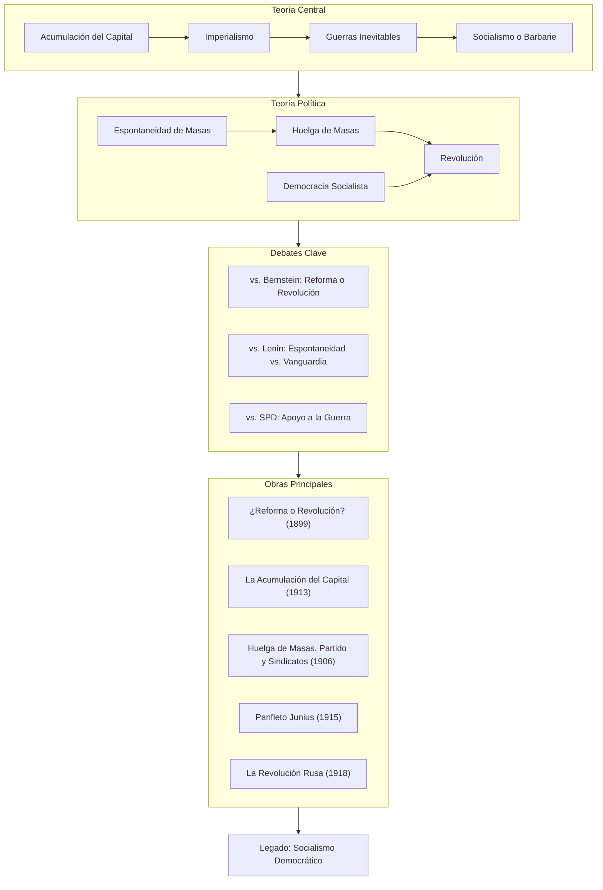
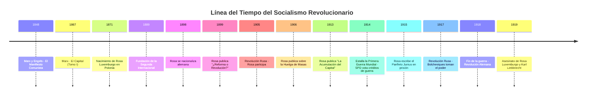

## Introducción

Imagina que vives en un mundo donde los imperios europeos dominan el planeta, donde las fábricas explotan a trabajadores que laboran 14 horas diarias, donde las mujeres no pueden votar, y donde los líderes socialistas —supuestamente defensores de los trabajadores— votan a favor de una guerra que matará a millones de jóvenes obreros. ¿Qué harías?

**Rosa Luxemburgo** (1871-1919) respondió con toda su vida: luchar. Teórica marxista, economista brillante, oradora incendiaria y revolucionaria incansable, Rosa desafió imperios, criticó a Lenin, enfrentó a la socialdemocracia alemana, y pagó con su vida por sus convicciones.

> **En una oración simple:** Rosa Luxemburgo fue una pensadora polaca-alemana que dedicó su vida a demostrar que el capitalismo conduce inevitablemente a la guerra y la destrucción, y que solo el socialismo democrático —construido desde abajo por las masas— puede salvar a la humanidad.

### ¿Por qué existe Rosa Luxemburgo como figura histórica?

Rosa Luxemburgo importa porque:

1. **Predijo las consecuencias del imperialismo** cuando otros marxistas aún no las comprendían
2. **Defendió la democracia dentro del socialismo** contra las tendencias autoritarias
3. **Acuñó "socialismo o barbarie"** — una frase que resume la encrucijada de la civilización
4. **Su asesinato** expuso las contradicciones mortales dentro de la izquierda alemana

### Contexto histórico breve

Rosa Luxemburgo nació en la Polonia ocupada por el Imperio Ruso, emigró a Suiza para estudiar, se nacionalizó alemana, y vivió la era más turbulenta de Europa:

- **La Segunda Internacional** (1889-1914): El movimiento socialista mundial antes de su ruptura
- **La Primera Guerra Mundial** (1914-1918): El horror que dividió al socialismo
- **La Revolución Rusa** (1917): El primer Estado socialista
- **La Revolución Alemana** (1918-1919): El intento fallido que le costó la vida

### ¿Qué vas a aprender en esta entrada?

Al terminar de leer, entenderás:

- La teoría económica de Rosa sobre la acumulación del capital y el imperialismo
- El debate Luxemburgo vs. Lenin sobre espontaneidad y organización
- Su famosa defensa de la democracia socialista ("la libertad es siempre libertad para el que piensa diferente")
- Su crítica a la Guerra Mundial y el Panfleto Junius
- Las circunstancias de su brutal asesinato
- Su legado en el feminismo socialista y los movimientos del siglo XXI

---

## Conceptos Fundamentales

### Vocabulario esencial luxemburguiano

Antes de adentrarnos en Rosa, necesitas conocer estos términos clave:

| Término                        | Definición                                                                 | Analogía                                                              |
| ------------------------------ | -------------------------------------------------------------------------- | --------------------------------------------------------------------- |
| **Acumulación del capital**    | El proceso por el cual el capitalismo crece absorbiendo riqueza            | Un imperio que solo puede sobrevivir conquistando más territorios     |
| **Imperialismo**               | La expansión violenta del capitalismo hacia economías no-capitalistas      | Un organismo que necesita devorar otros para vivir                    |
| **Huelga de masas**            | Acción espontánea de los trabajadores que paraliza la economía             | Un río que desborda sus diques—no puedes controlarlo, solo encauzarlo |
| **Espontaneidad**              | La capacidad de las masas para organizarse sin dirección desde arriba      | Un incendio forestal: una chispa desata algo incontrolable            |
| **Revisionismo**               | La idea de reformar el capitalismo gradualmente en lugar de revolucionarlo | Intentar vaciar el océano con cubetas                                 |
| **Dictadura del proletariado** | El poder de la clase trabajadora sobre los antiguos explotadores           | La democracia de la mayoría contra los privilegios de la minoría      |

### La analogía central: El capitalismo como tiburón

> **Imagina el capitalismo como un tiburón: si deja de nadar (expandirse), muere.**

Rosa Luxemburgo descubrió que el capitalismo no puede existir en equilibrio. Necesita constantemente:

1. **Nuevos mercados** donde vender sus productos
2. **Nuevos recursos** que explotar
3. **Nueva mano de obra** que abaratar

Cuando se agotan las fronteras externas (colonias, países "atrasados"), el capitalismo empieza a devorarse a sí mismo. El resultado: crisis, guerras, destrucción.

### Prerequisitos conceptuales

Para entender plenamente a Rosa Luxemburgo, ayuda conocer:

1. **Karl Marx y "El Capital"** — La base teórica que ella desarrolló y criticó
2. **La Segunda Internacional** — La organización de partidos socialistas que se fragmentó en 1914
3. **El SPD (Partido Socialdemócrata Alemán)** — El partido más grande del mundo, donde Rosa militó
4. **La Revolución Rusa de 1905** — El ensayo general que Rosa vivió en carne propia

---

## Mapa Conceptual: El Universo Luxemburguiano

### ¿Cómo encaja Rosa Luxemburgo en el contexto más amplio?

Rosa Luxemburgo fue contemporánea de:

- **Lenin** (1870-1924) — Con quien debatió fraternalmente
- **Karl Kautsky** (1854-1938) — El "Papa del marxismo" que ella criticó duramente
- **Eduard Bernstein** (1850-1932) — El revisionista que ella combatió
- **Clara Zetkin** (1857-1933) — Su amiga y aliada feminista

---

## Desarrollo Intermedio

### Subtema 1: La Vida de Rosa — De Polonia a Berlín

#### Infancia y juventud (1871-1889)

Rosa Luxemburgo nació el 5 de marzo de 1871 en **Zamość**, una ciudad de la Polonia ocupada por el Imperio Ruso. Su nombre de nacimiento era **Rozalia Luksenburg**, y provenía de una familia judía secular de comerciantes.

**Dato curioso #1:** Rosa nació con una displasia de cadera que le causó una cojera permanente. Tuvo que pasar un año en cama cuando era niña, tiempo que aprovechó para leer vorazmente.

Desde muy joven mostró una inteligencia extraordinaria y un espíritu rebelde. A los 16 años ya estaba involucrada en círculos revolucionarios clandestinos en Varsovia. Cuando la policía zarista comenzó a perseguirla, tuvo que huir de Polonia.

**Dato curioso #2:** Rosa escapó de Polonia escondida en un carro de heno, cruzando la frontera hacia Alemania. De ahí viajó a Suiza, donde viviría sus años formativos.

#### Formación en Suiza (1889-1898)

En Zúrich, Rosa encontró libertad intelectual y política. Estudió en la **Universidad de Zúrich** —una de las pocas universidades europeas que admitía mujeres— donde obtuvo un doctorado en economía política en 1898.

Su tesis doctoral, "El desarrollo industrial de Polonia", ya mostraba su capacidad para el análisis económico riguroso. Pero más importante fue su activismo: en Suiza cofundó el **SDKPiL** (Socialdemocracia del Reino de Polonia y Lituania), un partido que rechazaba el nacionalismo polaco y defendía la solidaridad internacional de los trabajadores.

**Dato curioso #3:** Rosa dominaba al menos cinco idiomas: polaco, ruso, alemán, francés e italiano. Su dominio del alemán era tan perfecto que muchos no sabían que era extranjera.

#### Alemania y el SPD (1898-1914)

En 1898, Rosa se mudó a Alemania mediante un matrimonio de conveniencia con Gustav Lübeck, que le otorgó la ciudadanía alemana. Inmediatamente se lanzó a la política del **SPD**, el Partido Socialdemócrata Alemán —el partido marxista más grande del mundo, con un millón de miembros.

Rosa rápidamente se destacó como:

- **Oradora brillante** — Capaz de electrizar multitudes
- **Polemista feroz** — Nadie quería debatir contra ella
- **Teórica rigurosa** — Sus análisis económicos eran respetados incluso por sus enemigos

De 1907 a 1914, enseñó economía política en la **escuela del partido SPD** en Berlín, formando a una generación de cuadros socialistas.

#### La guerra y la prisión (1914-1918)

El 4 de agosto de 1914 fue el día más negro para Rosa: el SPD, su partido, votó a favor de los **créditos de guerra** para financiar la Primera Guerra Mundial. Los líderes socialistas que prometían solidaridad internacional ahora llamaban a los obreros alemanes a matar obreros franceses, rusos y británicos.

> "El 4 de agosto de 1914, la socialdemocracia alemana se hundió políticamente, y con ella la Internacional." — Rosa Luxemburgo

Rosa respondió con resistencia total:

1. Cofundó la **Liga Espartaquista** junto a Karl Liebknecht
2. Organizó protestas anti-bélicas
3. Escribió panfletos clandestinos

Por esto pasó casi toda la guerra en prisión: de febrero de 1915 a noviembre de 1918, con breves interrupciones. Fue en la cárcel donde escribió algunas de sus obras más importantes.

**Dato curioso #4:** Desde prisión, Rosa escribía cartas de extraordinaria sensibilidad literaria sobre pájaros, plantas y literatura. También escribió críticas detalladas de la Revolución Rusa mientras estaba encerrada, demostrando una capacidad analítica impresionante.

#### La Revolución y el asesinato (1918-1919)

Cuando Alemania perdió la guerra y el káiser abdicó en noviembre de 1918, Rosa fue liberada. Inmediatamente se lanzó a la **Revolución Alemana**, junto a Karl Liebknecht.

Fundaron el **Partido Comunista de Alemania (KPD)** el 1 de enero de 1919, con Rosa como su principal teórica.

Pero la revolución alemana fue aplastada. El gobierno socialdemócrata de Friedrich Ebert y Gustav Noske desplegó a los **Freikorps** —milicias de veteranos de guerra ultraderechistas— para reprimir a los comunistas.

El 15 de enero de 1919, Rosa Luxemburgo y Karl Liebknecht fueron capturados, llevados al Hotel Eden en Berlín, interrogados, golpeados brutalmente, y asesinados. El cuerpo de Rosa fue arrojado al canal Landwehr. No fue encontrado hasta meses después.

**Dato curioso #5:** El oficial responsable del asesinato, Waldemar Pabst, nunca fue juzgado y vivió hasta 1970. Años después, reveló que había consultado con líderes del SPD antes del asesinato —una acusación que sigue siendo debatida por historiadores.

---

### Subtema 2: La Teoría Económica — "La Acumulación del Capital"

#### El problema que Rosa intentaba resolver

En "El Capital" de Marx, hay un problema técnico conocido como los **esquemas de reproducción**. Marx analizó cómo el capitalismo se reproduce a sí mismo, pero dejó algunos cabos sueltos sobre cómo ocurre la **reproducción ampliada** — es decir, cómo el sistema crece constantemente.

Rosa se preguntó: **¿De dónde viene la demanda para absorber la producción creciente del capitalismo?**

#### La tesis central

En "La Acumulación del Capital" (1913), Rosa argumentó que:

1. **El capitalismo produce más de lo que puede consumir internamente**
   - Los trabajadores no ganan suficiente para comprar todo lo que producen
   - Los capitalistas reinvierten las ganancias en lugar de consumirlas

2. **Por lo tanto, el capitalismo necesita mercados externos**
   - Economías pre-capitalistas (campesinos, colonias)
   - Territorios donde vender el exceso y obtener materias primas baratas

3. **El imperialismo es una necesidad económica, no solo una opción política**
   - Las guerras coloniales no son "errores" sino requisitos del sistema
   - El militarismo es funcional para el capital

4. **Cuando se agoten los territorios externos, el capitalismo colapsará**
   - El sistema se autodestruirá en guerras internas
   - De ahí: "socialismo o barbarie"

**Tabla comparativa: Rosa vs. Otras teorías del imperialismo**

| Teórico              | ¿Por qué imperialismo?                                            | Solución                           |
| -------------------- | ----------------------------------------------------------------- | ---------------------------------- |
| **Rosa Luxemburgo**  | Necesidad de mercados externos para absorber producción excedente | Revolución socialista              |
| **Lenin**            | Monopolios y capital financiero buscan exportar capital           | Revolución en el eslabón más débil |
| **Hobson (liberal)** | Mala distribución del ingreso crea subconsumo                     | Reformas redistributivas           |
| **Kautsky**          | Imperialismo es una "política" que puede cambiarse                | Educación y espera                 |

#### Críticas a la teoría de Rosa

La teoría fue criticada incluso por marxistas aliados:

- ¿Realmente el capitalismo no puede generar demanda interna? (Los trabajadores también consumen)
- ¿El capitalismo necesita _siempre_ territorios externos?
- ¿Qué pasa cuando todo el mundo es capitalista?

Sin embargo, la intuición central de Rosa ha sido reivindicada por fenómenos como:

- La **globalización** como búsqueda de mercados y mano de obra barata
- Las **guerras por recursos** (petróleo, minerales)
- La **financiarización** como forma de crear demanda artificial (deuda, crédito)

> **Analogía moderna:** Piensa en empresas como Amazon, que necesitan expandirse constantemente a nuevos países y sectores para mantener sus tasas de crecimiento. Sin expansión, el sistema entra en crisis.

---

### Subtema 3: La Teoría Política — Huelga de Masas y Espontaneidad

#### El contexto: La Revolución Rusa de 1905

En 1905, una revolución estalló en el Imperio Ruso tras la derrota en la guerra contra Japón. Rosa viajó clandestinamente a Varsovia (arriesgando su vida) para participar.

Lo que vio la transformó: **las masas se organizaban solas**, sin esperar instrucciones de ningún partido. Obreros que ayer parecían pasivos de repente hacían huelgas, formaban soviets (consejos), desafiaban al zarismo.

#### El libro: "Huelga de Masas, Partido y Sindicatos" (1906)

En este texto, Rosa desarrolló su teoría de la **espontaneidad**:

1. **La conciencia revolucionaria surge de la lucha misma**
   - No es algo que intelectuales "traen" a los trabajadores desde afuera
   - Se desarrolla en la experiencia de la acción colectiva

2. **La huelga de masas es el arma principal del proletariado**
   - No es algo que se "convoca" como si fuera un evento planificado
   - Es una erupción orgánica de todo el movimiento obrero

3. **El partido debe acompañar, no dirigir**
   - Su rol es formular consignas, dar dirección general
   - Pero no puede sustituir la creatividad de las masas

4. **Las luchas económicas y políticas se entrelazan**
   - Una huelga por salarios se convierte en desafío al Estado
   - Las fronteras entre "reforma" y "revolución" son fluidas

> **Analogía:** Rosa veía al partido como un surfista y a las masas como la ola. El surfista hábil aprovecha la energía de la ola, pero no puede crear la ola. Un partido que intenta controlar todo se ahogará.

---

### Subtema 4: El Debate con Lenin — Dos Visiones del Partido

#### La posición de Lenin

En "¿Qué hacer?" (1902), Lenin argumentaba que:

- Los trabajadores, dejados a su suerte, solo desarrollan "conciencia sindical" (demandas económicas inmediatas)
- La conciencia revolucionaria debe ser **importada desde afuera** por intelectuales profesionales
- Se necesita un **partido de vanguardia**, centralizado y disciplinado, para dirigir la revolución

#### La crítica de Rosa

Rosa respetaba a Lenin y lo consideraba un camarada, pero disentía profundamente:

| Aspecto           | Lenin                           | Rosa Luxemburgo                       |
| ----------------- | ------------------------------- | ------------------------------------- |
| **Conciencia**    | Viene de afuera (intelectuales) | Surge de la lucha misma               |
| **Partido**       | Vanguardia centralizada         | Organización democrática de las masas |
| **Disciplina**    | Subordinación a la dirección    | Debate libre y democracia interna     |
| **Espontaneidad** | Peligrosa, debe ser controlada  | Creativa, motor de la revolución      |

Rosa escribió en "Problemas de organización de la socialdemocracia rusa" (1904):

> "El movimiento de la clase obrera crea él mismo su organización en el curso de la lucha... La socialdemocracia no está unida a la organización de la clase obrera; es el movimiento de la clase obrera mismo."

#### ¿Quién tenía razón?

Este debate sigue vivo hoy:

- **Argumento pro-Lenin:** Los bolcheviques tomaron el poder; los espartaquistas fueron masacrados. ¿No prueba eso que la organización centralizada era necesaria?

- **Argumento pro-Rosa:** El bolchevismo derivó en Stalinismo. ¿No prueba eso que la falta de democracia interna conduce al autoritarismo?

Rosa misma ofreció una síntesis en su crítica póstuma de la Revolución Rusa: apoyaba a los bolcheviques contra sus enemigos, pero advertía contra la supresión de las libertades democráticas.

---

### Subtema 5: "La Libertad es Siempre Libertad para el que Piensa Diferente"

#### El contexto: La crítica a la Revolución Rusa

En 1918, desde prisión, Rosa escribió "La Revolución Rusa" — un texto de apoyo crítico a los bolcheviques. Celebraba la revolución pero advertía contra sus errores:

**Críticas principales:**

1. **Disolución de la Asamblea Constituyente** — Rosa argumentaba que era un error suprimir la democracia formal
2. **Restricción de libertades** — Sin libertad de prensa, reunión y expresión, el socialismo se atrofia
3. **Terror rojo** — La violencia desmedida puede volverse contraproducente

**La frase más famosa:**

> "La libertad solo para los partidarios del gobierno, solo para los miembros de un partido —por numerosos que sean— no es libertad. La libertad es siempre y exclusivamente libertad para el que piensa diferente."

Esta frase resume la visión de Rosa sobre el **socialismo democrático**:

- El socialismo no es solo propiedad colectiva de los medios de producción
- Es también (y fundamentalmente) **democracia radical**
- La participación activa de las masas es imprescindible
- Sin democracia, el socialismo se convierte en burocracia

**Dato curioso #6:** Rosa nunca publicó este texto; fue encontrado entre sus papeles y publicado póstumamente. Algunos comunistas soviéticos intentaron suprimirlo durante décadas.

---

### Subtema 6: "Socialismo o Barbarie" — El Panfleto Junius

#### Contexto: La traición del SPD

Cuando el SPD votó a favor de la guerra en 1914, Rosa quedó devastada. Escribió el **Panfleto Junius** (bajo seudónimo, desde prisión) para denunciar esta traición.

**El título** hace referencia a un panfletista inglés del siglo XVIII que criticó al gobierno de Jorge III. También evoca a Lucio Junio Bruto, el fundador de la República Romana que ejecutó a sus propios hijos por traición.

#### La tesis central

Rosa argumentaba que la guerra no era un "error" o una "política equivocada". Era la **consecuencia lógica del imperialismo**:

1. El capitalismo necesita expandirse
2. Los territorios están repartidos entre potencias imperialistas
3. La única forma de crecer es quitarle territorios a otras potencias
4. La guerra es inevitable mientras exista el capitalismo
5. **Por lo tanto: o socialismo, o barbarie**

**La frase "socialismo o barbarie":**

> "Friedrich Engels dijo una vez: 'La sociedad capitalista se enfrenta a un dilema: avance hacia el socialismo o regresión a la barbarie'... Esta guerra mundial es una regresión a la barbarie... Nos encontramos hoy ante la elección que Engels previó hace una generación: o el triunfo del imperialismo y la destrucción de toda civilización..., despoblamiento, desolación, degeneración, un gran cementerio. O la victoria del socialismo."

Esta frase se ha convertido en uno de los lemas más poderosos de la izquierda mundial. Fue citada por:

- Los situacionistas franceses (Mayo del 68)
- Movimientos ecologistas (ante la crisis climática)
- Teóricos como Cornelius Castoriadis

**Dato curioso #7:** La atribución a Engels que Rosa menciona es debatida. Engels escribió algo similar, pero la formulación exacta parece ser de Rosa. De cualquier forma, ella la popularizó mundialmente.

---

## Aspectos Avanzados

### El feminismo de Rosa Luxemburgo

Rosa Luxemburgo no se identificaba primariamente como "feminista" en el sentido burgués del término. Sin embargo, su vida y obra tienen profundas implicaciones para el **feminismo socialista**.

#### Su posición sobre la emancipación de la mujer

Rosa argumentaba que:

1. **La opresión de las mujeres está ligada al capitalismo**
   - Las mujeres de la clase obrera sufren doble explotación
   - La liberación de la mujer requiere la liberación de toda la clase trabajadora

2. **Igualdad legal es necesaria pero insuficiente**
   - El derecho al voto no elimina la explotación económica
   - Las mujeres necesitan independencia económica

3. **Las organizaciones de mujeres deben ser clasistas**
   - Las mujeres obreras tienen intereses diferentes a las burguesas
   - Rosa criticaba el feminismo liberal de su época

#### Su artículo "Mujer Proletaria" (1914)

En este texto poco conocido, Rosa analizó la resistencia de las mujeres no solo en Europa sino también en África y Latinoamérica, mostrando cómo el imperialismo destruía las formas tradicionales de vida de las mujeres en las colonias.

> "Las mujeres del proletariado luchador han mantenido la fe no solo en la emancipación de las mujeres, sino en la emancipación del ser humano, y eso significa socialismo."

#### Legado feminista

Rosa Luxemburgo es reivindicada hoy por el **feminismo socialista** y el **feminismo anticapitalista** porque:

- Conectó la opresión de género con la explotación de clase
- Analizó las dimensiones globales de la opresión femenina
- Demostró en su propia vida que una mujer podía ser líder intelectual y político

### El debate "Reforma o Revolución"

En 1896-1898, Eduard Bernstein, un veterano del SPD, publicó una serie de artículos argumentando que:

- Marx se había equivocado: el capitalismo no estaba colapsando
- Las reformas graduales podían transformar al capitalismo en socialismo
- La revolución violenta era innecesaria y peligrosa

Rosa respondió con **"¿Reforma social o revolución?"** (1899), uno de los textos más importantes del marxismo:

| Punto de Bernstein                               | Respuesta de Rosa                                         |
| ------------------------------------------------ | --------------------------------------------------------- |
| El capitalismo se está estabilizando             | Las crisis son inherentes al sistema; vendrán más grandes |
| Los trabajadores pueden ganar poder gradualmente | Sin tomar el Estado, las reformas pueden revertirse       |
| La democracia burguesa es suficiente             | La democracia real solo es posible con socialismo         |
| La violencia revolucionaria es inmoral           | La violencia del capitalismo es cotidiana e invisible     |

Rosa no rechazaba las reformas — las consideraba necesarias. Pero advertía:

> "Las reformas sociales son, pues, no un fin en sí mismas sino un medio. Para nosotros, es el movimiento de masas consciente por el socialismo lo que representa el fin... Si se abandona la meta del socialismo, la 'reforma social' se convierte en algo sin sentido."

### La actualidad de Rosa Luxemburgo

¿Por qué Rosa sigue siendo relevante en el siglo XXI?

| Problema contemporáneo      | Perspectiva luxemburguiana                                                         |
| --------------------------- | ---------------------------------------------------------------------------------- |
| **Crisis climática**        | "Socialismo o barbarie" — El capitalismo no puede resolver la crisis que genera    |
| **Globalización**           | La acumulación del capital sigue necesitando expansión, ahora a través de finanzas |
| **Crisis de la democracia** | La democracia formal sin democracia económica es vacía                             |
| **Movimientos de base**     | La espontaneidad y la auto-organización siguen siendo fuerzas transformadoras      |
| **Izquierda autoritaria**   | La libertad "para el que piensa diferente" sigue siendo necesaria                  |

---

## Curiosidades y Datos Poco Conocidos

### 1. El amor prohibido

Rosa tuvo una relación de 14 años con **Leo Jogiches**, un revolucionario lituano. Fue una relación intensa, intelectual y conflictiva. Se escribieron cientos de cartas que combinaban teoría marxista con declaraciones apasionadas. Eventualmente se separaron pero siguieron siendo camaradas políticos hasta el final.

### 2. Las cartas con el búfalo

En una de sus cartas más conmovedoras desde prisión (diciembre de 1917), Rosa describió cómo vio a unos soldados golpear brutalmente a un búfalo que arrastraba un carromato de provisiones. El animal sangraba mientras un soldado le gritaba: "¡No sirves de nada, cerdo!" Rosa escribió que el búfalo la miró "con una expresión como de un niño maltratado" y que ella lloró al verlo. Esta carta se ha convertido en un símbolo de su sensibilidad humanitaria.

### 3. La botánica revolucionaria

Desde prisión, Rosa coleccionaba y catalogaba plantas. Sus cartas están llenas de descripciones detalladas de flores, pájaros e insectos. Esta faceta naturalista contrasta con su imagen de revolucionaria feroz, mostrando una personalidad profundamente sensible.

### 4. La fundación Rosa Luxemburg

Hoy existe la **Fundación Rosa Luxemburg**, una de las fundaciones políticas más grandes de Alemania, afiliada a Die Linke (La Izquierda). Tiene oficinas en más de 20 países y financia proyectos de educación política, feminismo, ecología y movimientos sociales.

### 5. El cuerpo perdido

Cuando el cuerpo de Rosa fue arrojado al canal Landwehr, no fue encontrado hasta mayo de 1919. En 2009, un periódico alemán reportó que se había encontrado un cuerpo en un sótano de hospital que podría ser el verdadero de Rosa — sugiriendo que el cuerpo enterrado en 1919 era otro. La controversia nunca se resolvió definitivamente.

### 6. El adjetivo "luxemburguiano"

En la izquierda, "luxemburguiano/a" o "luxemburguismo" describe una corriente que combina:

- Marxismo revolucionario
- Democracia radical
- Énfasis en la espontaneidad de las masas
- Crítica tanto al reformismo como al autoritarismo leninista

### 7. Las últimas palabras

El último artículo de Rosa, publicado el día antes de su asesinato, terminaba:

> "¡El orden reina en Berlín! ¡Estúpidos esbirros! Vuestro 'orden' está construido sobre arena. Mañana la revolución se alzará de nuevo y proclamará con fanfarrias, para vuestro terror: ¡Fui, soy y seré!"

### 8. El epitafio de Bertolt Brecht

El dramaturgo Bertolt Brecht escribió un epitafio para Rosa:

> "Ahora está desaparecida la Rosa Roja.
> Dónde la enterraron nadie lo sabe.
> Porque ella les dijo la verdad a los pobres,
> los ricos del mundo la eliminaron."

---

## Conexiones con Otros Temas

### Con Antonio Gramsci

Gramsci, el marxista italiano, compartía algunas intuiciones con Rosa:

- La importancia de la cultura y la conciencia
- La crítica al economicismo vulgar
- La necesidad de construir hegemonía

Sin embargo, Gramsci era más "leninista" en organización y más "gradualista" en estrategia.

> **Conexión con el Jardín:** Ver la entrada sobre [Antonio Gramsci](/humanidades/politica-antonio-gramsci/) para profundizar en el marxismo italiano.

### Con Hannah Arendt

Hannah Arendt, la filósofa política judía alemana, escribió un ensayo admirativo sobre Rosa Luxemburgo. Aunque Arendt no era marxista, valoraba a Rosa por:

- Su defensa de la libertad política
- Su crítica al totalitarismo antes de que existiera el término
- Su humanismo fundamental

### Con el feminismo contemporáneo

Rosa es citada por feministas socialistas como:

- **Nancy Fraser** — Por su análisis de la relación entre capitalismo y opresión
- **Silvia Federici** — Por su crítica a la acumulación primitiva
- **Angela Davis** — Por su modelo de mujer revolucionaria

### Con la teoría decolonial

"La Acumulación del Capital" de Rosa es reivindicada por teóricos decoloniales porque:

- Mostró cómo el capitalismo depende de la explotación del "Sur global"
- Analizó la destrucción de economías no-capitalistas
- Conectó imperialismo con funcionamiento estructural del sistema

---

## Resumen: Puntos Clave

### La esencia de Rosa Luxemburgo en 10 puntos

| #   | Punto clave                                                                                     |
| --- | ----------------------------------------------------------------------------------------------- |
| 1   | **Acumulación del capital:** El capitalismo necesita expandirse constantemente o colapsa        |
| 2   | **Imperialismo económico:** Las guerras coloniales son necesidades del sistema, no "errores"    |
| 3   | **Socialismo o barbarie:** Sin cambio sistémico, la civilización se destruye a sí misma         |
| 4   | **Espontaneidad de masas:** Los trabajadores se auto-organizan en la lucha; el partido acompaña |
| 5   | **Huelga de masas:** El arma revolucionaria por excelencia, orgánica, no decretada              |
| 6   | **Contra el revisionismo:** Las reformas son medios, no fines; sin revolución se pierden        |
| 7   | **Democracia socialista:** Sin libertad de expresión y organización, el socialismo degenera     |
| 8   | **Crítica fraterna a Lenin:** Apoyar la revolución sin renunciar a la democracia interna        |
| 9   | **Internacionalismo radical:** Contra todo nacionalismo, incluido el polaco y el alemán         |
| 10  | **Feminismo de clase:** La liberación de la mujer requiere la liberación del proletariado       |

### Checklist de comprensión

Después de leer esta entrada, deberías poder:

- [ ] Explicar por qué Rosa decía que el capitalismo necesita imperialismo
- [ ] Comparar las posiciones de Rosa y Lenin sobre el partido
- [ ] Interpretar la frase "socialismo o barbarie"
- [ ] Describir el contexto del asesinato de Rosa
- [ ] Explicar qué significa "la libertad es siempre libertad para el que piensa diferente"
- [ ] Conectar las ideas de Rosa con debates contemporáneos (crisis climática, globalización)
- [ ] Discutir por qué Rosa criticó tanto al SPD como a los bolcheviques
- [ ] Relacionar a Rosa con el feminismo socialista

---

## Recursos para Profundizar

### Para principiantes

**Lecturas:**

- _¿Reforma social o revolución?_ — Texto corto, accesible, esencial
- _Cartas desde la prisión_ — Revelan su lado humano y literario
- Paul Frölich, _Rosa Luxemburg: Ideas en acción_ — La biografía clásica

**Audiovisuales:**

- _Rosa Luxemburg_ (1986), película de Margarethe von Trotta
- Documentales sobre la Revolución Alemana

### Para nivel intermedio

**Lecturas:**

- _La huelga de masas, el partido y los sindicatos_ — Teoría política central
- _La Revolución Rusa_ (texto póstumo) — Crítica a los bolcheviques
- _Panfleto Junius_ — Análisis de la guerra y la traición del SPD

**Estudios críticos:**

- Peter Nettl, _Rosa Luxemburg_ — Biografía académica exhaustiva
- Michael Löwy, _El pensamiento del Che Guevara y Rosa Luxemburgo_

### Para nivel avanzado

**Obras completas:**

- _La Acumulación del Capital_ — Su obra económica principal
- _Introducción a la economía política_ — Manuscritos de sus clases en la escuela del SPD
- Correspondencia completa con Leo Jogiches

**Estudios académicos:**

- Raya Dunayevskaya, _Rosa Luxemburg, Women's Liberation, and Marx's Philosophy of Revolution_
- Hannah Arendt, ensayo sobre Rosa Luxemburg en _Men in Dark Times_
- Estudios comparativos Rosa vs. Lenin, Rosa vs. Gramsci

**Contexto histórico:**

- Pierre Broué, _La revolución alemana 1917-1923_
- Sebastian Haffner, _La revolución alemana de 1918-1919_

---

## Glosario Final

| Término                   | Definición                                                                      |
| ------------------------- | ------------------------------------------------------------------------------- |
| **Créditos de guerra**    | Financiamiento parlamentario para gastos militares; el SPD votó a favor en 1914 |
| **Freikorps**             | Milicias paramilitares de veteranos que reprimieron la revolución alemana       |
| **KPD**                   | Partido Comunista de Alemania, fundado por Rosa y Liebknecht en 1919            |
| **Liga Espartaquista**    | Grupo anti-bélico dentro del SPD; precursor del KPD                             |
| **Revisionismo**          | Corriente que proponía reformar el capitalismo gradualmente                     |
| **SDKPiL**                | Partido socialdemócrata polaco-lituano, cofundado por Rosa                      |
| **Segunda Internacional** | Organización de partidos socialistas 1889-1914; colapsó con la guerra           |
| **SPD**                   | Partido Socialdemócrata de Alemania; el partido marxista más grande de su época |
| **Soviet**                | Consejo de trabajadores; órgano de poder obrero                                 |

---

## Reflexión Final

Rosa Luxemburgo vivió apenas 47 años, pero dejó un legado intelectual y político que sigue irradiando más de un siglo después.

En un mundo de crisis climática, desigualdad extrema y guerras interminables, su advertencia resuena: **socialismo o barbarie** no era una consigna retórica, sino un diagnóstico de la lógica destructiva del capitalismo.

Pero Rosa también nos dejó algo más: la insistencia en que **el socialismo sin democracia no es socialismo**. En una época donde la izquierda ha caído repetidamente en autoritarismos, su frase sigue siendo un faro:

> "La libertad es siempre y exclusivamente libertad para el que piensa diferente."

Rosa Luxemburgo fue asesinada por decir la verdad al poder. Pero sus ideas, como ella predijo, siguen vivas:

> "¡Fui, soy y seré!"
