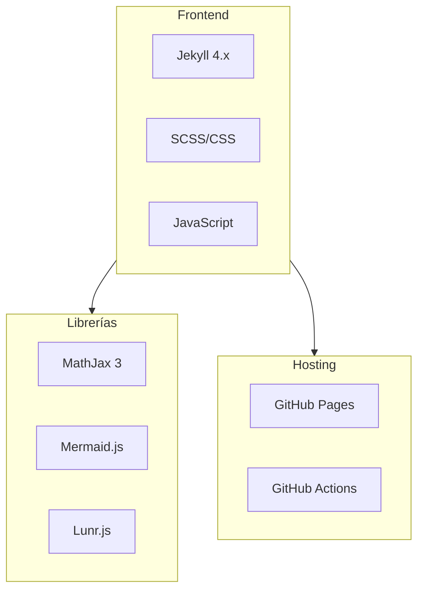

## Descripción del Proyecto

Este jardín digital es mi espacio personal para organizar, cultivar y compartir conocimiento de múltiples disciplinas.

## Stack Tecnológico

## Características Implementadas

- [x] 10 colecciones de contenido
- [x] Soporte LaTeX con MathJax
- [x] Diagramas con Mermaid.js
- [x] Búsqueda local con Lunr.js
- [x] Modo oscuro/claro
- [x] Diseño responsive
- [x] SEO optimizado
- [x] Sistema de comentarios básico

## Estructura de Colecciones

| Colección | Propósito |
|-----------|-----------|
| Humanidades | Filosofía, Historia, Psicología, Arte |
| Ciencias | Matemáticas, Física, Química |
| Tecnología | IA, Programación, Ciberseguridad |
| Negocios | Finanzas, Economía, Marketing |
| Salud | Nutrición, Fitness, Bienestar |
| Idiomas | Aprendizaje de lenguas |
| Hobbies | Ajedrez, Viajes, Cocina |
| Biblioteca | Reseñas de libros, películas, música |
| Proyectos | Side projects como este |
| Bitácora | Diario personal |

## Próximos Pasos

- [ ] Integrar sistema de backlinks entre notas
- [ ] Añadir gráfico de conexiones entre temas
- [ ] Implementar búsqueda avanzada con filtros
- [ ] Crear sistema de favoritos
- [ ] Añadir modo de lectura (sin distracciones)

## Lecciones Aprendidas

1. **Jekyll es poderoso** pero tiene curva de aprendizaje
2. **Las colecciones** son perfectas para contenido no-blog
3. **CSS custom properties** hacen el modo oscuro trivial
4. **Lunr.js** es sorprendentemente rápido para búsqueda local

## Recursos Utilizados

- [Jekyll Documentation](https://jekyllrb.com/docs/)
- [MathJax Documentation](https://docs.mathjax.org/)
- [Mermaid Documentation](https://mermaid.js.org/)
