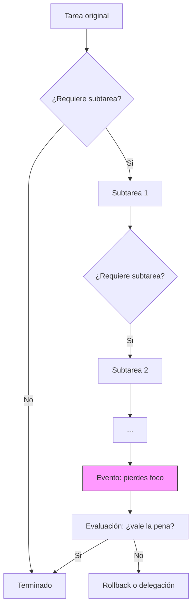

## Introducción
- ¿Qué es esto en una oración simple?

"Shaving the yak" (afeitar al yak) es una metáfora para describir cuando una tarea pequeña se transforma en una cadena de subtareas indirectas, aparentemente sin relación directa con el objetivo original, que consumen tiempo y energía.

- ¿Por qué existe / qué problema resuelve esta entrada?

La entrada explica por qué sucede el fenómeno, cuándo es peligroso y cuándo es razonable aceptarlo; ofrece señales, estrategias prácticas para evitar perder foco y patrones para gestionarlo sin sacrificar calidad.

- Contexto histórico breve

El término proviene de la cultura hacker y de la ingeniería de software: no hay una fecha única de aparición, sino que emergió como jerga entre equipos técnicos para describir tareas que se ramifican fuera del objetivo original. Con el tiempo la expresión cruzó a Product Management, DevOps, y productividad personal.

- Qué vas a aprender en esta entrada

- Definición y ejemplos claros
- Vocabulario y patrones asociados (deuda técnica, scope creep, tasks chaining)
- Un mapa conceptual (Mermaid)
- Estrategias prácticas y métricas
- Curiosidades y conexiones interdisciplinarias
- Recursos por niveles

## Conceptos fundamentales / Bases

### Definición formal

"Shaving the yak" es el proceso donde para completar una tarea A necesitas hacer la tarea B; para B necesitas C; para C necesitas D; y así sucesivamente, hasta que acabas realizando acciones que parecen alejadas del objetivo A. El resultado: gran inversión de tiempo en tareas preparatorias o auxiliares que aumentan el coste real del trabajo.

### Vocabulario esencial
- Yak: la tarea original o, por extensión, cualquier objeto de trabajo que acabe generando subtareas.
- Afeitar: el acto de abordar y resolver las subtareas.
- Chains / encadenamiento: la secuencia de dependencias o tareas auxiliares.
- Deuda técnica: decisiones técnicas pospuestas que aumentan la probabilidad de yak shaving futuro.
- Scope creep: expansión gradual y no controlada del alcance que puede coexistir con yak shaving.

### Por qué ocurre: motivaciones y causas comunes
- Dependencias ocultas: herramientas, permisos, librerías o configuraciones necesarias para una tarea.
- Falta de separación de responsabilidades: no delegar o fragmentar incorrectamente el trabajo.
- Sobreingeniería preventiva: intentar arreglar todos los problemas detectables antes de avanzar.
- Mala estimación: subestimar la complejidad real de una tarea.

## Mapa conceptual / Visión general

Este diagrama muestra la trampa del encadenamiento: cada nodo «sí» añade otra capa que puede llevarnos lejos del objetivo.

## Desarrollo intermedio

### Ejemplos prácticos y casos reales (software)

1) Ejemplo clásico de desarrollo:

- Objetivo A: arreglar un bug en producción.
- Subtarea B: reproducir el bug localmente.
- Subtarea C: actualizar dependencia X para reproducir el entorno.
- Subtarea D: instalar herramienta Y (requiere permisos del administrador de sistemas).
- Resultado: pasas 4 horas solicitando accesos, instalando y ajustando entornos—y el bug original hubiera sido solucionado con un parche rápido en producción.

2) Ejemplo en documentación:

- Objetivo A: escribir una guía de usuario.
- Subtarea B: generar ejemplos reproducibles.
- Subtarea C: crear contenedores para esos ejemplos.
- Subtarea D: optimizar el Dockerfile.
- Resultado: la documentación se pospone porque ahora estás construyendo infraestructura para que los ejemplos funcionen perfectamente.

3) Ejemplo en productividad personal:

- Objetivo A: terminar un informe.
- Subtarea B: ordenar archivos de investigación.
- Subtarea C: renombrar y clasificar carpetas.
- Subtarea D: crear un sistema de etiquetado.
- Resultado: más tiempo estructurando que escribiendo.

### Tabla comparativa: yak shaving vs patrón relacionados

| Característica | Yak Shaving | Scope Creep | Debt Técnico |
|---------------:|:-----------:|:-----------:|:------------:|
| Inicio típico | Dependencias ocultas o trabajos auxiliares | Solicitudes de cambio añadidas | Decisiones técnicas rápidas pospuestas |
| Efecto principal | Pérdida de foco; tiempo en tareas no centrales | Aumento de alcance del proyecto | Acumulación de complejidad técnica |
| Controlable? | Sí, con límites y reglas | Requiere gobernanza de producto | Sí, con refactor y políticas |
| Señal de alarma | Cadena de subtareas que no aportan valor inmediato | Nuevas funciones sin revisión | Incremento de errores / lentitud |

### ¿Cuándo es aceptable afeitar al yak?

- Preparación indispensable: cuando la subtarea es un prerequisito técnico ineludible (por ejemplo, actualizar un certificado expirado).
- Inversión estratégica: cuando afeitar un yak reduce fricción recurrente (automatizar un proceso manual que se repite cada semana).
- Experimentos controlados: prototipado o investigación que explícitamente incluye subtareas exploratorias.

### Señales de que estás en una trampa de yak

- El progreso hacia el objetivo original es menor que el tiempo invertido en subtareas.
- Surgen tareas que no estaban descritas en la definición original del trabajo.
- La lista de dependencias crece exponencialmente sin una evaluación de valor.
- Frustración y bloqueo del equipo.

## Aspectos técnicos / avanzados

### Modelos mentales para gestionar yak shaving

1. Coste marginal vs beneficio marginal: evaluar si la próxima subtarea añade más valor que coste. Si el coste es mayor, posponer o delegar.

2. Regla del 5-15: si la subtarea toma menos de 5 minutos, hazla; si toma más de 15 minutos, crea una tarea nueva priorizada o asignada a otro sprint.

3. Técnica del horizonte de 30 minutos: antes de iniciar una subtarea, pregúntate "¿esto me acerca en 30 minutos al objetivo A?". Si no, cuestiona la necesidad.

4. Políticas de integración contínua y automatización: tener scripts y pipelines para reducir trabajos manuales que originan yak shaving. Automatizar tareas repetitivas elimina muchas causas.

### Relación con deuda técnica y priorización

El yak shaving puede ser síntoma o causa de deuda técnica. Cuando se acumula deuda, tareas pequeñas necesitan soluciones provisionales que a su vez requieren mantenimiento adicional. Por otro lado, afeitar un yak (automatizar) puede ser inversión para reducir deuda futura.

Estrategia: mantener una cuenta clara de coste/beneficio y explícitamente reservar tiempo en sprints para "trabajo de infra/limpieza" con alcance limitado y aceptado por el equipo.

### Métricas y señales medibles

- Tiempo de ciclo: incrementos súbitos indican trabajos auxiliares
- Número de subtasks creadas por tarea principal
- Ratio de tiempo en valor directo vs soporte (ej. escribir código vs configurar herramienta)
- Porcentaje de tareas bloqueadas por dependencias externas

Recolectar estas métricas requiere disciplina de registro en el sistema de issues o en la herramienta de seguimiento (Jira, GitHub Issues, Trello).

### Cómo documentar y comunicar wak shaving al equipo

- Transparencia: cuando detectes una cadena de subtareas, crea un comentario breve en la issue explicando por qué y su coste estimado.
- Decisión explícita: si se decide afeitar, registrar la justificación (beneficio esperado, riesgos).
- Alternativas: proponer mitigaciones (delegación, pedir acceso temporal, parche mínimo viable).

## Estrategias prácticas y patrones anti‑yak

1. Politica de mínimo viable: antes de profundizar, busca la solución que resuelva el 80% del problema con el menor esfuerzo.

2. Delegación y escalado: pasar la subtarea técnica al equipo o rol que tenga jurisdicción (SRE, infra, administrador).

3. Bloques de tiempo y "stop-loss": si una subtarea supera X horas sin resultado tangible, parar y reevaluar.

4. Automatizar lo repetitivo: invertir en scripts o pipelines cuando la acción se repite con frecuencia.

5. Checkpoints y pequeñas entregas: dividir la cadena en entregas parciales que demuestren valor inmediato.

## Curiosidades y datos poco conocidos (5+)

1. El fenómeno trasciende la ingeniería: en medicina, administración y educación aparecen versiones análogas (p. ej. gastar tiempo en papeleo que impide atender pacientes).

2. Algunos gerentes usan la palabra "yak" para referirse a trabajo necesario pero aburrido; en equipos ágiles se establecen "yak days" para concentrar estas tareas.

3. Existen herramientas CLI y scripts llamados "yak-shaver" en repositorios personales que automatizan pasos comunes (nombres inspirados en la jerga).

4. En investigación académica, la preparación del entorno reproducible (contenerización, datos limpios) puede consumir más tiempo que el experimento: un ejemplo clásico de yak shaving.

5. El término ha sido adoptado por comunidades fuera del software: startups, equipos de producto y comunidades maker lo emplean para describir trabajo auxiliar.

6. Empresas con alto grado de automatización tienden a ver menos yak shaving; invertir en herramientas internas reduce la fricción cotidiana.

## Conexiones con otros temas del Jardín

- _tecnologia/redes-modelo-osi: dependencia de infra y configuraciones de red pueden originar yak shaving cuando las tareas requieren cambios en capas inferiores.
- _negocios: scope creep y gestión de stakeholders incrementan el riesgo de tareas encadenadas.
- _proyectos: priorización y gestión de sprints están directamente relacionados con políticas anti-yak.

## Ejercicios prácticos (mini‑workshop)

1. Auditoría rápida: selecciona 3 issues recientes y cuenta cuántas subtasks auxiliares aparecieron. ¿Cuál fue el tiempo total invertido? ¿Se justificó?

2. Simulación: toma una tarea simple y dibuja el grafo de dependencias. Aplica la regla del 5-15 y decide qué detenerías.

3. Automatiza un paso: identifica la subtarea que más se repite y escribe un script o alias para reducirla a un comando reproducible.

## Resumen / Puntos clave

- Shaving the yak es una metáfora para cadenas de subtareas que alejan del objetivo principal.
- No todo yak debe evitarse: distingue entre trabajo indispensable y distracción.
- Usa reglas prácticas (5-15, horizonte 30 minutos), métricas y automatización para controlar el fenómeno.
- Documenta decisiones y prioriza el valor inmediato. Delegar y limitar el alcance son técnicas esenciales.

### Checklist de comprensión
- [ ] Puedo identificar si una tarea que enfrento es un yak o una subtarea valiosa
- [ ] Sé aplicar la regla del 5-15 y la técnica del horizonte de 30 minutos
- [ ] Puedo proponer una alternativa (delegación, automatización, parche mínimo)
- [ ] Sé cuándo registrar y justificar oficialmente en la issue tracker

## Recursos para profundizar

Para principiantes:
- Artículo corto sobre productividad técnica y prioridades (blogs de engineering managers)
- Tutoriales de GitHub Issues / Jira: cómo crear subtasks y etiquetarlos

Para intermedios:
- Guías de SRE sobre reducción de toil (Google SRE book tiene capítulos relevantes)
- Artículos sobre deuda técnica y su gestión

Para avanzados:
- Papers y charlas sobre ingeniería de plataforma interna y reducción de fricción operativa
- Estudios de caso sobre inversión en tooling interno (cómo empresas redujeron time-to-ship automatizando infra)

---

Si quieres, puedo ahora:
- añadir ejemplos reales de proyectos (anónimo) desde el repositorio o issues del proyecto
- implementar plantillas de issue/PR para mitigar yak shaving en tu flujo de trabajo

Fin de la entrada.
