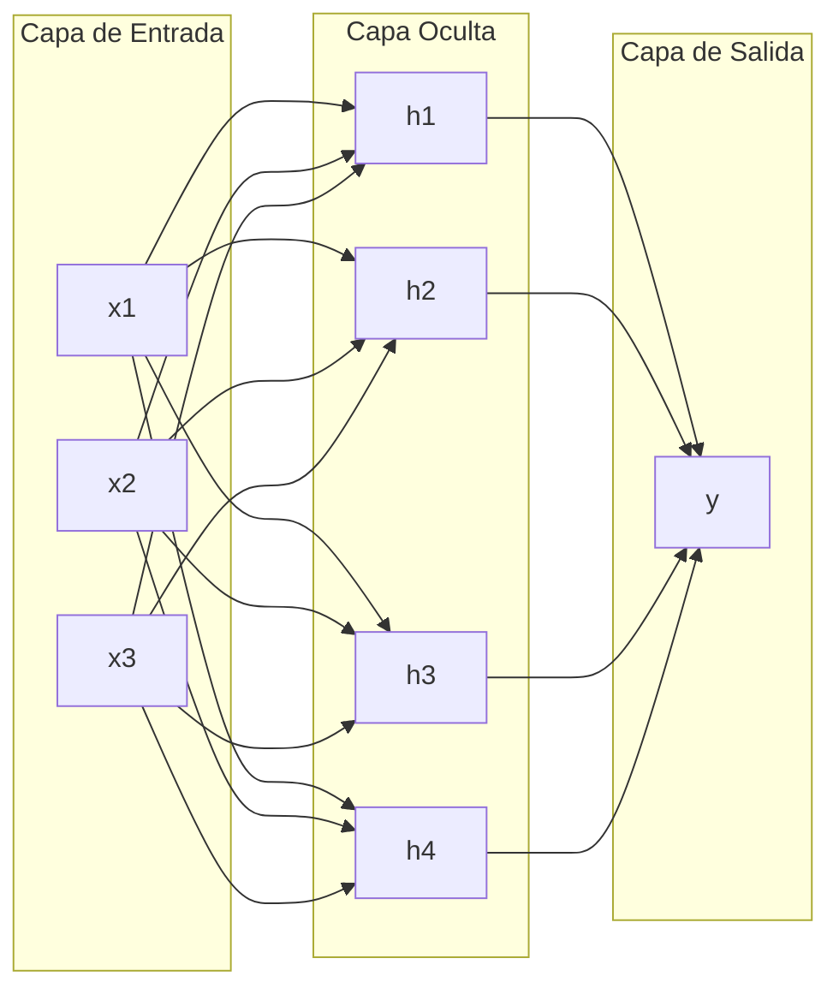
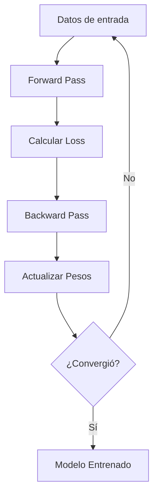

## ¿Qué es una Red Neuronal?

Una **red neuronal artificial** es un modelo computacional inspirado en el funcionamiento del cerebro humano. Consiste en capas de neuronas interconectadas que procesan información.

## Arquitectura Básica



## Componentes Clave

### 1. Neurona (Perceptrón)

Cada neurona realiza:

1. Suma ponderada de entradas
2. Aplica función de activación
3. Produce una salida

### 2. Funciones de Activación

| Función | Fórmula | Uso |
|---------|---------|-----|
| ReLU | $f(x) = max(0, x)$ | Capas ocultas |
| Sigmoid | $f(x) = \frac{1}{1+e^{-x}}$ | Clasificación binaria |
| Softmax | $f(x_i) = \frac{e^{x_i}}{\sum_j e^{x_j}}$ | Clasificación multiclase |

## Implementación en PyTorch

```python
import torch
import torch.nn as nn

class SimpleNN(nn.Module):
    def __init__(self, input_size, hidden_size, output_size):
        super(SimpleNN, self).__init__()
        self.layer1 = nn.Linear(input_size, hidden_size)
        self.relu = nn.ReLU()
        self.layer2 = nn.Linear(hidden_size, output_size)
    
    def forward(self, x):
        x = self.layer1(x)
        x = self.relu(x)
        x = self.layer2(x)
        return x

# Crear modelo
model = SimpleNN(input_size=784, hidden_size=128, output_size=10)

# Ver arquitectura
print(model)
```

## Proceso de Entrenamiento



## Recursos

- [PyTorch Documentation](https://pytorch.org/docs/)
- [Deep Learning Book](https://www.deeplearningbook.org/)
