## Introduccion

### ¿Que es el Modelo OSI en palabras simples?

Imagina que quieres enviar una carta a un amigo en otro pais. No basta con escribir el mensaje y lanzarlo al aire esperando que llegue. Necesitas:

1. **Escribir el mensaje** en un idioma que ambos entiendan
2. **Meterlo en un sobre** con la direccion correcta
3. **Llevarlo a correos** donde lo clasifican
4. **Transporte** por avion, tren o camion
5. **Entrega final** a la puerta de tu amigo

El **Modelo OSI** (Open Systems Interconnection) es exactamente esto, pero para datos digitales. Es un "manual de instrucciones" que divide la comunicacion entre computadoras en **7 pasos ordenados** (llamados capas), donde cada paso tiene una responsabilidad especifica.

> **En una oracion:** El Modelo OSI es el "idioma universal" que permite que cualquier dispositivo hable con cualquier otro dispositivo en una red, sin importar quien los fabrico.

### ¿Por que existe? El problema que resuelve

En los años 70, cada fabricante de computadoras creaba su propio sistema de comunicacion:
- IBM tenia **SNA** (Systems Network Architecture)
- DEC tenia **DECnet**
- Xerox tenia sus propios protocolos

**El problema:** Una computadora IBM no podia "hablar" con una DEC. Era como si cada pais inventara su propio alfabeto - el caos total.

La **ISO** (Organizacion Internacional de Estandarizacion) creo el Modelo OSI en 1984 para resolver esto: un marco de referencia universal que todos pudieran seguir.

### ¿Que vas a aprender en esta entrada?

Al terminar de leer, seras capaz de:

- ✅ Explicar que hace cada una de las 7 capas del modelo OSI
- ✅ Identificar en que capa opera cada protocolo (HTTP, TCP, IP, Ethernet...)
- ✅ Entender por que fallo una conexion de red usando el modelo como guia de diagnostico
- ✅ Comparar OSI con el modelo TCP/IP que realmente usa Internet
- ✅ Impresionar en entrevistas tecnicas con conocimiento profundo de networking

---

## Conceptos Fundamentales

### Vocabulario Esencial

Antes de sumergirnos en las capas, necesitas conocer estos terminos:

| Termino | Definicion Simple | Analogia |
|---------|------------------|----------|
| **Protocolo** | Conjunto de reglas para comunicarse | El "idioma" acordado entre dos personas |
| **Capa (Layer)** | Un nivel de abstraccion con responsabilidad especifica | Un departamento en una empresa |
| **PDU** (Protocol Data Unit) | El "paquete" de datos en cada capa | El sobre que contiene tu carta |
| **Encapsulacion** | Envolver datos con informacion de control | Meter una carta en un sobre, y ese sobre en una caja |
| **Header** (Cabecera) | Informacion de control al inicio de los datos | La etiqueta con direccion en un paquete |
| **Host** | Cualquier dispositivo conectado a la red | Tu computadora, telefono, servidor... |
| **Nodo** | Punto de conexion en una red | Cada "parada" en el camino de los datos |

### Prerequisitos: ¿Que necesitas saber antes?

- **Nivel basico:** Saber que es Internet y que las computadoras se conectan en redes
- **Nivel intermedio:** Entender que es una direccion IP y que existen cables/WiFi
- **Nivel avanzado:** Conocer algun protocolo como HTTP o TCP

### La Analogia Central: El Sistema Postal Internacional

La mejor forma de entender OSI es compararlo con enviar un paquete internacional:

```
TU (Aplicacion) 
    → Escribes el mensaje
        → Lo metes en un sobre (Presentacion)
            → Decides si necesitas confirmacion de entrega (Sesion)
                → Eliges envio express o economico (Transporte)
                    → Correos asigna ruta y codigo postal (Red)
                        → El cartero local lo recoge (Enlace)
                            → El camion lo transporta fisicamente (Fisica)
```

**Cada capa solo se comunica con la capa inmediatamente superior e inferior.** El cartero no necesita saber que dice tu carta, solo necesita la direccion.

### ¿Por que 7 capas y no 5 o 10?

La division en 7 capas no es arbitraria. Sigue el principio de **separacion de responsabilidades**:

1. **Cada capa hace UNA cosa bien** - Principio de responsabilidad unica
2. **Los cambios en una capa no afectan a otras** - Si mejoras el WiFi (capa 1), TCP (capa 4) sigue funcionando igual
3. **Permite innovacion independiente** - Puedes cambiar de cable a fibra optica sin reescribir aplicaciones

> **Dato historico:** El comite de ISO considero modelos de 5, 6, 7 y 8 capas. Eligieron 7 como el balance optimo entre granularidad y practicidad.

---

## Mapa Conceptual: Vision General del Modelo OSI

### Diagrama de las 7 Capas

```mermaid
flowchart TB
    subgraph "CAPAS SUPERIORES (Host Layers)"
        L7[7. APLICACION<br/>HTTP, FTP, SMTP, DNS]
        L6[6. PRESENTACION<br/>SSL/TLS, JPEG, ASCII]
        L5[5. SESION<br/>NetBIOS, RPC, PPTP]
    end
    
    subgraph "CAPAS INFERIORES (Media Layers)"
        L4[4. TRANSPORTE<br/>TCP, UDP, SCTP]
        L3[3. RED<br/>IP, ICMP, ARP]
        L2[2. ENLACE DE DATOS<br/>Ethernet, WiFi, PPP]
        L1[1. FISICA<br/>Cables, Fibra, Señales]
    end
    
    L7 --> L6
    L6 --> L5
    L5 --> L4
    L4 --> L3
    L3 --> L2
    L2 --> L1
    
    style L7 fill:#e1f5fe
    style L6 fill:#e1f5fe
    style L5 fill:#e1f5fe
    style L4 fill:#fff3e0
    style L3 fill:#fff3e0
    style L2 fill:#fff3e0
    style L1 fill:#fff3e0
```



### Tabla Resumen de las 7 Capas

| # | Capa | Funcion Principal | PDU | Dispositivo Tipico | Protocolo Ejemplo |
|---|------|-------------------|-----|-------------------|-------------------|
| 7 | Aplicacion | Interfaz con el usuario | Datos | - | HTTP, FTP, SMTP |
| 6 | Presentacion | Formato y cifrado | Datos | - | SSL, JPEG, ASCII |
| 5 | Sesion | Control de dialogos | Datos | - | NetBIOS, RPC |
| 4 | Transporte | Entrega confiable | Segmento | - | TCP, UDP |
| 3 | Red | Enrutamiento | Paquete | Router | IP, ICMP |
| 2 | Enlace | Acceso al medio | Trama (Frame) | Switch | Ethernet, WiFi |
| 1 | Fisica | Transmision de bits | Bits | Hub, Cable | RS-232, DSL |

### Mnemotecnicos para Recordar las Capas

**De arriba hacia abajo (7→1):**
> "**A**ll **P**eople **S**eem **T**o **N**eed **D**ata **P**rocessing"
> (Aplicacion, Presentacion, Sesion, Transporte, Network/Red, Data Link/Enlace, Physical/Fisica)

**De abajo hacia arriba (1→7):**
> "**P**lease **D**o **N**ot **T**hrow **S**ausage **P**izza **A**way"
> (Physical, Data Link, Network, Transport, Session, Presentation, Application)

**En español (7→1):**
> "**A**yer **P**edro **S**alio **T**emprano **R**umbo **E**l **F**utbol"

---

## Las 7 Capas en Detalle

### Capa 1: Fisica (Physical Layer)

#### ¿Que hace? (Nivel Basico)

La capa fisica es la "carretera" por donde viajan los datos. Se encarga de convertir los **1s y 0s digitales** en señales que pueden viajar por cables, aire o fibra optica.

> **Analogia:** Si los datos son agua, la capa fisica son las tuberias. No le importa si es agua potable o residual - solo la transporta.

#### Responsabilidades Especificas

1. **Transmision de bits** - Enviar y recibir bits individuales
2. **Definir voltajes y señales** - Que significa "1" y "0" electricamente
3. **Especificaciones fisicas** - Tipo de conector, cable, frecuencia
4. **Sincronizacion** - Cuando empieza y termina cada bit
5. **Topologia fisica** - Como se conectan fisicamente los dispositivos

#### Medios de Transmision

| Medio | Velocidad Maxima | Distancia Maxima | Uso Tipico |
|-------|-----------------|------------------|------------|
| Cable UTP Cat5e | 1 Gbps | 100m | Oficinas |
| Cable UTP Cat6a | 10 Gbps | 100m | Data centers |
| Fibra Monomodo | 100+ Gbps | 40+ km | Internet backbone |
| Fibra Multimodo | 10 Gbps | 550m | Campus |
| WiFi 6 (802.11ax) | 9.6 Gbps | ~30m interior | Hogares, oficinas |

#### Ejemplo Tecnico: Codificacion Manchester

En Ethernet clasico, un "1" no es simplemente voltaje alto. Se usa **codificacion Manchester**:

```
Bit 1 = Transicion de bajo a alto (↑)
Bit 0 = Transicion de alto a bajo (↓)

Datos:    1    0    1    1    0
Señal:   _↑‾  ‾↓_  _↑‾  _↑‾  ‾↓_
```

**¿Por que?** Porque si envias muchos 1s seguidos (voltaje constante alto), el receptor pierde la sincronizacion. Las transiciones constantes actuan como "reloj" integrado.

#### Dispositivos de Capa 1

- **Hub:** Repite la señal a todos los puertos (obsoleto)
- **Repetidor:** Amplifica la señal para mayor distancia
- **Modem:** Convierte señales digitales a analogicas (y viceversa)
- **Transceiver:** Convierte entre tipos de medio (ej: cobre a fibra)

---

### Capa 2: Enlace de Datos (Data Link Layer)

#### ¿Que hace? (Nivel Basico)

Si la capa fisica es la carretera, la capa de enlace es el **sistema de trafico local**. Se asegura de que los datos lleguen al dispositivo correcto en tu red local (tu casa, tu oficina).

> **Analogia:** El cartero de tu barrio. Conoce todas las casas de la zona y sabe exactamente cual puerta tocar para entregar cada paquete.

#### Responsabilidades Especificas

1. **Direccionamiento fisico (MAC)** - Identificar cada dispositivo con una direccion unica
2. **Control de acceso al medio** - Decidir quien puede "hablar" en cada momento
3. **Deteccion de errores** - Verificar que los datos no se corrompieron
4. **Control de flujo** - Evitar saturar al receptor

#### Las Dos Subcapas

La capa 2 se divide en dos partes:


#### Direcciones MAC: La Identidad de tu Dispositivo

Cada tarjeta de red tiene una **direccion MAC** (Media Access Control) unica de 48 bits:

```
Formato: XX:XX:XX:XX:XX:XX (hexadecimal)
Ejemplo: 00:1A:2B:3C:4D:5E

Estructura:
[00:1A:2B] : [3C:4D:5E]
    ↓            ↓
   OUI      Identificador
(Fabricante)  (Unico)
```

- **OUI (Organizationally Unique Identifier):** Los primeros 24 bits identifican al fabricante
  - `00:00:0C` = Cisco
  - `00:1A:2B` = Ayecom Technology
  - `AC:DE:48` = Apple

- **Identificador:** Los ultimos 24 bits son unicos para cada dispositivo

> **Dato curioso:** Existen 2^48 = 281 billones de direcciones MAC posibles. Aun no nos hemos quedado sin ellas.

#### Ethernet Frame: La Estructura de los Datos

Cuando envias datos por Ethernet, se empaquetan en un "frame" (trama):

```
┌─────────────────────────────────────────────────────────────┐
│ Preambulo │ SFD │ MAC Dest │ MAC Orig │ Tipo │ Datos │ FCS │
│  7 bytes  │ 1B  │  6 bytes │  6 bytes │  2B  │46-1500│ 4B  │
└─────────────────────────────────────────────────────────────┘

- Preambulo: Patron de sincronizacion (10101010... repetido)
- SFD: Start Frame Delimiter - indica inicio de datos reales
- MAC Dest/Orig: Direcciones de destino y origen
- Tipo: Indica protocolo de capa superior (0x0800 = IPv4)
- Datos: La carga util (payload)
- FCS: Frame Check Sequence - checksum para detectar errores
```

#### CSMA/CD: Como Evitar Colisiones

En Ethernet clasico (half-duplex), multiples dispositivos comparten el mismo cable. ¿Que pasa si dos hablan a la vez?

**CSMA/CD** (Carrier Sense Multiple Access with Collision Detection):

1. **Carrier Sense:** Antes de enviar, escucha si alguien esta transmitiendo
2. **Multiple Access:** Todos comparten el mismo medio
3. **Collision Detection:** Si detectas colision, para inmediatamente
4. **Backoff aleatorio:** Espera un tiempo random antes de reintentar

```
Dispositivo A: "Voy a enviar..." *escucha* "...silencio, envio!"
Dispositivo B: "Voy a enviar..." *escucha* "...silencio, envio!"
*COLISION* 💥
Ambos: "Ups, colision detectada. Espero tiempo aleatorio..."
A espera 2ms, B espera 7ms
A: "Ahora si, envio primero"
```

> **Nota:** En redes modernas con switches full-duplex, CSMA/CD ya no es necesario porque cada conexion es punto a punto.

#### Dispositivos de Capa 2

- **Switch:** Aprende direcciones MAC y envia frames solo al puerto correcto
- **Bridge:** Conecta dos segmentos de red (ancestro del switch)
- **Punto de Acceso WiFi:** Maneja frames 802.11

---

### Capa 3: Red (Network Layer)

#### ¿Que hace? (Nivel Basico)

La capa de red es el **GPS de Internet**. Se encarga de encontrar la mejor ruta para que tus datos viajen desde tu computadora hasta un servidor al otro lado del mundo.

> **Analogia:** El servicio de planificacion de rutas de correos. No entrega el paquete directamente, pero decide que aviones, trenes y camiones debe tomar para llegar a su destino.

#### Responsabilidades Especificas

1. **Direccionamiento logico (IP)** - Identificar dispositivos globalmente
2. **Enrutamiento** - Encontrar el mejor camino entre redes
3. **Fragmentacion** - Dividir paquetes grandes si la red no los soporta
4. **Control de congestion** - A nivel de red (diferente al de capa 4)

#### Direcciones IP: Tu Identidad Global

A diferencia de MAC (identidad fisica permanente), la IP es una **direccion logica asignable**:

**IPv4:**
```
Formato: XXX.XXX.XXX.XXX (decimal)
Ejemplo: 192.168.1.100

32 bits = 4 bytes
Rango: 0.0.0.0 - 255.255.255.255
Total: ~4.3 mil millones de direcciones
```

**IPv6:**
```
Formato: XXXX:XXXX:XXXX:XXXX:XXXX:XXXX:XXXX:XXXX (hexadecimal)
Ejemplo: 2001:0db8:85a3:0000:0000:8a2e:0370:7334

128 bits = 16 bytes
Total: 340 sextillones de direcciones (3.4 × 10^38)
```

#### El Paquete IP: Estructura

```
┌────────────────────────────────────────────────────────────────┐
│ Version │ IHL │ ToS │ Longitud Total │ Identificacion │       │
│  4 bits │ 4b  │ 8b  │    16 bits     │    16 bits     │       │
├─────────┴─────┴─────┴────────────────┴────────────────┤       │
│ Flags │ Fragment Offset │ TTL │ Protocolo │ Checksum │       │
│  3b   │     13 bits     │ 8b  │    8b     │   16b    │ Header│
├───────┴─────────────────┴─────┴───────────┴──────────┤ 20-60B│
│              Direccion IP Origen (32 bits)           │       │
├──────────────────────────────────────────────────────┤       │
│              Direccion IP Destino (32 bits)          │       │
├──────────────────────────────────────────────────────┼───────┤
│                    Opciones (variable)               │       │
├──────────────────────────────────────────────────────┤       │
│                    DATOS (Payload)                   │       │
└──────────────────────────────────────────────────────┴───────┘
```

**Campos importantes:**
- **TTL (Time To Live):** Numero de "saltos" (routers) antes de descartar el paquete. Evita loops infinitos.
- **Protocolo:** Indica capa 4 (6=TCP, 17=UDP, 1=ICMP)
- **Checksum:** Solo verifica el header, no los datos

#### Enrutamiento: Como Viajan los Paquetes

Cuando envias datos a google.com:


Cada router:
1. Recibe el paquete
2. Lee la IP destino
3. Consulta su **tabla de enrutamiento**
4. Envia al siguiente router mas cercano al destino
5. Decrementa TTL en 1

**Tabla de enrutamiento simplificada:**

| Red Destino | Mascara | Gateway | Interfaz |
|-------------|---------|---------|----------|
| 192.168.1.0 | /24 | Directa | eth0 |
| 10.0.0.0 | /8 | 192.168.1.1 | eth0 |
| 0.0.0.0 | /0 | 192.168.1.1 | eth0 |

La ultima fila (`0.0.0.0/0`) es la **ruta por defecto** - "si no se a donde ir, manda aqui".

#### ARP: El Puente entre Capa 2 y 3

**Problema:** El router sabe que debe enviar a IP `192.168.1.50`, pero Ethernet necesita una direccion MAC.

**Solucion:** ARP (Address Resolution Protocol)

```
Router: "Oigan todos, ¿quien tiene la IP 192.168.1.50?"
        (ARP Request - broadcast a FF:FF:FF:FF:FF:FF)

PC con .50: "Soy yo, mi MAC es 00:1A:2B:3C:4D:5E"
            (ARP Reply - unicast)

Router: "Genial, guardo en mi cache ARP"
```

#### Dispositivos de Capa 3

- **Router:** Conecta diferentes redes y toma decisiones de enrutamiento
- **Switch Layer 3:** Switch que tambien puede enrutar
- **Firewall:** Filtra trafico basado en IPs y puertos

---

### Capa 4: Transporte (Transport Layer)

#### ¿Que hace? (Nivel Basico)

La capa de transporte es el **servicio de mensajeria**. Garantiza que tu mensaje llegue completo, en orden, y al programa correcto en el dispositivo destino.

> **Analogia:** FedEx vs una paloma mensajera. TCP es FedEx (confirma entrega, rastrea paquetes, reintenta si se pierden). UDP es la paloma (mas rapido, pero sin garantias).

#### Responsabilidades Especificas

1. **Segmentacion** - Dividir datos grandes en segmentos manejables
2. **Control de flujo** - No enviar mas rapido de lo que el receptor puede procesar
3. **Control de errores** - Detectar y corregir perdidas/corrupciones
4. **Multiplexacion** - Permitir multiples aplicaciones usando puertos

#### TCP vs UDP: La Decision Fundamental

| Caracteristica | TCP | UDP |
|---------------|-----|-----|
| Conexion | Orientado a conexion | Sin conexion |
| Confiabilidad | Garantiza entrega | Best-effort |
| Orden | Garantiza orden | No garantiza |
| Velocidad | Mas lento | Mas rapido |
| Overhead | 20+ bytes header | 8 bytes header |
| Uso tipico | Web, email, archivos | Streaming, gaming, DNS |

#### TCP: El Protocolo Confiable

**Three-Way Handshake (Establecer conexion):**


**Estructura del Segmento TCP:**

```
┌──────────────────────────────────────────────────────────┐
│ Puerto Origen (16b) │ Puerto Destino (16b)              │
├─────────────────────┴───────────────────────────────────┤
│                 Numero de Secuencia (32b)               │
├─────────────────────────────────────────────────────────┤
│              Numero de Acknowledgment (32b)             │
├──────────┬──────┬────────────────┬──────────────────────┤
│Offset(4b)│Reserv│Flags(9b)       │ Ventana (16b)        │
├──────────┴──────┴────────────────┴──────────────────────┤
│ Checksum (16b)      │ Urgent Pointer (16b)              │
├─────────────────────┴───────────────────────────────────┤
│                    Opciones (variable)                  │
├─────────────────────────────────────────────────────────┤
│                        DATOS                            │
└─────────────────────────────────────────────────────────┘
```

**Flags TCP importantes:**
- **SYN:** Iniciar conexion
- **ACK:** Confirmar recepcion
- **FIN:** Cerrar conexion
- **RST:** Resetear/abortar conexion
- **PSH:** Enviar datos inmediatamente (no buffering)

#### UDP: El Protocolo Rapido

**Header minimalista (8 bytes):**

```
┌─────────────────────────────────────────┐
│ Puerto Origen (16b) │ Puerto Dest (16b)│
├─────────────────────┴──────────────────┤
│   Longitud (16b)    │ Checksum (16b)   │
├─────────────────────┴──────────────────┤
│                 DATOS                  │
└────────────────────────────────────────┘
```

**¿Cuando usar UDP?**
- Streaming de video (un frame perdido < un frame atrasado)
- VoIP (preferible audio cortado que retrasado)
- DNS (consultas tan pequenas que TCP es overkill)
- Gaming online (la posicion de hace 200ms no importa)

#### Puertos: Identificando Aplicaciones

Los puertos (0-65535) permiten que multiples aplicaciones usen la red simultaneamente:

| Rango | Nombre | Uso |
|-------|--------|-----|
| 0-1023 | Well-known | Protocolos estandar (requiere root) |
| 1024-49151 | Registered | Aplicaciones registradas |
| 49152-65535 | Dynamic | Puertos temporales/cliente |

**Puertos famosos:**
- **20/21:** FTP
- **22:** SSH
- **23:** Telnet
- **25:** SMTP (email)
- **53:** DNS
- **80:** HTTP
- **443:** HTTPS
- **3306:** MySQL
- **5432:** PostgreSQL

---

### Capa 5: Sesion (Session Layer)

#### ¿Que hace? (Nivel Basico)

La capa de sesion es el **coordinador de la conversacion**. Establece, mantiene y termina "sesiones" de comunicacion entre aplicaciones.

> **Analogia:** Un moderador en una videollamada grupal. Decide quien puede hablar, mantiene el orden, y se asegura de que todos esten sincronizados.

#### Responsabilidades Especificas

1. **Establecer sesiones** - Autenticacion y autorizacion inicial
2. **Mantener sesiones** - Checkpoints y recuperacion
3. **Sincronizacion** - Puntos de reinicio si falla la conexion
4. **Control de dialogo** - Half-duplex o full-duplex

#### Modos de Dialogo


#### Ejemplos de Protocolos

- **NetBIOS:** Comunicacion en redes Windows antiguas
- **RPC (Remote Procedure Call):** Ejecutar funciones en computadoras remotas
- **PPTP:** Tuneles VPN (parcialmente capa 5)
- **SIP (parcial):** Señalizacion para VoIP

> **Nota honesta:** En la practica moderna, las funciones de capa 5 suelen implementarse en capa 7 (aplicacion). Es la capa "mas teorica" del modelo.

---

### Capa 6: Presentacion (Presentation Layer)

#### ¿Que hace? (Nivel Basico)

La capa de presentacion es el **traductor e interprete**. Se asegura de que los datos enviados por una aplicacion puedan ser entendidos por la aplicacion receptora.

> **Analogia:** Un interprete en una cumbre internacional. No le importa el contenido del discurso - solo lo traduce para que todos entiendan.

#### Responsabilidades Especificas

1. **Traduccion de formatos** - Convertir entre diferentes representaciones
2. **Cifrado/Descifrado** - Seguridad de datos
3. **Compresion** - Reducir tamaño de datos

#### Funciones Detalladas

**1. Traduccion de Datos**

Diferentes sistemas representan datos de forma distinta:

```
Texto "Hola" en diferentes codificaciones:
- ASCII:  72 111 108 97 (decimal)
- EBCDIC: 200 150 147 129 (IBM mainframes)
- UTF-8:  48 6F 6C 61 (hexadecimal, mismo que ASCII para latin)
- UTF-16: 00 48 00 6F 00 6C 00 61 (2 bytes por caracter)
```

**2. Cifrado (SSL/TLS - parcialmente)**

Aunque TLS tecnicamente opera entre capa 4 y 7, sus funciones de cifrado son "de presentacion":

```
Datos originales: "password123"
Cifrado AES-256:  "7a3b9c2d..."
```

**3. Compresion**

Formatos como JPEG, PNG, MP3, GZIP reducen datos antes de transmitir:

| Formato | Tipo | Compresion | Perdida |
|---------|------|------------|---------|
| JPEG | Imagen | 10:1 tipico | Si |
| PNG | Imagen | 2-3:1 | No |
| MP3 | Audio | 10:1 | Si |
| GZIP | General | Variable | No |
| H.264 | Video | 50:1+ | Si |

---

### Capa 7: Aplicacion (Application Layer)

#### ¿Que hace? (Nivel Basico)

La capa de aplicacion es la **interfaz con el usuario**. Es donde "viven" las aplicaciones que usas diariamente: navegadores, email, apps de mensajeria.

> **Analogia:** La ventanilla de atencion al cliente. Es lo unico que ves, aunque detras hay un sistema enorme funcionando.

#### Responsabilidades Especificas

1. **Servicios de red a aplicaciones** - Interfaz entre programas y la red
2. **Identificar recursos** - URLs, direcciones de email
3. **Sincronizacion de comunicacion** - Entre aplicaciones

#### Protocolos Principales

**HTTP/HTTPS (Protocolo de la Web)**

```
Peticion HTTP:
GET /index.html HTTP/1.1
Host: www.ejemplo.com
User-Agent: Mozilla/5.0
Accept: text/html

Respuesta HTTP:
HTTP/1.1 200 OK
Content-Type: text/html
Content-Length: 1234

<html>...</html>
```

**DNS (Sistema de Nombres de Dominio)**

```
Tu: "¿Cual es la IP de google.com?"
DNS: "142.250.80.46"
```

**SMTP/POP3/IMAP (Email)**

- **SMTP:** Enviar emails (puerto 25/587)
- **POP3:** Descargar emails (puerto 110)
- **IMAP:** Sincronizar emails (puerto 143)

**FTP (Transferencia de Archivos)**

```
ftp> open servidor.com
Connected to servidor.com
ftp> user admin
Password: ****
ftp> put archivo.txt
ftp> bye
```

**SSH (Acceso Remoto Seguro)**

```bash
ssh usuario@servidor.com
# Ahora tienes una terminal en el servidor remoto
```

---

## El Proceso de Encapsulacion

### Como Viajan los Datos: Paso a Paso

Cuando envias un mensaje, cada capa agrega su propia "etiqueta" (header):


**Ejemplo concreto:** Enviar "Hola" por HTTP

```
1. APLICACION:  "Hola" + [HTTP Header: GET /chat HTTP/1.1...]
2. PRESENTACION: [Sin cambios en HTTP simple]
3. SESION:      [Sin cambios en HTTP simple]
4. TRANSPORTE:  [TCP Header: Puerto 80, Seq=1000] + datos
5. RED:         [IP Header: Src=192.168.1.1, Dst=93.184.216.34] + segmento
6. ENLACE:      [Ethernet: MAC src/dst, Tipo 0x0800] + paquete + [FCS]
7. FISICA:      Señales electricas/opticas representando los bits
```

En el receptor, el proceso se invierte (desencapsulacion): cada capa lee y remueve su header, pasando los datos a la capa superior.

---

## OSI vs TCP/IP: El Modelo Real de Internet

### ¿Por que Internet no usa OSI?

El modelo OSI se publico en 1984. Para entonces, TCP/IP (1983) ya estaba en uso en ARPANET. **TCP/IP gano por pragmatismo, no por superioridad teorica.**

### Comparacion de Modelos


### Tabla Comparativa

| Aspecto | OSI | TCP/IP |
|---------|-----|--------|
| Capas | 7 | 4 |
| Desarrollo | Teorico (ISO) | Practico (DARPA) |
| Uso real | Referencia educativa | Internet actual |
| Sesion/Presentacion | Capas separadas | Incluidas en Aplicacion |
| Flexibilidad | Mas rigido | Mas adaptable |

### ¿Entonces para que sirve OSI?

1. **Educacion:** Enseña conceptos de networking de forma estructurada
2. **Referencia:** "Opera en capa 3" es un lenguaje universal
3. **Troubleshooting:** Diagnosticar problemas capa por capa
4. **Certificaciones:** CCNA, CompTIA Network+ lo usan

---

## Ejemplo Completo: ¿Que Pasa Cuando Escribes "google.com"?

Este es el ejercicio mental mas importante para entender OSI. Vamos a seguir el viaje completo de una peticion web, capa por capa, con todo el detalle tecnico.

### El Escenario

```
Tu computadora: 192.168.1.100 (MAC: AA:BB:CC:DD:EE:FF)
Router de casa: 192.168.1.1 (MAC: 11:22:33:44:55:66)
Servidor Google: 142.250.80.46
```

Abres Chrome y escribes `google.com`. ¿Que sucede?

### Fase 1: Resolucion DNS (Antes de HTTP)

**Primero, tu computadora no sabe que IP tiene google.com.** Necesita preguntarle al DNS.

```mermaid
sequenceDiagram
    participant PC as Tu PC
    participant Router as Router Casa
    participant DNS as Servidor DNS
    
    PC->>Router: ¿Cual es la IP de google.com?
    Router->>DNS: ¿Cual es la IP de google.com?
    DNS->>Router: Es 142.250.80.46
    Router->>PC: Es 142.250.80.46
```



**Detalle por capas (consulta DNS):**

| Capa | Accion | Datos Agregados |
|------|--------|-----------------|
| 7 | Chrome pide resolver "google.com" | Query DNS: "google.com" tipo A |
| 4 | UDP empaqueta (DNS usa UDP puerto 53) | Puerto origen: 54321, destino: 53 |
| 3 | IP agrega direcciones | Src: 192.168.1.100, Dst: 8.8.8.8 |
| 2 | Ethernet agrega MACs | Src: AA:BB:CC, Dst: 11:22:33 (router!) |
| 1 | Señales electricas por el cable | Bits viajan al router |

> **Punto clave:** En capa 2, el destino MAC es el ROUTER, no Google. Tu PC no conoce la MAC de Google (ni podria, esta en otra red). Solo sabe enviar al gateway.

### Fase 2: El Viaje de la Peticion HTTP

Ahora que sabemos la IP, Chrome puede hacer la peticion HTTP.

#### CAPA 7 - Aplicacion: Chrome genera la peticion

```http
GET / HTTP/1.1
Host: www.google.com
User-Agent: Mozilla/5.0 (Windows NT 10.0; Win64; x64) Chrome/120.0
Accept: text/html,application/xhtml+xml
Accept-Language: es-ES,es;q=0.9
Accept-Encoding: gzip, deflate, br
Connection: keep-alive
```

**En este punto:** Solo texto plano. ~300 bytes de headers HTTP.

#### CAPA 6 - Presentacion: TLS cifra todo

Como es HTTPS (puerto 443), TLS entra en accion:

```
Antes de TLS:  "GET / HTTP/1.1\r\nHost: www.google.com..."
Despues de TLS: 0x17 0x03 0x03 0x00 0x1F 0x8A 0x2B... (cifrado)
```

**El handshake TLS ya ocurrio antes** (negociacion de claves). Ahora solo cifra.

#### CAPA 5 - Sesion: Mantenimiento de conexion

En HTTP/1.1 con `Connection: keep-alive`, la sesion TCP se mantiene abierta para multiples peticiones. La capa de sesion (conceptualmente) gestiona esto.

#### CAPA 4 - Transporte: TCP segmenta y numera

TCP toma los datos cifrados y:

1. **Segmenta** si es necesario (MSS tipico: 1460 bytes)
2. **Asigna numero de secuencia** (ej: seq=1000)
3. **Asigna puerto origen** aleatorio (ej: 52431)
4. **Puerto destino:** 443 (HTTPS)

```
┌─────────────────────────────────────────────────────────┐
│ Src Port: 52431 │ Dst Port: 443                        │
├─────────────────┴──────────────────────────────────────┤
│ Sequence Number: 1000                                  │
├────────────────────────────────────────────────────────┤
│ ACK Number: 7501 (del handshake previo)                │
├────────────────────────────────────────────────────────┤
│ Flags: PSH, ACK │ Window: 65535                        │
├─────────────────┴──────────────────────────────────────┤
│ [Datos HTTP cifrados por TLS - ~320 bytes]             │
└────────────────────────────────────────────────────────┘
```

**Header TCP:** 20 bytes minimo
**Datos ahora:** 320 bytes HTTP + 20 bytes TCP = 340 bytes

#### CAPA 3 - Red: IP enruta globalmente

IP agrega su header:

```
┌────────────────────────────────────────────────────────┐
│ Version: 4 │ IHL: 5 │ ToS: 0 │ Total Length: 360      │
├────────────┴────────┴────────┴────────────────────────┤
│ ID: 54321 │ Flags: DF │ Fragment Offset: 0            │
├───────────┴──────────┴────────────────────────────────┤
│ TTL: 64 │ Protocol: 6 (TCP) │ Checksum: 0xABCD        │
├─────────┴───────────────────┴─────────────────────────┤
│ Source IP: 192.168.1.100                              │
├───────────────────────────────────────────────────────┤
│ Destination IP: 142.250.80.46                         │
├───────────────────────────────────────────────────────┤
│ [Segmento TCP completo - 340 bytes]                   │
└───────────────────────────────────────────────────────┘
```

**Header IP:** 20 bytes
**Paquete total:** 340 + 20 = 360 bytes

**TTL=64:** Puede atravesar 64 routers antes de ser descartado.

#### CAPA 2 - Enlace: Ethernet enmarca localmente

**Pregunta critica:** ¿A que MAC enviamos?

- Destino IP: 142.250.80.46 (Google)
- ¿Esta en nuestra red local (192.168.1.0/24)? **NO**
- Entonces enviamos al **gateway** (router): 192.168.1.1

Tu PC consulta su tabla ARP (o hace ARP request) para obtener la MAC del router:

```
┌────────────────────────────────────────────────────────────────┐
│ Preambulo (7B) │ SFD (1B)                                      │
├────────────────┴──────────────────────────────────────────────┤
│ Dest MAC: 11:22:33:44:55:66 (Router)                          │
├───────────────────────────────────────────────────────────────┤
│ Src MAC: AA:BB:CC:DD:EE:FF (Tu PC)                            │
├───────────────────────────────────────────────────────────────┤
│ EtherType: 0x0800 (IPv4)                                      │
├───────────────────────────────────────────────────────────────┤
│ [Paquete IP completo - 360 bytes]                             │
├───────────────────────────────────────────────────────────────┤
│ FCS: 0x12345678 (CRC-32 para detectar errores)                │
└───────────────────────────────────────────────────────────────┘
```

**Header Ethernet:** 14 bytes + 4 bytes FCS = 18 bytes
**Frame total:** 360 + 18 = 378 bytes

#### CAPA 1 - Fisica: Señales en el cable

El frame de 378 bytes = 3,024 bits se convierte en:

- **Cable Ethernet:** Señales electricas (voltajes)
- **WiFi:** Ondas de radio moduladas
- **Fibra optica:** Pulsos de luz

```
Tiempo de transmision en 1 Gbps:
3,024 bits / 1,000,000,000 bps = 0.000003 segundos = 3 microsegundos
```

### Fase 3: El Viaje por Internet


**En cada router (hop):**

1. Capa 1: Recibe señales, las convierte a bits
2. Capa 2: Verifica FCS (error check), extrae frame
3. Capa 2: Descarta el frame Ethernet (las MACs eran locales)
4. Capa 3: Lee IP destino, consulta tabla de enrutamiento
5. Capa 3: Decrementa TTL (64→63→62...)
6. Capa 2: Crea NUEVO frame con MACs del siguiente salto
7. Capa 1: Transmite señales al siguiente router

> **Insight clave:** Las direcciones MAC cambian en cada salto. La direccion IP permanece igual durante todo el viaje.

### Fase 4: Respuesta de Google (Desencapsulacion)

El servidor de Google recibe tu peticion y la procesa en orden inverso:

```
Capa 1: Recibe señales → bits
Capa 2: Verifica FCS, extrae paquete → descarta frame
Capa 3: Verifica IP destino (es para mi!) → extrae segmento
Capa 4: TCP verifica checksum, reensambla → pasa a aplicacion
Capa 5: Sesion activa, continua dialogo
Capa 6: TLS descifra los datos HTTP
Capa 7: Servidor web procesa "GET /" → genera HTML
```

Google responde con ~50KB de HTML. El proceso se repite en reversa.

### Diagrama Completo del Viaje

```mermaid
flowchart TB
    subgraph "TU PC - Encapsulacion"
        A1[Chrome: GET google.com] --> A2[TLS: Cifra datos]
        A2 --> A3[TCP: Puerto 52431→443, Seq=1000]
        A3 --> A4[IP: 192.168.1.100→142.250.80.46]
        A4 --> A5[Ethernet: AA:BB:CC→11:22:33]
        A5 --> A6[Señales electricas]
    end
    
    A6 --> R1
    
    subgraph "ROUTER CASA"
        R1[Recibe bits] --> R2[Nuevo frame: MAC→ISP]
        R2 --> R3[TTL: 64→63]
    end
    
    R3 --> Internet
    
    subgraph "INTERNET (Multiples Hops)"
        Internet[Routers intermedios<br/>MACs cambian en cada salto<br/>IP permanece igual]
    end
    
    Internet --> G1
    
    subgraph "GOOGLE - Desencapsulacion"
        G1[Recibe bits] --> G2[Extrae frame]
        G2 --> G3[Extrae paquete IP]
        G3 --> G4[Extrae segmento TCP]
        G4 --> G5[TLS descifra]
        G5 --> G6[Servidor procesa GET]
    end
```



### Tiempos Tipicos (Latencia)

| Segmento | Tiempo Tipico |
|----------|---------------|
| Tu PC → Router casa | <1 ms |
| Router → ISP | 5-15 ms |
| ISP → Internet Exchange | 10-30 ms |
| Atravesar oceano (si aplica) | 60-100 ms |
| Google Edge → Servidor | 1-5 ms |
| **Total ida y vuelta (RTT)** | **20-200 ms** |

---

## Troubleshooting con el Modelo OSI

### La Metodologia: De Abajo Hacia Arriba

Cuando algo no funciona, diagnostica **capa por capa, empezando desde abajo**:


### Comandos de Diagnostico por Capa

#### Capa 1 - Fisica: ¿Hay conexion fisica?

```powershell
# Windows - Ver estado del adaptador
Get-NetAdapter

# Salida esperada:
# Name       Status       MacAddress
# ----       ------       ----------
# Ethernet   Up           AA-BB-CC-DD-EE-FF
# Wi-Fi      Disconnected 11-22-33-44-55-66
```

**Señales de problema en capa 1:**
- LED del puerto apagado
- "Media disconnected"
- Cable dañado o mal conectado
- Driver de red faltante

#### Capa 2 - Enlace: ¿Puedo ver mi red local?

```powershell
# Ver tabla ARP (MACs conocidas)
arp -a

# Salida esperada:
# Internet Address    Physical Address    Type
# 192.168.1.1        11-22-33-44-55-66   dynamic
# 192.168.1.50       AA-BB-CC-DD-EE-FF   dynamic
```

**Señales de problema en capa 2:**
- No aparecen MACs en la tabla ARP
- MAC duplicadas (conflicto)
- VLAN mal configurada

#### Capa 3 - Red: ¿Puedo alcanzar otras redes?

```powershell
# 1. Verificar mi IP
ipconfig

# 2. Ping al gateway (router)
ping 192.168.1.1

# 3. Ping a internet (IP directa, sin DNS)
ping 8.8.8.8

# 4. Ver ruta que siguen los paquetes
tracert google.com
```

**Interpretacion:**

| Resultado | Significado |
|-----------|-------------|
| Ping gateway OK, ping 8.8.8.8 falla | Problema del ISP o routing |
| Ping 8.8.8.8 OK, ping google.com falla | Problema de DNS (capa 7) |
| Tracert se detiene en un punto | Ese router tiene el problema |

**Señales de problema en capa 3:**
- "Destination host unreachable"
- "Request timed out" (sin respuesta)
- TTL expired (loop de routing)

#### Capa 4 - Transporte: ¿El servicio esta escuchando?

```powershell
# Ver puertos abiertos en mi maquina
netstat -an | findstr LISTENING

# Verificar si un puerto remoto esta abierto
Test-NetConnection google.com -Port 443

# Salida esperada:
# ComputerName     : google.com
# RemotePort       : 443
# TcpTestSucceeded : True
```

**Señales de problema en capa 4:**
- "Connection refused" (puerto cerrado)
- "Connection timed out" (firewall bloqueando)
- Puerto no aparece en LISTENING

#### Capa 7 - Aplicacion: ¿El servicio funciona correctamente?

```powershell
# Probar DNS especificamente
nslookup google.com

# Probar HTTP con curl (si esta instalado)
curl -I https://google.com

# Verificar certificado TLS
# En PowerShell:
[Net.ServicePointManager]::SecurityProtocol = [Net.SecurityProtocolType]::Tls12
Invoke-WebRequest https://google.com -Method Head
```

**Señales de problema en capa 7:**
- DNS no resuelve nombres
- HTTP 500 (error del servidor)
- Certificado TLS invalido/expirado

### Caso Practico: "No Puedo Acceder a un Sitio Web"

**Sintoma:** Chrome dice "Este sitio no puede ser alcanzado"

**Diagnostico sistematico:**

```powershell
# PASO 1: Capa 1 - ¿Tengo conexion fisica?
Get-NetAdapter
# Resultado: Ethernet = Up ✓

# PASO 2: Capa 3 - ¿Puedo salir a internet?
ping 8.8.8.8
# Resultado: 4 paquetes enviados, 4 recibidos ✓

# PASO 3: Capa 7 - ¿DNS funciona?
nslookup google.com
# Resultado: Non-existent domain ✗ <-- PROBLEMA AQUI

# SOLUCION: DNS no funciona. Cambiar servidor DNS.
# Panel de Control → Redes → Cambiar DNS a 8.8.8.8
```

### Tabla de Errores Comunes por Capa

| Capa | Error Tipico | Causa Comun | Solucion |
|------|-------------|-------------|----------|
| 1 | "No hay conexion" | Cable desconectado | Verificar cables, reiniciar router |
| 2 | "ARP who-has sin respuesta" | Switch mal configurado | Verificar VLAN, reiniciar switch |
| 3 | "Destination unreachable" | Gateway mal configurado | Verificar IP y gateway en ipconfig |
| 3 | "TTL expired" | Loop de routing | Contactar ISP |
| 4 | "Connection refused" | Servicio no corriendo | Iniciar el servicio, verificar puerto |
| 4 | "Connection timed out" | Firewall bloqueando | Revisar reglas de firewall |
| 7 | "DNS_PROBE_FINISHED_NXDOMAIN" | DNS no resuelve | Cambiar servidor DNS |
| 7 | "ERR_CERT_DATE_INVALID" | Certificado TLS vencido | Verificar fecha del sistema |

---

## Wireshark: Viendo las Capas en Accion

Wireshark es la herramienta definitiva para ver exactamente que pasa en cada capa. Aqui hay un ejemplo real de una peticion HTTP.

### Captura de Ejemplo: Peticion a google.com

```
Frame 1: 74 bytes on wire (592 bits)
├── Ethernet II
│   ├── Destination: 11:22:33:44:55:66 (Router)
│   ├── Source: aa:bb:cc:dd:ee:ff (Tu PC)
│   └── Type: IPv4 (0x0800)
│
├── Internet Protocol Version 4
│   ├── Source: 192.168.1.100
│   ├── Destination: 142.250.80.46
│   ├── Time to live: 64
│   └── Protocol: TCP (6)
│
├── Transmission Control Protocol
│   ├── Source Port: 52431
│   ├── Destination Port: 443
│   ├── Sequence number: 1
│   ├── Flags: 0x018 (PSH, ACK)
│   └── Window size: 65535
│
└── TLS (Transport Layer Security)
    ├── Content Type: Application Data (23)
    ├── Version: TLS 1.2
    └── [Encrypted Application Data]
```

### Filtros Utiles de Wireshark

| Filtro | Que Muestra |
|--------|-------------|
| `ip.addr == 192.168.1.100` | Todo el trafico de/hacia esa IP |
| `tcp.port == 443` | Todo el trafico HTTPS |
| `http` | Solo peticiones HTTP (no HTTPS) |
| `dns` | Solo consultas DNS |
| `tcp.flags.syn == 1` | Inicios de conexion TCP |
| `arp` | Consultas ARP (capa 2-3) |
| `icmp` | Pings y errores de red |

### Ejercicio: Captura Tu Propia Peticion

1. Abre Wireshark y selecciona tu interfaz de red
2. Inicia la captura
3. En Chrome, abre `http://example.com` (HTTP, no HTTPS, para ver contenido)
4. Detén la captura
5. Filtra por `http`
6. Haz clic en un paquete HTTP y observa las capas

Veras exactamente:
- La MAC de tu router (capa 2)
- Tu IP y la del servidor (capa 3)
- Puertos TCP 80 y el tuyo aleatorio (capa 4)
- La peticion GET completa (capa 7)

---

## Ejercicios de Autoevaluacion

### Test 1: Identifica la Capa

¿En que capa opera cada uno de estos elementos?

| Elemento | Tu Respuesta | Capa Correcta |
|----------|--------------|---------------|
| Direccion MAC | | 2 |
| Router | | 3 |
| Numero de secuencia TCP | | 4 |
| Cable de red | | 1 |
| HTML | | 7 |
| JPEG comprimido | | 6 |
| Direccion IP | | 3 |
| Switch | | 2 |
| Puerto 443 | | 4 |
| Cifrado AES | | 6 |

### Test 2: Escenarios de Troubleshooting

**Escenario A:** Puedes hacer ping a 8.8.8.8 pero no a google.com
- ¿Que capa tiene el problema?
- ¿Que verificarias?

<details>
<summary>Ver respuesta</summary>

**Capa 7 (DNS)**. El hecho de que ping funcione con IP directa pero no con nombre indica que la resolucion DNS falla.

**Verificar:**
```powershell
nslookup google.com
# Si falla, cambiar DNS a 8.8.8.8 o 1.1.1.1
```
</details>

**Escenario B:** El LED del puerto Ethernet esta apagado
- ¿Que capa tiene el problema?
- ¿Que verificarias?

<details>
<summary>Ver respuesta</summary>

**Capa 1 (Fisica)**. Sin luz = sin conexion electrica.

**Verificar:**
- Cable bien conectado en ambos extremos
- Probar otro cable
- Probar otro puerto del switch/router
- Verificar que el adaptador de red esta habilitado
</details>

**Escenario C:** `ping 192.168.1.1` funciona, pero `ping 192.168.1.50` dice "Request timed out"
- ¿Que capas podrian tener el problema?
- ¿Que verificarias?

<details>
<summary>Ver respuesta</summary>

**Capa 2 o 3**. Puede ser:
- El dispositivo .50 esta apagado o desconectado (capa 1-2)
- Firewall en .50 bloqueando ICMP (capa 3-4)
- IP incorrecta o duplicada (capa 3)

**Verificar:**
```powershell
arp -a | findstr 192.168.1.50
# Si no aparece, el dispositivo no esta respondiendo ARP
```
</details>

### Test 3: Orden de Encapsulacion

Ordena estos eventos de primero (1) a ultimo (7) cuando envias un email:

- [ ] El switch lee la MAC destino y reenvia
- [ ] SMTP formatea el mensaje de email
- [ ] TCP divide el mensaje en segmentos
- [ ] IP agrega direccion origen y destino
- [ ] Señales electricas viajan por el cable
- [ ] Ethernet agrega MAC origen y destino
- [ ] TLS cifra el contenido del email

<details>
<summary>Ver respuesta correcta</summary>

1. SMTP formatea el mensaje de email (Capa 7)
2. TLS cifra el contenido del email (Capa 6)
3. TCP divide el mensaje en segmentos (Capa 4)
4. IP agrega direccion origen y destino (Capa 3)
5. Ethernet agrega MAC origen y destino (Capa 2)
6. Señales electricas viajan por el cable (Capa 1)
7. El switch lee la MAC destino y reenvia (Capa 2)
</details>

### Test 4: Preguntas de Entrevista

Estas son preguntas reales de entrevistas tecnicas:

1. **"¿Por que necesitamos tanto direcciones MAC como direcciones IP?"**

<details>
<summary>Ver respuesta modelo</summary>

**MAC (capa 2)** identifica dispositivos en la red LOCAL. Es una direccion fisica, grabada en el hardware, que no cambia y solo funciona dentro del mismo segmento de red.

**IP (capa 3)** identifica dispositivos GLOBALMENTE a traves de multiples redes. Es una direccion logica, asignable y modificable, que permite enrutamiento entre redes distintas.

**Analogia:** MAC es como tu huella digital (unica, permanente, pero solo util cuando estas presente). IP es como tu direccion postal (puede cambiar, pero permite que te encuentren desde cualquier parte del mundo).

**Razon tecnica:** Los routers operan en capa 3 y necesitan IPs para tomar decisiones de enrutamiento global. Los switches operan en capa 2 y usan MACs para reenvio local eficiente.
</details>

2. **"Explica el three-way handshake de TCP"**

<details>
<summary>Ver respuesta modelo</summary>

Es el proceso de 3 pasos para establecer una conexion TCP confiable:

1. **SYN:** El cliente envia un paquete con flag SYN y un numero de secuencia inicial (ISN) aleatorio. "Quiero conectarme, mi secuencia empieza en X"

2. **SYN-ACK:** El servidor responde con SYN + ACK. Confirma el ISN del cliente (ACK=X+1) y envia su propio ISN. "Recibido, mi secuencia empieza en Y"

3. **ACK:** El cliente confirma el ISN del servidor (ACK=Y+1). "Confirmado, empecemos"

**¿Por que 3 pasos?** Para sincronizar los numeros de secuencia en ambas direcciones y confirmar que ambos extremos pueden enviar Y recibir.
</details>

3. **"¿Cual es la diferencia entre un switch y un router?"**

<details>
<summary>Ver respuesta modelo</summary>

| Aspecto | Switch | Router |
|---------|--------|--------|
| Capa OSI | 2 (Enlace) | 3 (Red) |
| Direcciones | MAC | IP |
| Funcion | Conecta dispositivos en UNA red | Conecta DIFERENTES redes |
| Dominio de broadcast | Todos los puertos = 1 dominio | Cada interfaz = dominio separado |
| Tabla | MAC address table | Routing table |
| Inteligencia | Aprende MACs automaticamente | Requiere configuracion de rutas |

**Resumen:** El switch es el "cartero local" (conoce las casas del barrio). El router es el "servicio de correos internacional" (sabe como llegar a otras ciudades/paises).
</details>

---

## Aspectos Tecnicos Avanzados

### MTU y Fragmentacion

**MTU (Maximum Transmission Unit):** Tamaño maximo de paquete que una red puede manejar.

- Ethernet: 1500 bytes
- PPPoE: 1492 bytes
- VPN: Puede ser menor por overhead

**Fragmentacion IP:**

Si un paquete de 4000 bytes debe pasar por una red con MTU 1500:

```
Paquete original: 4000 bytes
    ↓
Fragmento 1: 1500 bytes (offset=0, MF=1)
Fragmento 2: 1500 bytes (offset=1480, MF=1)
Fragmento 3: 1040 bytes (offset=2960, MF=0)
```

**Path MTU Discovery:** Tecnica para encontrar el MTU minimo de toda la ruta.

### QoS (Quality of Service)

Priorizar ciertos tipos de trafico:

| Clase | Ejemplo | Prioridad |
|-------|---------|-----------|
| EF (Expedited Forwarding) | VoIP | Maxima |
| AF (Assured Forwarding) | Video streaming | Alta |
| BE (Best Effort) | Email, web | Normal |

### NAT (Network Address Translation)

**Problema:** IPv4 tiene ~4.3 mil millones de direcciones, pero hay mas dispositivos.

**Solucion:** NAT permite que multiples dispositivos compartan una IP publica:

```
Red interna:                 Internet:
192.168.1.10 ─┐
192.168.1.11 ─┼─→ [Router NAT] ─→ IP Publica 203.0.113.1
192.168.1.12 ─┘   (traduce)
```

El router mantiene una tabla de traducciones:

| IP Interna | Puerto Interno | IP Externa | Puerto Externo |
|------------|---------------|------------|----------------|
| 192.168.1.10 | 5000 | 203.0.113.1 | 40001 |
| 192.168.1.11 | 5001 | 203.0.113.1 | 40002 |

### VLANs (Virtual LANs)

Dividir un switch fisico en multiples redes logicas:

```
Switch Fisico
├── VLAN 10 (Ventas): Puertos 1-8
├── VLAN 20 (IT): Puertos 9-16
└── VLAN 30 (Invitados): Puertos 17-24
```

Los dispositivos en diferentes VLANs no pueden comunicarse directamente (necesitan un router).

---

## Curiosidades y Datos Poco Conocidos

### 1. El Modelo OSI Casi No Existio

En 1977, la ISO encargo el modelo a **Hubert Zimmermann** (Francia) y **Charles Bachman** (USA, ganador del Turing Award). Originalmente tenian 8 capas, pero eliminaron una por considerarla redundante.

### 2. La Capa 8: El Factor Humano

En broma, los administradores de red hablan de la **"Capa 8"** - los usuarios. 

> "El problema esta en capa 8" = El usuario hizo algo mal

Algunos extienden hasta:
- Capa 9: Organizacion/Gerencia
- Capa 10: Gobierno/Regulaciones

### 3. Por Que TCP/IP Gano la Guerra

En los 80s, el gobierno de USA financiaba ARPANET (que usaba TCP/IP). La NSF (National Science Foundation) exigia TCP/IP para conectarse a su red academica. OSI quedo como "el estandar europeo que nunca despego".

### 4. El Easter Egg de los Puertos

El puerto **1337** (leet speak para "elite") es tradicionalmente usado por hackers para backdoors. El puerto **666** a veces se evita por supersticion.

### 5. MAC Addresses Famosas

- `FF:FF:FF:FF:FF:FF` - Broadcast (todos los dispositivos)
- `00:00:00:00:00:00` - Direccion nula/invalida
- `01:00:5E:XX:XX:XX` - Reservado para multicast IPv4

### 6. El RFC Mas Corto

RFC 768 (UDP) tiene solo **3 paginas**. RFC 793 (TCP) tiene 85. La simplicidad de UDP era intencional.

### 7. TTL y el Arte del Traceroute

`traceroute` funciona enviando paquetes con TTL=1, luego TTL=2, etc. Cada router que descarta el paquete envia un mensaje ICMP "Time Exceeded", revelando su IP.

```bash
traceroute google.com
1  192.168.1.1 (router casa)     1ms
2  10.0.0.1 (router ISP)         5ms
3  ...
```

### 8. WiFi Es Capa 1 y 2

802.11 (WiFi) especifica tanto la capa fisica (frecuencias, modulacion) como la capa de enlace (frames, direccionamiento). Por eso es mas complejo que Ethernet.

### 9. La Muerte del Hub

Los hubs (capa 1) son practicamente extintos. Un hub reenvia todo a todos los puertos, creando colisiones y filtrando nada. Los switches (capa 2) son superiores en todo aspecto y ahora cuestan lo mismo.

### 10. IPv6 Fue Diseñado en 1995

IPv6 (RFC 1883) fue publicado en 1995, anticipando el agotamiento de IPv4. 30 años despues, la adopcion global es ~40%. La inercia tecnologica es real.

---

## Conexiones con Otros Temas

### Ciberseguridad

Cada capa tiene sus propias vulnerabilidades:

| Capa | Ataque Ejemplo |
|------|---------------|
| 1 | Wire tapping (espiar cables) |
| 2 | MAC spoofing, ARP poisoning |
| 3 | IP spoofing, ICMP flood |
| 4 | SYN flood, port scanning |
| 5-6 | Session hijacking, SSL stripping |
| 7 | SQL injection, XSS, phishing |

### Cloud Computing

Los proveedores cloud (AWS, Azure, GCP) abstraen capas 1-3. Tu solo te preocupas de 4-7.

```
Tu responsabilidad:  [7][6][5][4]
Cloud provider:      [3][2][1]
```

### SDN (Software-Defined Networking)

Separa el **plano de control** (decisiones de enrutamiento) del **plano de datos** (reenvio de paquetes). El controlador SDN opera en capa 3+.

### IoT (Internet of Things)

Dispositivos con recursos limitados a veces usan protocolos simplificados:
- **CoAP:** HTTP simplificado para IoT
- **MQTT:** Mensajeria ligera (capa 7)
- **6LoWPAN:** IPv6 sobre redes de bajo consumo

---

## Resumen: Puntos Clave

### Tabla Sintesis Final

| Capa | Nombre | Palabra Clave | PDU | Dispositivo | Protocolo |
|------|--------|--------------|-----|-------------|-----------|
| 7 | Aplicacion | Interfaz | Datos | - | HTTP, DNS |
| 6 | Presentacion | Formato | Datos | - | SSL, JPEG |
| 5 | Sesion | Dialogo | Datos | - | RPC |
| 4 | Transporte | Puertos | Segmento | - | TCP, UDP |
| 3 | Red | Enrutamiento | Paquete | Router | IP |
| 2 | Enlace | MAC | Frame | Switch | Ethernet |
| 1 | Fisica | Señales | Bits | Hub, Cable | RS-232 |

### Checklist de Comprension

Ahora deberias poder:

- [ ] Explicar la funcion de cada capa en 1-2 oraciones
- [ ] Identificar en que capa opera un protocolo dado
- [ ] Describir el proceso de encapsulacion/desencapsulacion
- [ ] Comparar OSI con TCP/IP y explicar las diferencias
- [ ] Usar el modelo OSI para diagnosticar problemas de red
- [ ] Responder preguntas de entrevista sobre networking

### Los 5 Conceptos Mas Importantes

1. **Separacion de responsabilidades:** Cada capa hace una cosa bien
2. **Encapsulacion:** Los datos se "envuelven" capa por capa
3. **Direccionamiento doble:** MAC (local) + IP (global)
4. **TCP vs UDP:** Confiabilidad vs velocidad
5. **OSI es teorico, TCP/IP es practico:** Pero OSI sigue siendo la referencia educativa

---

## Recursos para Profundizar

### Para Principiantes

- **Video:** "OSI Model Explained" - NetworkChuck (YouTube) - Explicacion animada y divertida
- **Curso:** "Bits and Bytes of Computer Networking" - Google (Coursera) - Gratuito y estructurado
- **Simulador:** Cisco Packet Tracer - Practica visual de redes

### Para Intermedios

- **Libro:** "Computer Networking: A Top-Down Approach" - Kurose & Ross - El libro de texto estandar
- **Certificacion:** CompTIA Network+ - Certificacion reconocida de networking
- **Labs:** GNS3 - Simulador profesional de redes

### Para Avanzados

- **RFCs Fundamentales:**
  - RFC 791 (IP)
  - RFC 793 (TCP)
  - RFC 768 (UDP)
  - RFC 826 (ARP)
- **Libro:** "TCP/IP Illustrated Vol. 1" - W. Richard Stevens - La biblia tecnica
- **Herramientas:** Wireshark para analisis de trafico real

### Herramientas Practicas

| Herramienta | Uso | Capa |
|-------------|-----|------|
| `ping` | Verificar conectividad | 3 |
| `traceroute` | Ver ruta de paquetes | 3 |
| `netstat` | Ver conexiones activas | 4 |
| `nslookup/dig` | Consultas DNS | 7 |
| Wireshark | Captura de paquetes | 1-7 |
| `tcpdump` | Captura en terminal | 1-7 |

---

## Glosario Rapido

| Termino | Definicion |
|---------|------------|
| **ARP** | Protocolo que traduce IP a MAC |
| **Broadcast** | Mensaje a todos los dispositivos de la red |
| **CIDR** | Notacion de mascaras de red (ej: /24) |
| **DHCP** | Asignacion automatica de IPs |
| **DNS** | Traduce nombres de dominio a IPs |
| **Frame** | Unidad de datos en capa 2 |
| **Gateway** | Router que conecta a otras redes |
| **ICMP** | Protocolo de mensajes de control (usado por ping) |
| **Latencia** | Tiempo de ida y vuelta de un paquete |
| **Loopback** | Direccion que apunta a ti mismo (127.0.0.1) |
| **MAC** | Direccion fisica unica de hardware |
| **MTU** | Tamaño maximo de transmision |
| **NAT** | Traduce IPs privadas a publicas |
| **Paquete** | Unidad de datos en capa 3 |
| **Payload** | Los datos utiles (sin headers) |
| **RFC** | Request for Comments - documentos de estandares |
| **Segmento** | Unidad de datos en capa 4 |
| **Socket** | Combinacion de IP + Puerto |
| **Subnet** | Subdivision de una red |
| **TTL** | Time To Live - limite de saltos |
| **VLAN** | Red local virtual |
